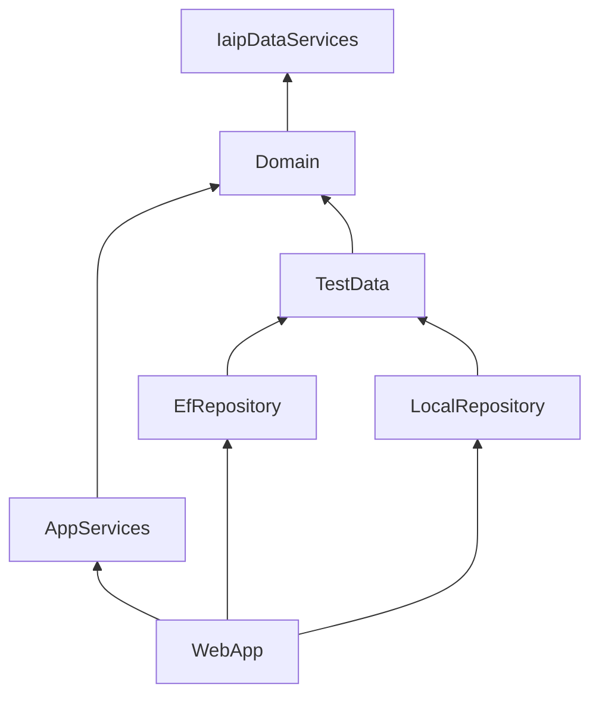
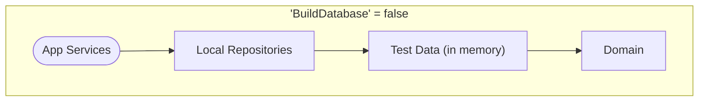
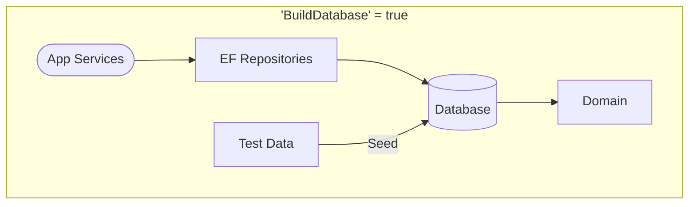
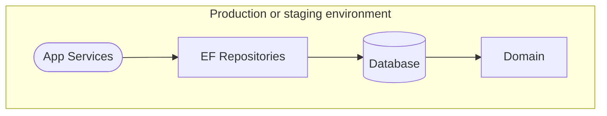
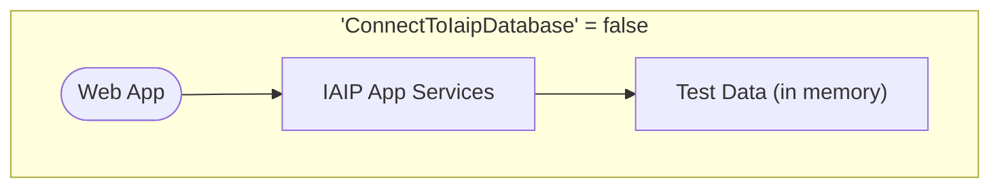
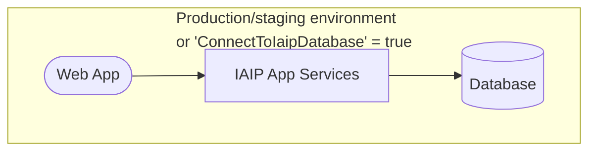

# Air Web Application

The Air Web app is operated to collect and organize the data required to operate an efficient air quality regulatory
program for the State of Georgia Environmental Protection Division (EPD) Air Protection Branch (APB).

[](https://github.com/gaepdit)
[](https://github.com/gaepdit/air-web/actions/workflows/dotnet-test.yml)
[](https://sonarcloud.io/summary/new_code?id=gaepdit_air-web)
[](https://sonarcloud.io/summary/new_code?id=gaepdit_air-web)


## Background and project requirements

The application is under active development to replace similar functionality currently housed in
the [Integrated Air Information Platform](https://github.com/gaepdit/iaip) (IAIP). As each new module is developed, it
will be removed from the IAIP until all functionality has been migrated and the IAIP can be retired.

This long-term project began with
the [Small Business Environmental Assistance Program](https://github.com/gaepdit/sbeap) which was migrated into a
standalone application.

The current effort focuses on the Stationary Source Compliance Program, specifically the compliance monitoring and
enforcement modules (which are also used by the EPD District Offices). This effort will also require updates to
our [ICIS-Air data flows](https://github.com/gaepdit/icis-air-data-exchange).

The remaining IAIP modules are described in [this discussion topic](https://github.com/gaepdit/air-web/discussions/50).

### Project ownership

The overall project is owned by the Air Protection Branch. Various modules are owned by the appropriate Programs within
the Branch.

## Preparing for deployment

Complete the following tasks when the application is ready for deployment.

* Create server-specific settings and config files and add copies to the "app-config" repository.
* Create Web Deploy Publish Profiles for each web server using the "Example-Server.pubxml" file as an example.
* Configure the following external services as needed:
    - [Azure App registration](https://portal.azure.com/#view/Microsoft_AAD_RegisteredApps/ApplicationsListBlade) to
      manage employee authentication. *(Add configuration settings in the "AzureAd" section in a server settings file.)*
      When configuring the app in the Azure Portal, add optional claims for "email", "family_name", and "given_name"
      under "Token configuration".
    - [Raygun](https://app.raygun.com/) for crash reporting and performance monitoring. *(Add the API key to the "
      RaygunSettings" section in a server settings file.)*
    - [SonarCloud](https://sonarcloud.io/projects) for code quality and security scanning. *(Update the project key in
      the "sonarcloud-scan.yml" workflow file and in the badges above.)*
    - [Better Uptime](https://betterstack.com/better-uptime) for site uptime monitoring. *(No app configuration
      needed.)*

## Solution organization

The solution contains the following projects:

* **Domain** — A class library containing the data models, business logic, and repository interfaces.
* **AppServices** — A class library containing the services used by an application to interact with the domain.
* **IaipDataService** — A class library implementing data services for IAIP data.
* **LocalRepository** — A class library implementing the repositories and data stores using static in-memory test data
  (for local development).
* **EfRepository** — A class library implementing the repositories and data stores using Entity Framework and a
  database (as specified by the configured connection string).
* **WebApp** — The front end web application and API.
* **TestData** — A class library containing test data for development and testing.

There are also corresponding unit test projects for each (not counting the `TestData` project).

### Project dependency diagram



## Development settings

The following settings section configures the data stores, authentication, and other settings for development purposes.
To work with these settings, add an `appsettings.Development.json` file in the root of the `WebApp` folder with a
`DevSettings` section, and make your changes there. Here's a sample `appsettings.Development.json` file to start out:

```json
{
    "DevSettings": {
        "UseDevSettings": true,
        "BuildDatabase": false,
        "UseEfMigrations": false,
        "ConnectToIaipDatabase": false,
        "EnableTestUser": true,
        "TestUserIsAuthenticated": true,
        "TestUserRoles": [
            "GeneralStaff"
        ],
        "EnableSecurityHeaders": false,
        "EnableWebOptimizer": false
    }
}
```

- *UseDevSettings* — Indicates whether the following Dev settings should be applied.

### Dev database settings

- *BuildDatabase*
    - When `true`, the `EfRepository` data store is used. A SQL Server database is created, and data is seeded from the
      `TestData` project (unless Entity Framework migrations are enabled).
    - When `false`, the `LocalRepository` data store is used. In-memory data is initialized from the `TestData` project.
- *UseEfMigrations* — (Only applies if `BuildDatabase` is `true`.)
    - When `true`, applies Entity Framework database migrations as needed. Test data is not seeded.
    - When `false`, the database is deleted and recreated based on the `DbContext`. Data is seeded from the `TestData`
      project.
- *ConnectToIaipDatabase*
    - When `true`, the IAIP data services will connect to an existing SQL Server database defined by the
      `IaipConnection` connection string. (A new database will not be created or seeded with data.)
    - When `false`, test IAIP data is used (located in `src/IaipDataService/TestData`).

### Dev authentication settings

- *EnableTestUser* — If `true`, a test user account will be available for development purposes.
- *TestUserIsAuthenticated* — Simulates a successful login with a test account when `true`. Simulates a failed login
  when `false`. (Only applies if `EnableTestUser` is `false`.)
- *TestUserRoles* — Adds the listed App Roles to the logged-in account. (Only applies if `TestUserIsAuthenticated` is
  `true`.)

### Miscellaneous dev settings

- *EnableSecurityHeaders* — Sets whether to include HTTP security headers.
- *EnableWebOptimizer* — Sets whether to enable the WebOptimizer middleware for bundling and minification of CSS
  and JavaScript files.

## Production settings

In a production or staging environment, `UseDevSettings` is automatically set to `false` regardless of what is specified
in the `appsettings.json` file.

### Database settings

Connection Strings for both a `DefaultConnection` and a `MigrationConnection` must be specified.

- The `DefaultConnection` is used for normal app connectivity. The account only requires DML rights on the database.
- The `MigrationConnection` is only used for applying Entity Framework migrations. The account requires DDL plus select
  and insert rights on the database.

### Authentication settings

The login providers must be enabled and configured. Currently, Okta and (Azure) Entra ID are available in the
application.

1. To enable authentication using Entra ID, the app must be registered in the Azure portal and configured in the
   `AzureAd` settings section.

  ```json
  {
    "AzureAd": {
        "Instance": "https://login.microsoftonline.com/",
        "CallbackPath": "/signin-oidc",
        "TenantId": "[Enter the Directory (tenant) ID from the Azure portal]",
        "ClientId": "[Enter the Application (client) ID from the Azure portal]"
    }
}
  ```

2. To enable Okta, the app must be registered in the Okta portal and configured in the `Okta` settings section.

  ```json
  {
    "Okta": {
        "OktaDomain": "https://${yourOktaDomain}",
        "ClientId": "${clientId}",
        "ClientSecret": "${clientSecret}",
        "AuthorizationServerId": "default"
    }
}
  ```

3. Finally, the login providers must be enabled in the `EnabledLoginProviders` section along with the allowed Okta
   organization ID or Entra Tenant ID.

```json
{
    "EnabledLoginProviders": [
        {
            "Name": "EntraId",
            "Id": "tenant-1-id"
        },
        {
            "Name": "EntraId",
            "Id": "tenant-2-id"
        },
        {
            "Name": "Okta",
            "Id": "okta-id"
        }
    ]
}
```

### Seeding user roles

User roles can be seeded using the `SeedUserRoles` setting. The roles are added to the user's account the first time
they log in. For example:

```json
{
    "SeedUserRoles": [
        {
            "User": "user1@example.com",
            "Roles": [
                "UserAdmin",
                "Staff"
            ]
        }
    ]
}
```

## Data persistence

Here's a visualization of how the settings configure data storage at runtime.







#### IAIP data services

Here's a visualization of how the settings configure the IAIP data services at runtime.




