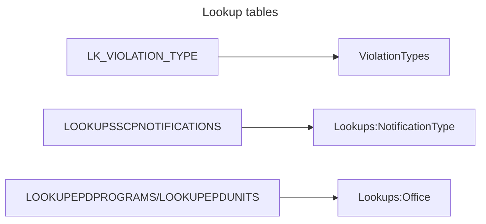
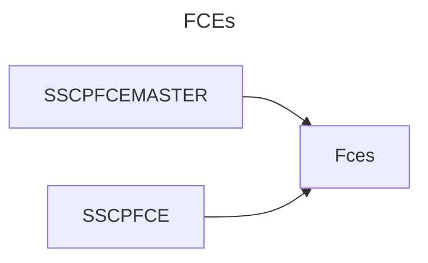
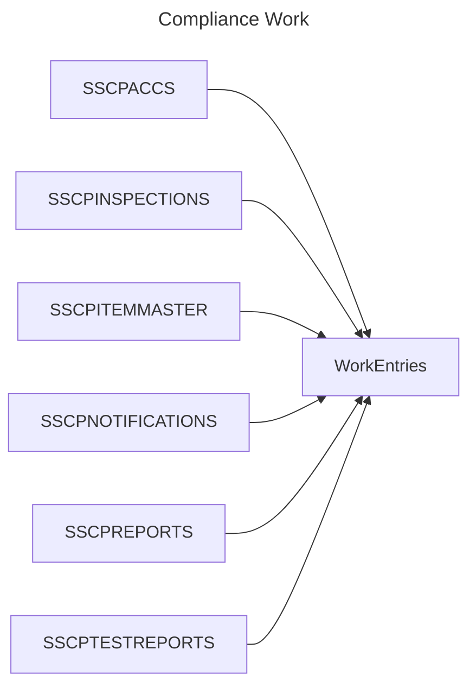
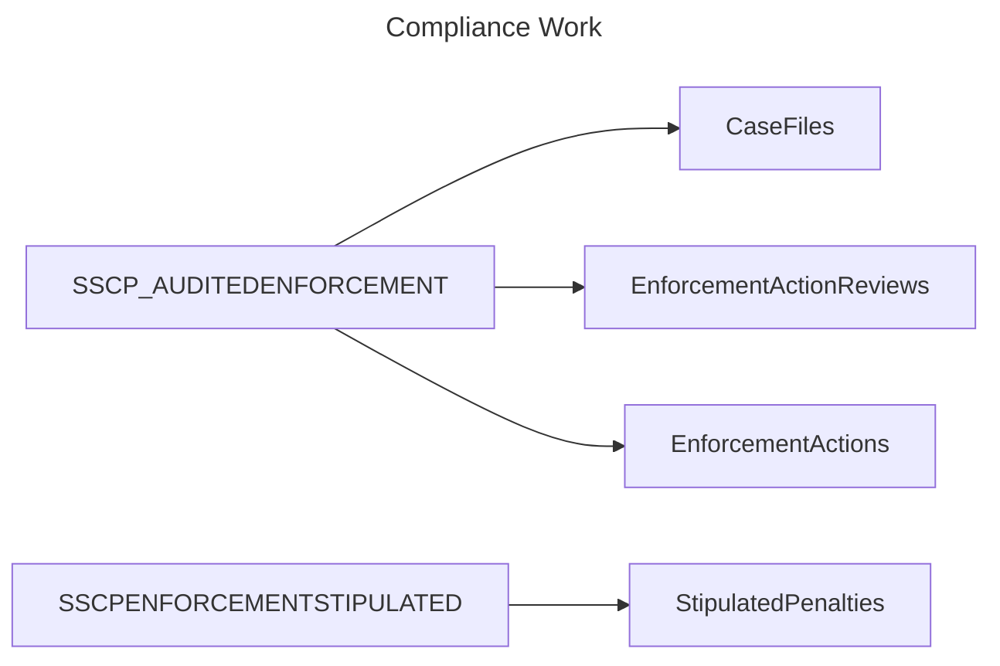
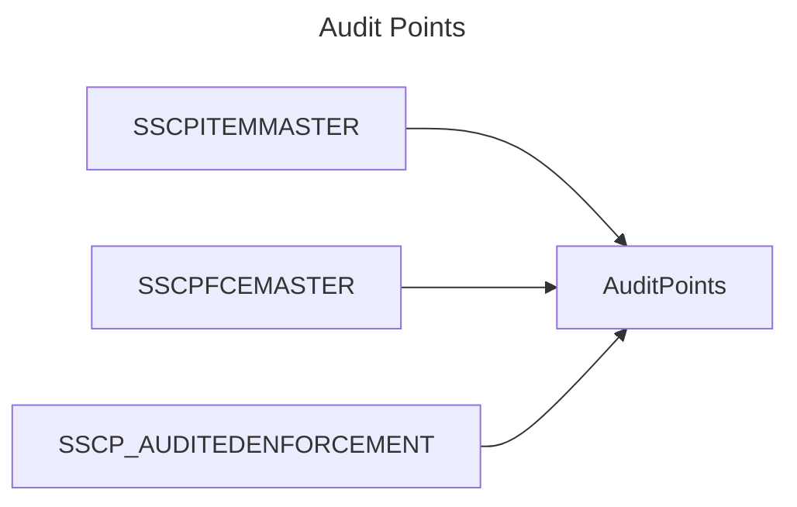

# Data migration flow

## New tables

* [x] `AspNetRoles` (automatically populated)
* [x] `AspNetUsers`
* [x] `AspNetUserRoles`
* [ ] `AuditPoints`
    * [ ] FCE
    * [ ] Case File
    * [ ] Work Entry
* [ ] `CaseFileComplianceEvents`
* [ ] `CaseFiles`
* [ ] `Comments`
    * [ ] FCE
    * [ ] Case File
    * [ ] Work Entry
* [ ] `EmailLogs`
* [ ] `EnforcementActionReviews`
* [ ] `EnforcementActions`
* [ ] `Fces`
* [x] `Lookups`
* [ ] `StipulatedPenalties`
* [x] `ViolationTypes`
* [ ] `WorkEntries`

## Old tables

* `LK_VIOLATION_TYPE`
* `LOOKUPSSCPNOTIFICATIONS`
* `SSCPACCS`
* `SSCPACCSHISTORY` *(not migrated)*
* `SSCPENFORCEMENTSTIPULATED`
* `SSCPFCEMASTER`
* `SSCPFCE`
* `SSCPINSPECTIONS`
* `SSCPITEMMASTER`
* `SSCPNOTIFICATIONS`
* `SSCPREPORTS`
* `SSCPTESTREPORTS`
* `SSCP_AUDITEDENFORCEMENT`
* `SSCP_ENFORCEMENT` *(not migrated)*
* `SSCP_EnforcementEvents`

## General migration flow

