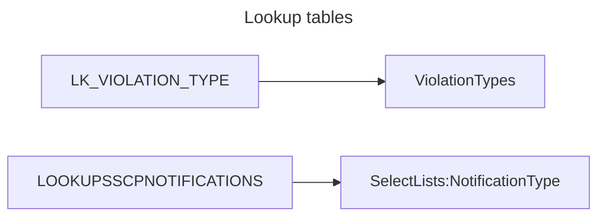
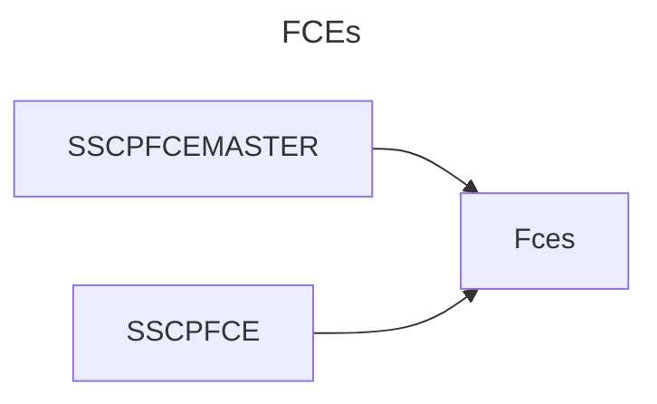
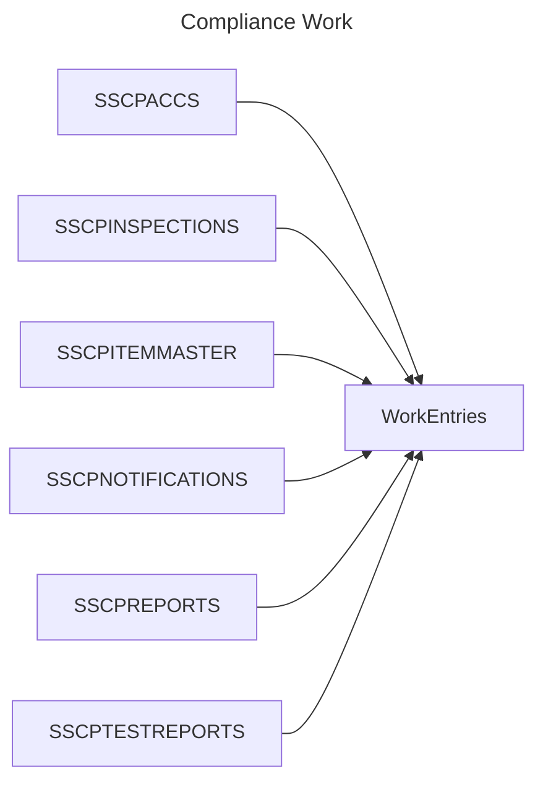
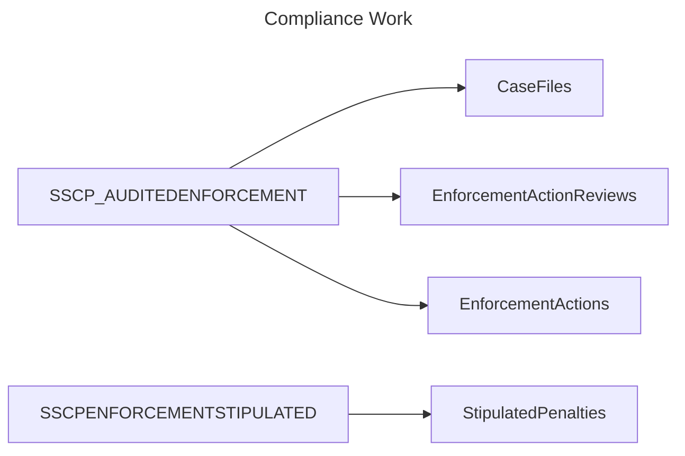
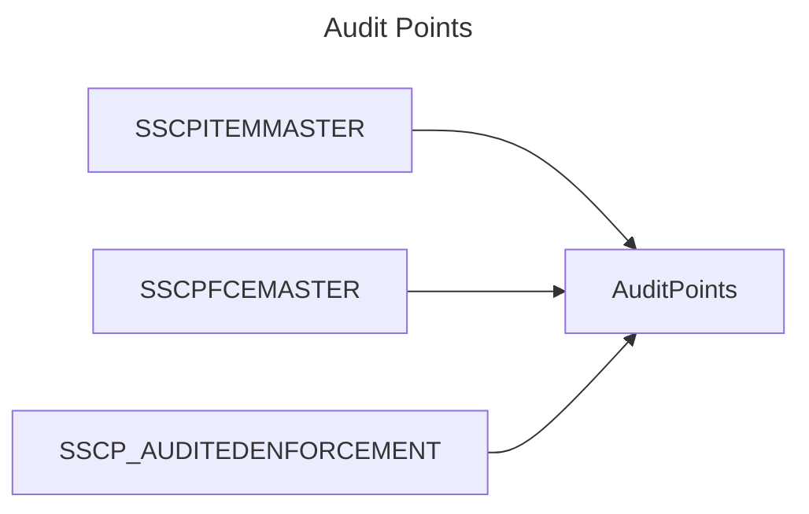

# Data migration flow

## New tables

* `AuditPoints`
* `CaseFileComplianceEvents`
* `CaseFiles`
* `Comments`
* `EmailLogs`
* `EnforcementActionReviews`
* `EnforcementActions`
* `Fces`
* `SelectLists`
* `StipulatedPenalties`
* `ViolationTypes`
* `WorkEntries`

## Old tables

* `LK_VIOLATION_TYPE`
* `LOOKUPSSCPNOTIFICATIONS`
* `SSCPACCS`
* `SSCPENFORCEMENTSTIPULATED`
* `SSCPFCEMASTER`
* `SSCPFCE`
* `SSCPINSPECTIONS`
* `SSCPITEMMASTER`
* `SSCPNOTIFICATIONS`
* `SSCPREPORTS`
* `SSCPTESTREPORTS`
* `SSCP_AUDITEDENFORCEMENT`
* `SSCP_EnforcementEvents`

## General migration flow

