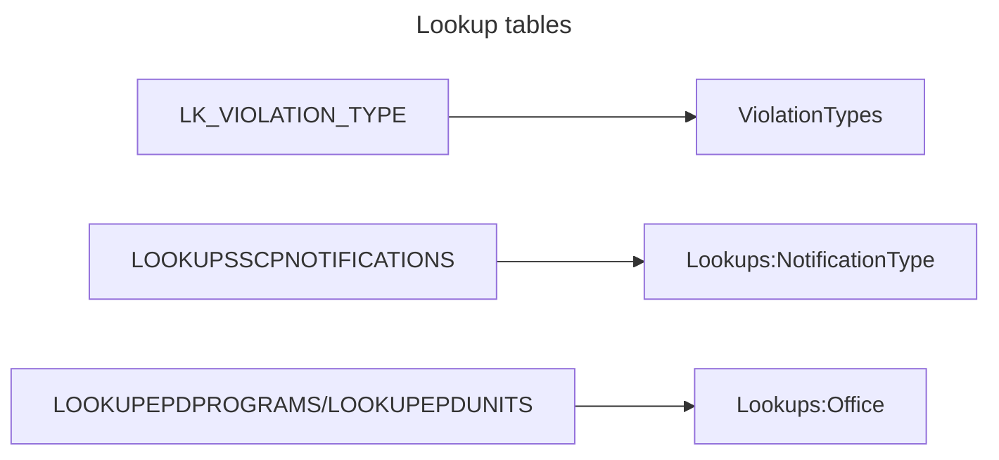
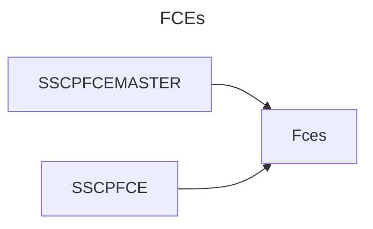
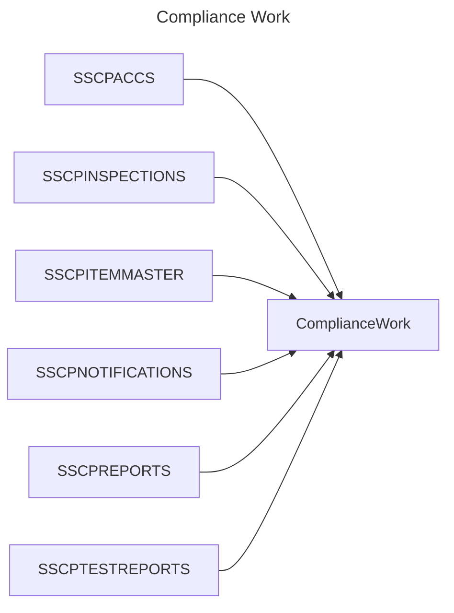
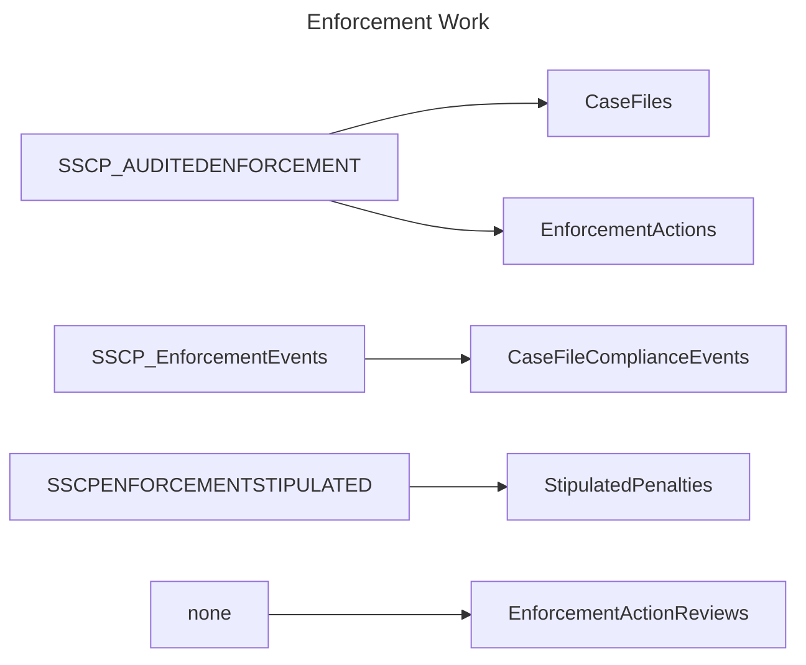
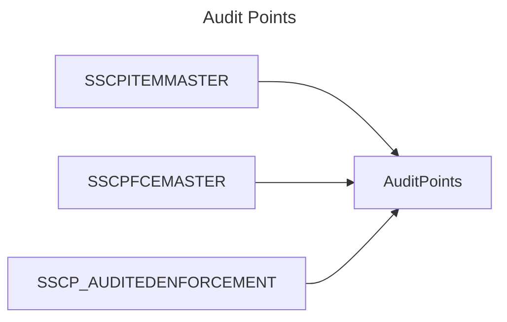

# Data migration flow

## New tables

* `AspNetRoles` (automatically populated)
* `AspNetUserRoles`
* `AspNetUsers`
* `AuditPoints`
    * FCE
    * Case File
    * Work Entry
* `CaseFileComplianceEvents`
* `CaseFiles`
* `Comments`
    * FCE
    * Case File
    * Work Entry
* `ComplianceWork` (`WorkEntry` entity)
* `EmailLogs`
* `EnforcementActionReviews`
* `EnforcementActions`
* `Fces`
* `Lookups`
* `StipulatedPenalties`
* `ViolationTypes`

## Old tables

* `LK_VIOLATION_TYPE`
* `LOOKUPSSCPNOTIFICATIONS`
* `SSCPACCS`
* `SSCPACCSHISTORY` *(not migrated)*
* `SSCPENFORCEMENTSTIPULATED`
* `SSCPFCEMASTER`
* `SSCPFCE`
* `SSCPINSPECTIONS`
* `SSCPITEMMASTER`
* `SSCPNOTIFICATIONS`
* `SSCPREPORTS`
* `SSCPTESTREPORTS`
* `SSCP_AUDITEDENFORCEMENT`
* `SSCP_ENFORCEMENT` *(not migrated)*
* `SSCP_EnforcementEvents`

## General migration flow

