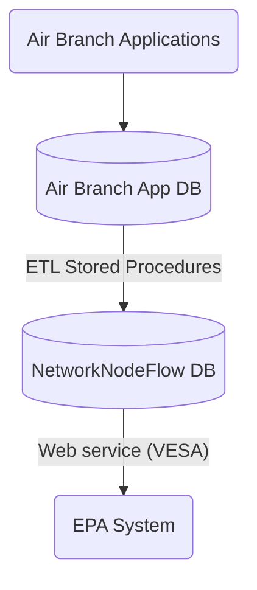

# EPA Data Exchange

## Data flow

* ETLs runs daily.
* Web service runs weekly.

## Data elements

### Compliance Monitoring

| Compliance Work Type                  | Not reportable | Reportable |
|---------------------------------------|:--------------:|:----------:|
| Annual Compliance Certification (ACC) |                |     ✓      |
| Inspection                            |                |     ✓      |
| Notification                          |       ✓        |            |
| Permit revocation                     |       ✓        |            |
| Report                                |                |     ✓      |
| Risk Management Plan (RMP) Inspection |       ✓        |            |
| Source Test Compliance Review         |                |     ✓      |

### Enforcement

| Enforcement Action type    | Not reportable | Reportable as "informal" | Reportable as "formal" |
|----------------------------|:--------------:|:------------------------:|:----------------------:|
| Letter of Noncompliance    |       ✓        |                          |                        |
| Notice of Violation        |                |            ✓             |                        |
| No Further Action Letter   |      ✓ *       |                          |                        |
| Combined NOV/NFA Letter    |                |            ✓             |                        |
| Proposed Consent Order     |                |            ✓             |                        |
| Consent Order              |                |                          |           ✓            |
| Administrative Order       |                |                          |           ✓            |
| Order Resolved  (CO or AO) |       ✓        |                          |                        |
| Informational Letter       |       ✓        |                          |                        |

* NFA letters are not reportable on their own but are sent as Addressing & Resolving Pathway Activities.

#### ICIS-Air Pathway Activities

| Item                          | ICIS-Air Data Type    | Pathway Activity                  |
|-------------------------------|-----------------------|-----------------------------------|
| Case File                     | Case File             | *N/A*                             |
| Compliance Event              | Compliance Monitoring | Discovery                         |
| Notice of Violation           | Informal EA           | Notification                      |
| No Further Action Letter      | *N/A*                 | Addressing/Resolving              |
| Combined NOV/NFA Letter       | Informal EA           | Notification/Addressing/Resolving |
| Proposed Consent Order        | Informal EA           | Notification                      |
| Consent Order                 | Formal EA             | Addressing                        |
| Consent Order Resolved        | *N/A*                 | Resolving                         |
| Administrative Order          | Formal EA             | Addressing                        |
| Administrative Order Resolved | *N/A*                 | Resolving                         |
