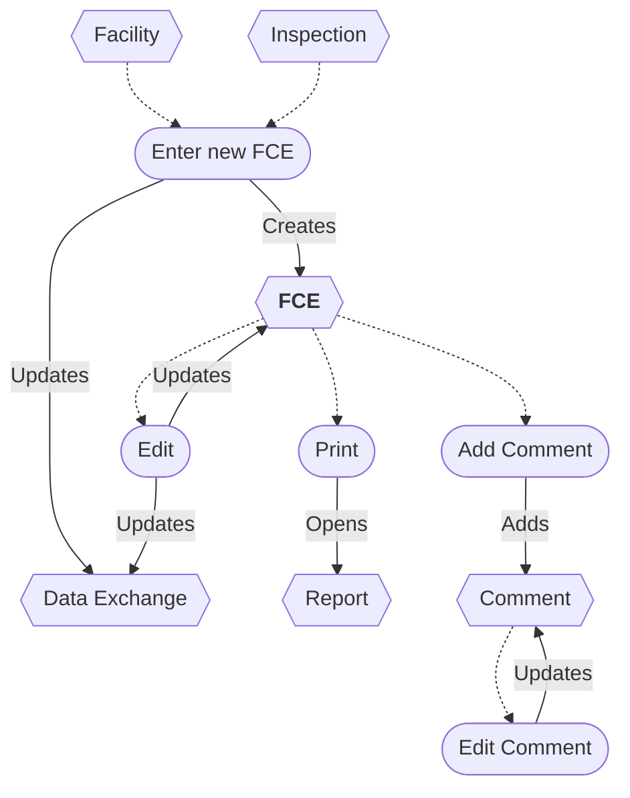
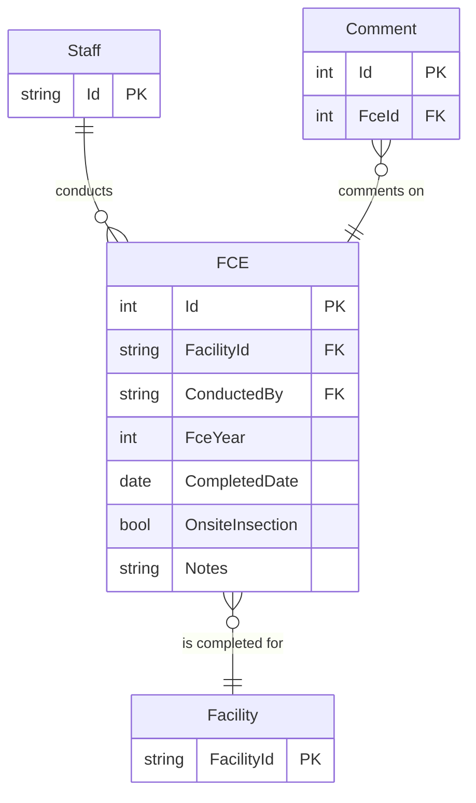

# Full Compliance Evaluation (FCE) Workflow and ERD

* A new FCE can be entered from a Facility or an Inspection.
* The FCE can be edited.
* Saving an FCE updates the Data Exchange.
* The FCE report can be printed.
* An FCE can be deleted/restored *(not shown)*.
* Comments can be added and edited.
* A Comment can be deleted *(not shown)*.

## Flowchart

## Entity Relationship Diagram

## Original IAIP table columns

| Column                          | Type          | Properties | Status  | Destination      |
|---------------------------------|---------------|------------|---------|------------------|
| SSCPFCEMASTER.STRFCENUMBER      | numeric(10)   | not null   | ✔       | Id               |
| SSCPFCEMASTER.STRAIRSNUMBER     | varchar(12)   | not null   | ✔       | FacilityId       |
| SSCPFCEMASTER.STRMODIFINGPERSON | varchar(3)    | not null   | ✖       | *none*           |
| SSCPFCEMASTER.DATMODIFINGDATE   | datetime2(0)  | not null   | ✖       | *none*           |
| SSCPFCEMASTER.ICIS_STATUSIND    | varchar       |            | *defer* |                  |
| SSCPFCEMASTER.IsDeleted         | bit           | default 0  | ✔       | Base.IsDeleted   |
| SSCPFCE.STRFCESTATUS            | varchar(5)    | not null   | ✖       | *none*           |
| SSCPFCE.STRREVIEWER             | varchar(3)    | not null   | ✔       | ConductedBy      |
| SSCPFCE.DATFCECOMPLETED         | datetime2(0)  | not null   | ✔       | CompletedDate    |
| SSCPFCE.STRFCECOMMENTS          | varchar(4000) | not null   | ✔       | Notes            |
| SSCPFCE.STRMODIFINGPERSON       | varchar(3)    | not null   | ✔       | Base.UpdatedById |
| SSCPFCE.DATMODIFINGDATE         | datetime2(0)  | not null   | ✔       | Base.UpdatedAt   |
| SSCPFCE.STRSITEINSPECTION       | varchar(5)    |            | ✔       | onsiteInspection |
| SSCPFCE.STRFCEYEAR              | varchar(4)    |            | ✔       | FceYear          |
