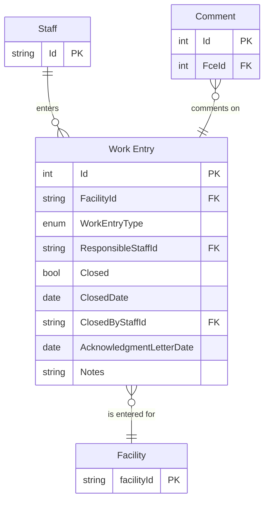

# Base Work Entry

## Entities

- WRK: Work Entry
    - CME: Compliance Event
        - ACC: Annual Compliance Certification (ACC)
        - INS: Inspection
        - RMP: RMP Inspection
        - SMR: Source Monitoring Review
        - REP: Report
    - NOT: Notification
    - REV: Permit revocation †

† Indicates a change in hierarchy compared to the IAIP.

## SSCP Diagram

## Original IAIP table columns

| Column                                    | Type         | Properties | Status  | Destination               |
|-------------------------------------------|--------------|------------|---------|---------------------------|
| SSCPITEMMASTER.STRTRACKINGNUMBER          | numeric(10)  | not null   | ✔       | Id                        |
| SSCPITEMMASTER.STRAIRSNUMBER              | varchar(12)  | not null   | ✔       | FacilityId                |
| SSCPITEMMASTER.DATRECEIVEDDATE            | datetime2(0) | not null   | ✔       | *subtypes*                |
| SSCPITEMMASTER.STREVENTTYPE               | varchar(3)   | not null   | ✔       | WorkEntryType             |
| SSCPITEMMASTER.STRRESPONSIBLESTAFF        | varchar(3)   |            | ✔       | ResponsibleStaffId        |
| SSCPITEMMASTER.DATCOMPLETEDATE            | datetime2(0) |            | ✔       | Closed, ClosedDate        |
| SSCPITEMMASTER.STRMODIFINGPERSON          | varchar(3)   | not null   | ✔       | Base.UpdatedById          |
| SSCPITEMMASTER.DATMODIFINGDATE            | datetime2(0) | not null   | ✔       | Base.UpdatedAt            |
| SSCPITEMMASTER.STRDELETE                  | varchar(5)   |            | ✔       | Base.IsDeleted            |
| SSCPITEMMASTER.DATACKNOLEDGMENTLETTERSENT | datetime2(0) |            | ✔       | AcknowledgmentLetterDate  |
| SSCPITEMMASTER.DATINFORMATIONREQUESTDATE  | datetime2(0) |            | ✖       | *none*                    |
| SSCPITEMMASTER.ICIS_STATUSIND             | varchar      |            | *defer* |                           |
