# Compliance Work Entry ERDs

## Compliance Work Entities

```mermaid
erDiagram
    FAC["Facility 🛩️"] {
        string FacilityId PK
    }

    TST["Source Test Report 🛩️"] {
        int ReferenceNumber PK
    }

    FCE["FCE ⚓"] {
        int Id PK
    }

    WRK["Work Entry ⚓"] {
        int Id PK
        bool IsComplianceEvent
    }

    CME["Compliance Event"]
    STR["Source Test Review"]
    ACC["ACC"]
    BINS["Base Inspection"]
    INS["Inspection"]
    RMP["RMP Inspection"]
    REP["Report"]
    NOT["Notification"]
    REV["Permit Revocation"]
    STR |o--|| CME: "is a type of"
    ACC |o--|| CME: "is a type of"
    BINS |o--|| CME: "is a type of"
    INS |o--|| BINS: "is a type of"
    RMP |o--|| BINS: "is a type of"
    REP |o--|| CME: "is a type of"
    CME |o--|| WRK: "is a subset of"
    NOT |o--|| WRK: "is a type of"
    REV |o--|| WRK: "is a type of"
    STR |o--|| TST: "evaluates"
    TST }o--|| FAC: "is conducted at"
    WRK }o--|| FAC: "is entered for"
    FCE }o--|| FAC: "is completed for"

```

## Base ERD

### IAIP table column mapping

| Column                                    | Type         | Migrate | Destination              |
|-------------------------------------------|--------------|:-------:|--------------------------|
| SSCPITEMMASTER.STRTRACKINGNUMBER          | numeric(10)  |    ✓    | Id                       |
| SSCPITEMMASTER.STRAIRSNUMBER              | varchar(12)  |    ✓    | FacilityId               |
| SSCPITEMMASTER.DATRECEIVEDDATE            | datetime2(0) |    ✓    | *see subtypes*           |
| SSCPITEMMASTER.STREVENTTYPE               | varchar(3)   |    ✓    | WorkEntryType            |
| SSCPITEMMASTER.STRRESPONSIBLESTAFF        | varchar(3)   |    ✓    | ResponsibleStaffId       |
| SSCPITEMMASTER.DATCOMPLETEDATE            | datetime2(0) |    ✓    | Closed, ClosedDate       |
| SSCPITEMMASTER.STRMODIFINGPERSON          | varchar(3)   |    ✓    | CreatedById              |
| SSCPITEMMASTER.DATMODIFINGDATE            | datetime2(0) |    ✓    | CreatedAt                |
| SSCPITEMMASTER.STRDELETE                  | varchar(5)   |    ✓    | IsDeleted                |
| SSCPITEMMASTER.DATACKNOLEDGMENTLETTERSENT | datetime2(0) |    ✓    | AcknowledgmentLetterDate |
| SSCPITEMMASTER.DATINFORMATIONREQUESTDATE  | datetime2(0) |    ✗    | *none*                   |
| SSCPITEMMASTER.ICIS_STATUSIND             | varchar      |    ✓    | DataExchangeStatus       |

### Derived event types

| Key | Event Type                      | Work Entry Enum               |
|:----|:--------------------------------|:------------------------------|
| 01  | Report                          | Report                        |
| 02  | Inspection                      | Inspection                    |
| 03  | Performance Tests               | SourceTestReview              |
| 04  | Annual Compliance Certification | AnnualComplianceCertification |
| 05  | Notification                    | Notification                  |
| 07  | RMP Inspection                  | RmpInspection                 |

## ACC columns

### IAIP table column mapping

| Column                              | Type          | Migrate | Destination                            |
|-------------------------------------|---------------|:-------:|----------------------------------------|
| SSCPITEMMASTER.DATRECEIVEDDATE      | datetime2(0)  |    ✓    | ReceivedDate, EventDate                |
| SSCPACCS.STRSUBMITTALNUMBER         | numeric(3)    |    ✗    | *none*                                 |
| SSCPACCS.STRPOSTMARKEDONTIME        | varchar(5)    |    ✓    | PostmarkedOnTime                       |
| SSCPACCS.DATPOSTMARKDATE            | datetime2(0)  |    ✓    | Postmarked                             |
| SSCPACCS.STRSIGNEDBYRO              | varchar(5)    |    ✓    | SignedByRo                             |
| SSCPACCS.STRCORRECTACCFORMS         | varchar(5)    |    ✓    | OnCorrectForms                         |
| SSCPACCS.STRTITLEVCONDITIONSLISTED  | varchar(5)    |    ✓    | IncludesAllTvConditions                |
| SSCPACCS.STRACCCORRECTLYFILLEDOUT   | varchar(5)    |    ✓    | CorrectlyCompleted                     |
| SSCPACCS.STRREPORTEDDEVIATIONS      | varchar(5)    |    ✓    | ReportsDeviations                      |
| SSCPACCS.STRDEVIATIONSUNREPORTED    | varchar(5)    |    ✓    | IncludesPreviouslyUnreportedDeviations |
| SSCPACCS.STRCOMMENTS                | varchar(4000) |    ✓    | Notes                                  |
| SSCPACCS.STRENFORCEMENTNEEDED       | varchar(5)    |    ✓    | EnforcementNeeded                      |
| SSCPACCS.STRMODIFINGPERSON          | varchar(3)    |    ✓    | UpdatedById                            |
| SSCPACCS.DATMODIFINGDATE            | datetime2(0)  |    ✓    | UpdatedAt                              |
| SSCPACCS.DATACCREPORTINGYEAR        | datetime2(0)  |    ✓    | AccReportingYear                       |
| SSCPACCS.STRKNOWNDEVIATIONSREPORTED | varchar(5)    |    ✓    | ReportsAllKnownDeviations              |
| SSCPACCS.STRRESUBMITTALREQUIRED     | varchar(5)    |    ✓    | ResubmittalRequired                    |

## Inspection/RMP Inspection columns

### IAIP table column mapping

| Column                                        | Type          | Migrate | Destination                  |
|-----------------------------------------------|---------------|:-------:|------------------------------|
| SSCPITEMMASTER.DATRECEIVEDDATE                | datetime2(0)  |    ✗    | *none*                       |
| SSCPINSPECTIONS.DATINSPECTIONDATESTART        | datetime2(0)  |    ✓    | InspectionStarted, EventDate |
| SSCPINSPECTIONS.DATINSPECTIONDATEEND          | datetime2(0)  |    ✓    | InspectionEnded              |
| SSCPINSPECTIONS.STRINSPECTIONREASON           | varchar(35)   |    ✓    | InspectionReason             |
| SSCPINSPECTIONS.STRWEATHERCONDITIONS          | varchar(100)  |    ✓    | WeatherConditions            |
| SSCPINSPECTIONS.STRINSPECTIONGUIDE            | varchar(100)  |    ✓    | InspectionGuide              |
| SSCPINSPECTIONS.STRFACILITYOPERATING          | varchar(5)    |    ✓    | FacilityOperating            |
| SSCPINSPECTIONS.STRINSPECTIONCOMPLIANCESTATUS | varchar(35)   |    ✓    | DeviationsNoted              |
| SSCPINSPECTIONS.STRINSPECTIONCOMMENTS         | varchar(4000) |    ✓    | Notes                        |
| SSCPINSPECTIONS.STRINSPECTIONFOLLOWUP         | varchar(5)    |    ✓    | FollowupTaken                |
| SSCPINSPECTIONS.STRMODIFINGPERSON             | varchar(3)    |    ✓    | UpdatedById                  |
| SSCPINSPECTIONS.DATMODIFINGDATE               | datetime2(0)  |    ✓    | UpdatedAt                    |

## Notification columns

### Notification types

| Key | Notification Type   |
|:----|:--------------------|
| 01  | Other               |
| 02  | Startup             |
| 03  | Permit Revocation * |
| 06  | Response Letter     |
| 07  | Malfunction         |
| 08  | Deviation           |

* Permit Revocations are migrated as a separate event type.

### IAIP table column mapping

| Column                                     | Type          | Migrate | Destination             |
|--------------------------------------------|---------------|:-------:|-------------------------|
| SSCPITEMMASTER.DATRECEIVEDDATE             | datetime2(0)  |    ✓    | ReceivedDate, EventDate |
| SSCPNOTIFICATIONS.DATNOTIFICATIONDUE       | datetime2(0)  |    ✓    | DueDate                 |
| SSCPNOTIFICATIONS.STRNOTIFICATIONDUE       | varchar(5)    |    ✗    | *none*                  |
| SSCPNOTIFICATIONS.DATNOTIFICATIONSENT      | datetime2(0)  |    ✓    | SentDate                |
| SSCPNOTIFICATIONS.STRNOTIFICATIONSENT      | varchar(10)   |    ✗    | *none*                  |
| SSCPNOTIFICATIONS.STRNOTIFICATIONTYPE      | varchar(2)    |    ✓    | NotificationType        |
| SSCPNOTIFICATIONS.STRNOTIFICATIONTYPEOTHER | varchar(100)  |    ✓    | Notes                   |
| SSCPNOTIFICATIONS.STRNOTIFICATIONCOMMENT   | varchar(4000) |    ✓    | Notes                   |
| SSCPNOTIFICATIONS.STRNOTIFICATIONFOLLOWUP  | varchar(5)    |    ✓    | FollowupTaken           |
| SSCPNOTIFICATIONS.STRMODIFINGPERSON        | varchar(3)    |    ✓    | UpdatedById             |
| SSCPNOTIFICATIONS.DATMODIFINGDATE          | datetime2(0)  |    ✓    | UpdatedAt               |

## Permit Revocation columns

### IAIP table column mapping

| Column                                     | Type          | Migrate | Destination             |
|--------------------------------------------|---------------|:-------:|-------------------------|
| SSCPITEMMASTER.DATRECEIVEDDATE             | datetime2(0)  |    ✓    | ReceivedDate, EventDate |
| SSCPNOTIFICATIONS.DATNOTIFICATIONDUE       | datetime2(0)  |    ✓    | PermitRevocationDate    |
| SSCPNOTIFICATIONS.STRNOTIFICATIONDUE       | varchar(5)    |    ✗    | *none*                  |
| SSCPNOTIFICATIONS.DATNOTIFICATIONSENT      | datetime2(0)  |    ✓    | PhysicalShutdownDate    |
| SSCPNOTIFICATIONS.STRNOTIFICATIONSENT      | varchar(10)   |    ✗    | *none*                  |
| SSCPNOTIFICATIONS.STRNOTIFICATIONTYPE      | varchar(2)    |    ✗    | *none*                  |
| SSCPNOTIFICATIONS.STRNOTIFICATIONTYPEOTHER | varchar(100)  |    ✗    | *none*                  |
| SSCPNOTIFICATIONS.STRNOTIFICATIONCOMMENT   | varchar(4000) |    ✓    | Notes                   |
| SSCPNOTIFICATIONS.STRNOTIFICATIONFOLLOWUP  | varchar(5)    |    ✓    | FollowupTaken           |
| SSCPNOTIFICATIONS.STRMODIFINGPERSON        | varchar(3)    |    ✓    | UpdatedById             |
| SSCPNOTIFICATIONS.DATMODIFINGDATE          | datetime2(0)  |    ✓    | UpdatedAt               |

## Report columns

### IAIP table column mapping

| Column                                 | Type          | Migrate | Destination             |
|----------------------------------------|---------------|:-------:|-------------------------|
| SSCPITEMMASTER.DATRECEIVEDDATE         | datetime2(0)  |    ✓    | ReceivedDate, EventDate |
| SSCPREPORTS.STRREPORTPERIOD            | varchar(25)   |    ✓    | ReportingPeriodType     |
| SSCPREPORTS.DATREPORTINGPERIODSTART    | datetime2(0)  |    ✓    | ReportingPeriodStart    |
| SSCPREPORTS.DATREPORTINGPERIODEND      | datetime2(0)  |    ✓    | ReportingPeriodEnd      |
| SSCPREPORTS.STRREPORTINGPERIODCOMMENTS | varchar(4000) |    ✓    | ReportingPeriodComment  |
| SSCPREPORTS.DATREPORTDUEDATE           | datetime2(0)  |    ✓    | DueDate                 |
| SSCPREPORTS.DATSENTBYFACILITYDATE      | datetime2(0)  |    ✓    | SentDate                |
| SSCPREPORTS.STRCOMPLETESTATUS          | varchar(5)    |    ✓    | ReportComplete          |
| SSCPREPORTS.STRENFORCEMENTNEEDED       | varchar(5)    |    ✓    | EnforcementNeeded       |
| SSCPREPORTS.STRSHOWDEVIATION           | varchar(5)    |    ✓    | ReportsDeviations       |
| SSCPREPORTS.STRGENERALCOMMENTS         | varchar(4000) |    ✓    | Notes                   |
| SSCPREPORTS.STRMODIFINGPERSON          | varchar(3)    |    ✓    | UpdatedById             |
| SSCPREPORTS.DATMODIFINGDATE            | datetime2(0)  |    ✓    | UpdatedAt               |
| SSCPREPORTS.STRSUBMITTALNUMBER         | varchar(3)    |    ✗    | *none*                  |

## Source Test Review columns

### IAIP table column mapping

| Column                                   | Type          | Migrate | Destination                         |
|------------------------------------------|---------------|:-------:|-------------------------------------|
| SSCPITEMMASTER.DATRECEIVEDDATE           | datetime2(0)  |    ✓    | ReceivedByComplianceDate, EventDate |
| SSCPTESTREPORTS.STRREFERENCENUMBER       | varchar(9)    |    ✓    | ReferenceNumber                     |
| SSCPTESTREPORTS.DATTESTREPORTDUE         | datetime2(0)  |    ✓    | DueDate                             |
| SSCPTESTREPORTS.STRTESTREPORTCOMMENTS    | varchar(4000) |    ✓    | Notes                               |
| SSCPTESTREPORTS.STRTESTREPORTFOLLOWUP    | varchar(5)    |    ✓    | FollowupTaken                       |
| SSCPTESTREPORTS.STRMODIFINGPERSON        | varchar(3)    |    ✓    | UpdatedById                         |
| SSCPTESTREPORTS.DATMODIFINGDATE          | datetime2(0)  |    ✓    | UpdatedAt                           |
| APBSUPPLAMENTALDATA.DATSSCPTESTREPORTDUE | datetime2(0)  |    ✗    | *none*                              |

## Data Exchange Action Numbers

| Column                               | Type       | Migrate | Destination                   |
|--------------------------------------|------------|:-------:|-------------------------------|
| AFSSSCPFCERECORDS.STRAFSACTIONNUMBER | varchar(5) |    ✓    | Fce.ActionNumber              |
| AFSSSCPRECORDS.STRAFSACTIONNUMBER    | varchar(5) |    ✓    | ComplianceEvent.ActionNumber  |
| AFSISMPRECORDS.STRAFSACTIONNUMBER    | varchar(5) |    ✓    | SourceTestReview.ActionNumber |
