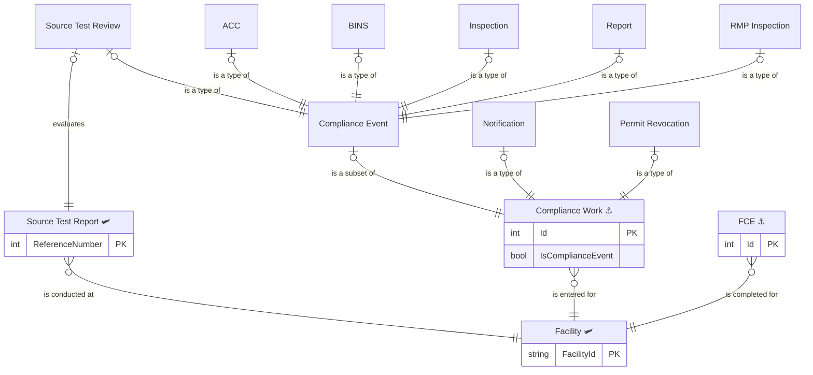
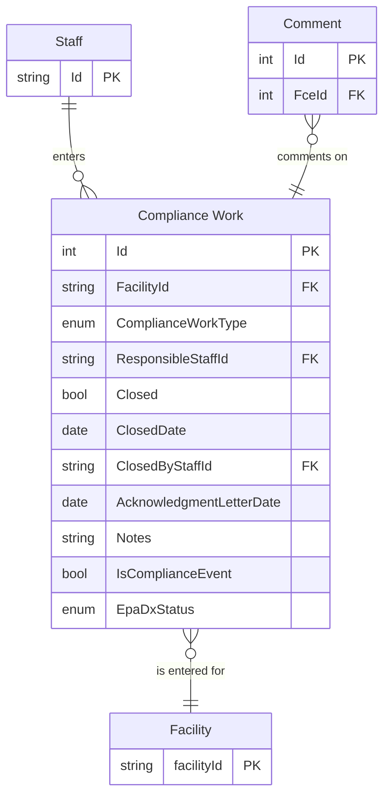
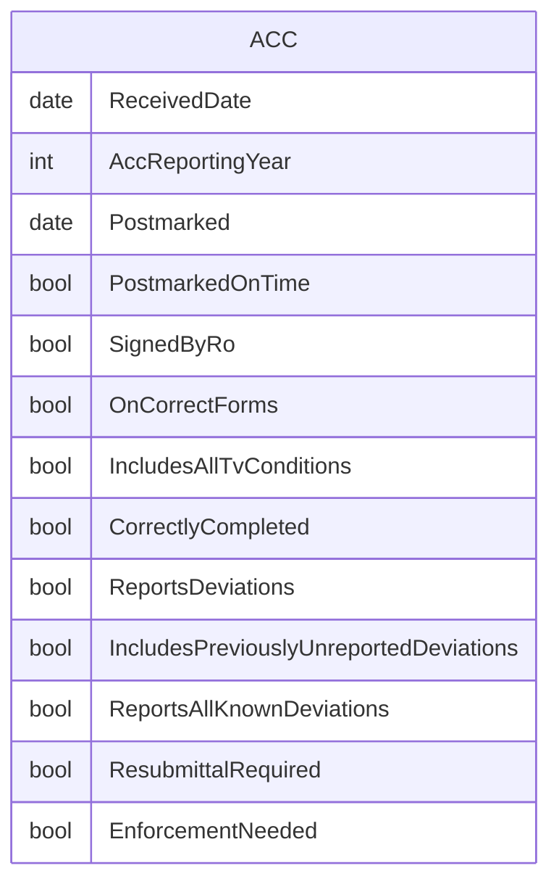
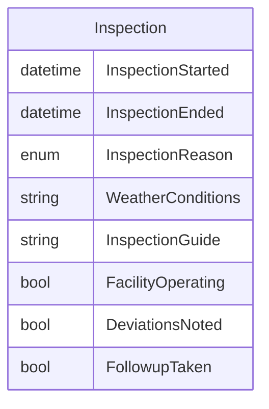
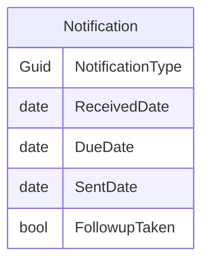
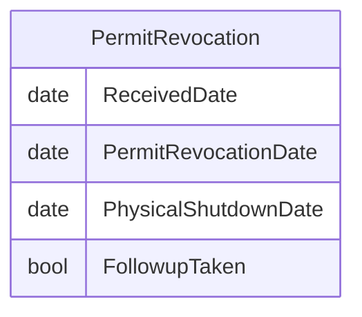
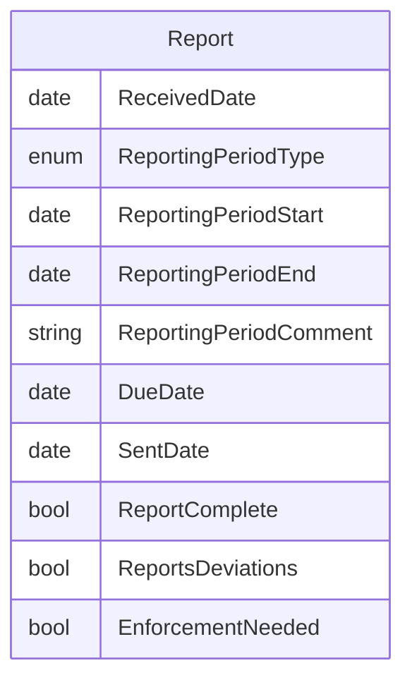
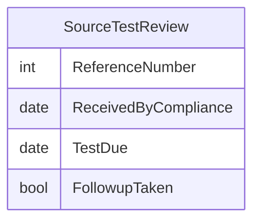

# Compliance Monitoring ERDs

## Compliance Work Entities

## Base ERD

### Derived event types

- Report
- Inspection
- Performance Tests
- Annual Compliance Certification
- Notification
- RMP Inspection

## ACC columns

## Inspection/RMP Inspection columns

## Notification columns

### Notification types

- Other
- Startup
- Permit Revocation
- Response Letter
- Malfunction
- Deviation

## Permit Revocation columns

## Report columns

## Source Test Review columns

