# Compliance Monitoring and Enforcement

## Entities

### Retrieved from IAIP

- FAC: Facility
- TST: Source Test Report (Performance Test/Stack Test)

### Migrated into the Air Web app

- FCE: Full Compliance Evaluation (FCE)
- WRK: Work Entry
    - Compliance Event (a subset of Work Entries)
        - ACC: Annual Compliance Certification (ACC)
        - INS: Inspection
        - RMP: RMP Inspection
        - STR: Source Test Compliance Review
        - REP: Report
    - NOT: Notification
    - REV: Permit revocation (previously a type of Notification)
- ENF: Enforcement

## ERD

```mermaid
erDiagram
    FAC["Facility 🛩️"] {
    string FacilityId PK
}

    TST["Source Test Report 🛩️"] {
    int ReferenceNumber PK
}

    FCE["FCE ⚓"] {
    int Id PK
}

    WRK["Work Entry ⚓"] {
    int Id PK
    bool IsComplianceEvent
}

    CME["Compliance Event"]

        STR["Source Test Review"]
        ACC["ACC"]
        INS["Inspection"]
        RMP["RMP Inspection"]
        REP["Report"]

    NOT["Notification"]
    
    REV["Permit Revocation"]

    ENF["Enforcement ⚓"] {
    int Id PK
}

    CEL["Compliance Event-Enforcement 🔗"] {
    int EnforcementId FK
    int WorkEntryId FK
}

STR |o--|| CME : "is a type of"
ACC |o--|| CME : "is a type of"
INS |o--|| CME : "is a type of"
RMP |o--|| CME : "is a type of"
REP |o--|| CME : "is a type of"

CME |o--|| WRK : "is a subset of"
NOT |o--|| WRK : "is a type of"
REV |o--|| WRK : "is a type of"

STR |o--|| TST : "evaluates"

TST }o--|| FAC : "is conducted at"
WRK }o--|| FAC : "is entered for"
FCE }o--|| FAC : "is completed for"
ENF }o--|| FAC : "is issued to"

CEL }o--|| ENF : "addresses"
CEL }o--|| CME : "is linked to"

```

