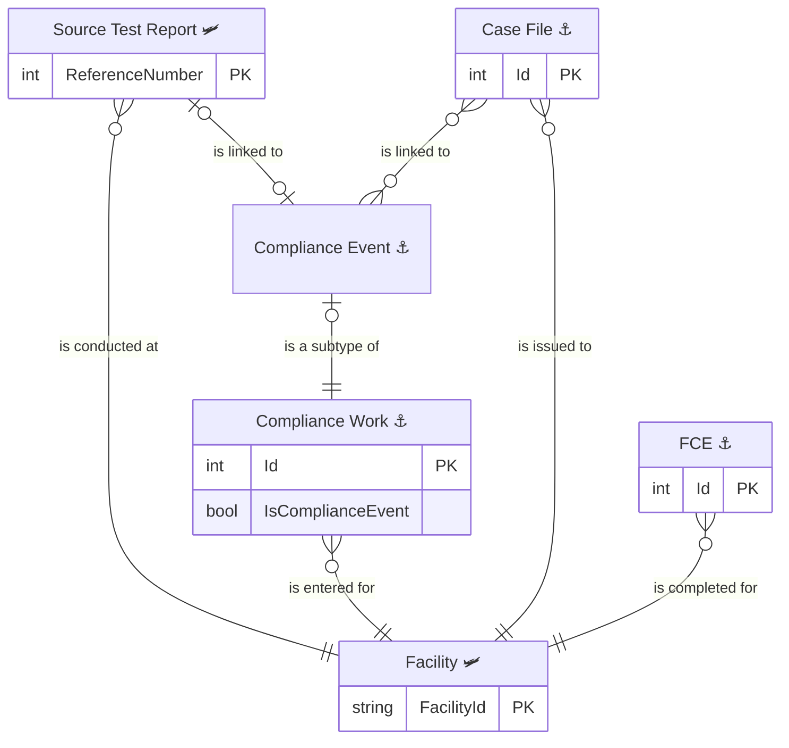

# Compliance Monitoring and Enforcement Relationships

## Entities

### Air Web App

- Full Compliance Evaluation (FCE)
- Compliance Work
    - Compliance Event (a subset of Compliance Work)
        - Annual Compliance Certification (ACC)
        - Inspection
        - Risk Management Plan Inspection
        - Source Test Compliance Review
        - Report
    - Notification
    - Permit revocation
- Case File
    - Enforcement Action

### External Data Retrieved from IAIP

- Facility
- Source Test Report

## Entity Relationship Diagram

**Key:** 
⚓ - Air Web entities 
🛩️ - External data (from the IAIP service)

```mermaid
erDiagram
    FAC["Facility 🛩️"] {
        string FacilityId PK
    }

    TST["Source Test Report 🛩️"] {
        int ReferenceNumber PK
    }

    FCE["FCE ⚓"] {
        int Id PK
    }

    CME["Compliance Event ⚓"]

    WRK["Compliance Work ⚓"] {
        int Id PK
        bool IsComplianceEvent
    }

    ENF["Case File ⚓"] {
        int Id PK
    }

    TST }o--|| FAC: "is conducted at"
    WRK }o--|| FAC: "is entered for"
    ENF }o--|| FAC: "is issued to"
    FCE }o--|| FAC: "is completed for"
    TST |o--o| CME: "is linked to"
    CME |o--|| WRK: "is a subtype of"
    ENF }o--o{ CME: "is linked to"

```
