# Compliance Monitoring and Enforcement Relationships

## Entities

### Retrieved from IAIP

- FAC: Facility
- TST: Source Test Report (Performance Test/Stack Test)

### Migrated into the Air Web app

- FCE: Full Compliance Evaluation (FCE)
- WRK: Work Entry
    - CME: Compliance Event (a subset of Work Entries)
        - ACC: Annual Compliance Certification (ACC)
        - INS: Inspection
        - RMP: Risk Management Plan Inspection
        - STR: Source Test Compliance Review
        - REP: Report
    - NOT: Notification
    - REV: Permit revocation (formerly a type of Notification)
- ENF: Enforcement Case File

## Entity Relationship Diagrams

**Key:** 
🔗 - Many-to-many linkage table 
⚓ - Primary entities 
🛩️ - External data (from the IAIP service)

```mermaid
erDiagram
    FAC["Facility 🛩️"] {
        string FacilityId PK
    }

    TST["Source Test Report 🛩️"] {
        int ReferenceNumber PK
    }

    FCE["FCE ⚓"] {
        int Id PK
    }

    CME["Compliance Event"]

    WRK["Work Entry ⚓"] {
        int Id PK
        bool IsComplianceEvent
    }

    ENF["Enforcement Case File ⚓"] {
        int Id PK
    }

    TST }o--|| FAC: "is conducted at"
    WRK }o--|| FAC: "is entered for"
    ENF }o--|| FAC: "is issued to"
    FCE }o--|| FAC: "is completed for"
    TST |o--o| CME: "is linked to"
    CME |o--|| WRK: "is a subtype of"
    ENF }o--o{ CME: "is linked to"

```

