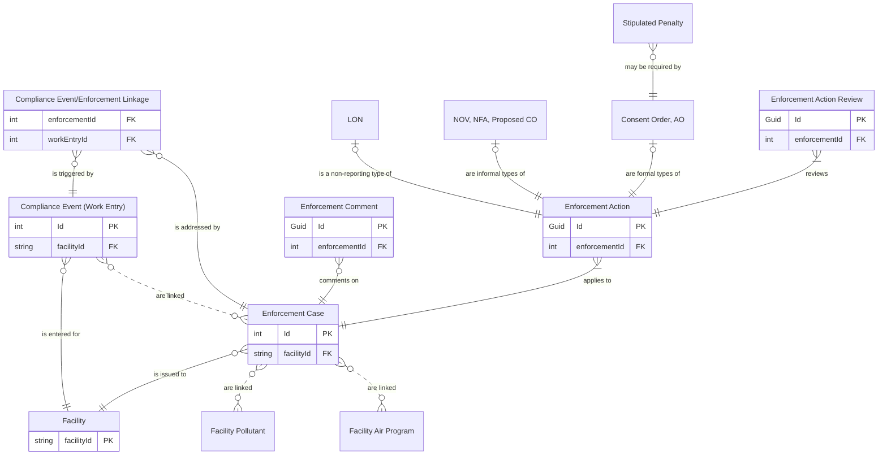

# Enforcement ERD

## IAIP table column mapping

All columns are from the `SSCP_AUDITEDENFORCEMENT` table.

| Column                     | Type          | Migrate | Enforcement Case        | Enforcement Action |
|----------------------------|---------------|:-------:|-------------------------|--------------------|
| STRENFORCEMENTNUMBER       | numeric(10)   |    ✓    | Id                      |                    |
| STRTRACKINGNUMBER          | numeric(10)   |    ✗    |                         |                    |
| STRAIRSNUMBER              | varchar(12)   |    ✓    | FacilityId              |                    |
| STRENFORCEMENTFINALIZED    | varchar(5)    |    ✓    | IsClosed, Status        |                    |
| DATENFORCEMENTFINALIZED    | datetime2(0)  |    ✓    | ClosedDate              |                    |
| NUMSTAFFRESPONSIBLE        | float         |    ✓    | ResponsibleStaff        |                    |
| STRSTATUS                  | varchar(5)    |         |                         |                    |
| STRACTIONTYPE              | varchar(15)   |         |                         |                    |
| STRGENERALCOMMENTS         | varchar(4000) |    ✓    | Notes                   |                    |
| STRDISCOVERYDATE           | varchar(5)    |    ✓    | DiscoveryDate           |                    |
| DATDISCOVERYDATE           | datetime2(0)  |    ✓    | DiscoveryDate           |                    |
| STRDAYZERO                 | varchar(5)    |    ✓    | DayZero                 |                    |
| DATDAYZERO                 | datetime2(0)  |    ✓    | DayZero                 |                    |
| STRHPV                     | varchar(15)   |    ✓    | ViolationTypeId         |                    |
| STRPOLLUTANTS              | varchar(4000) |    ✓    | Pollutants, AirPrograms |                    |
| STRPOLLUTANTSTATUS         | varchar(2)    |    ✗    |                         |                    |
| STRLONTOUC                 | varchar(5)    |         |                         |                    |
| DATLONTOUC                 | datetime2(0)  |         |                         |                    |
| STRLONSENT                 | varchar(5)    |         |                         |                    |
| DATLONSENT                 | datetime2(0)  |         |                         |                    |
| STRLONRESOLVED             | varchar(5)    |    ✓    | Status                  |                    |
| DATLONRESOLVED             | datetime2(0)  |         |                         |                    |
| STRLONCOMMENTS             | varchar(4000) |         |                         |                    |
| STRLONRESOLVEDENFORCEMENT  | varchar(5)    |         |                         |                    |
| STRNOVTOUC                 | varchar(5)    |         |                         |                    |
| DATNOVTOUC                 | datetime2(0)  |         |                         |                    |
| STRNOVTOPM                 | varchar(5)    |         |                         |                    |
| DATNOVTOPM                 | datetime2(0)  |         |                         |                    |
| STRNOVSENT                 | varchar(5)    |         |                         |                    |
| DATNOVSENT                 | datetime2(0)  |         |                         |                    |
| STRNOVRESPONSERECEIVED     | varchar(5)    |         |                         |                    |
| DATNOVRESPONSERECEIVED     | datetime2(0)  |         |                         |                    |
| STRNFATOUC                 | varchar(5)    |         |                         |                    |
| DATNFATOUC                 | datetime2(0)  |         |                         |                    |
| STRNFATOPM                 | varchar(5)    |         |                         |                    |
| DATNFATOPM                 | datetime2(0)  |         |                         |                    |
| STRNFALETTERSENT           | varchar(5)    |    ✓    | Status                  |                    |
| DATNFALETTERSENT           | datetime2(0)  |         |                         |                    |
| STRNOVCOMMENT              | varchar(4000) |         |                         |                    |
| STRNOVRESOLVEDENFORCEMENT  | varchar(5)    |         |                         |                    |
| STRCOTOUC                  | varchar(5)    |         |                         |                    |
| DATCOTOUC                  | datetime2(0)  |         |                         |                    |
| STRCOTOPM                  | varchar(5)    |         |                         |                    |
| DATCOTOPM                  | datetime2(0)  |         |                         |                    |
| STRCOPROPOSED              | varchar(5)    |         |                         |                    |
| DATCOPROPOSED              | datetime2(0)  |         |                         |                    |
| STRCORECEIVEDFROMCOMPANY   | varchar(5)    |         |                         |                    |
| DATCORECEIVEDFROMCOMPANY   | datetime2(0)  |         |                         |                    |
| STRCORECEIVEDFROMDIRECTOR  | varchar(5)    |         |                         |                    |
| DATCORECEIVEDFROMDIRECTOR  | datetime2(0)  |         |                         |                    |
| STRCOEXECUTED              | varchar(5)    |    ✓    | Status                  |                    |
| DATCOEXECUTED              | datetime2(0)  |         |                         |                    |
| STRCONUMBER                | varchar(255)  |         |                         |                    |
| STRCORESOLVED              | varchar(5)    |    ✓    | Status                  |                    |
| DATCORESOLVED              | datetime2(0)  |         |                         |                    |
| STRCOPENALTYAMOUNT         | varchar(20)   |         |                         |                    |
| STRCOPENALTYAMOUNTCOMMENTS | varchar(4000) |         |                         |                    |
| STRCOCOMMENT               | varchar(4000) |         |                         |                    |
| STRSTIPULATEDPENALTY       | varchar(3)    |         |                         |                    |
| STRCORESOLVEDENFORCEMENT   | varchar(5)    |         |                         |                    |
| STRAOEXECUTED              | varchar(5)    |    ✓    | Status                  |                    |
| DATAOEXECUTED              | datetime2(0)  |         |                         |                    |
| STRAOAPPEALED              | varchar(5)    |         |                         |                    |
| DATAOAPPEALED              | datetime2(0)  |         |                         |                    |
| STRAORESOLVED              | varchar(5)    |    ✓    | Status                  |                    |
| DATAORESOLVED              | datetime2(0)  |         |                         |                    |
| STRAOCOMMENT               | varchar(4000) |         |                         |                    |
| STRAFSKEYACTIONNUMBER      | varchar(5)    |    ✓    | AfsKeyActionNumber      |                    |
| STRAFSNOVSENTNUMBER        | varchar(5)    |         |                         |                    |
| STRAFSNOVRESOLVEDNUMBER    | varchar(5)    |         |                         |                    |
| STRAFSCOPROPOSEDNUMBER     | varchar(5)    |         |                         |                    |
| STRAFSCOEXECUTEDNUMBER     | varchar(5)    |         |                         |                    |
| STRAFSCORESOLVEDNUMBER     | varchar(5)    |         |                         |                    |
| STRAFSAOTOAGNUMBER         | varchar(5)    |         |                         |                    |
| STRAFSCIVILCOURTNUMBER     | varchar(5)    |         |                         |                    |
| STRAFSAORESOLVEDNUMBER     | varchar(5)    |         |                         |                    |
| STRMODIFINGPERSON          | varchar(3)    |    ✓    | UpdatedById             | UpdatedById        |
| DATMODIFINGDATE            | datetime2(0)  |    ✓    | UpdatedAt               | UpdatedAt          |
| ICIS_STATUSIND             | varchar       |         |                         |                    |
| IsDeleted                  | bit           |    ✓    | IsDeleted               |                    |
