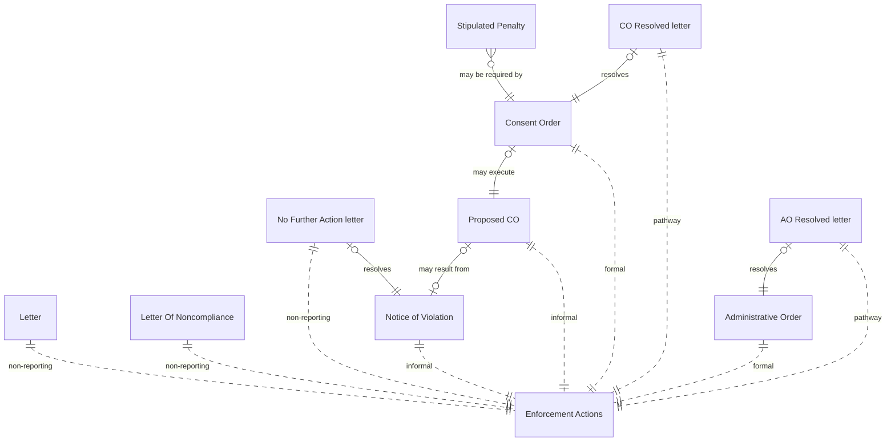

# Enforcement ERD

† See next diagram for Enforcement Actions. 
‡ Pollutants & Air Programs are combined on the graph but are tracked separately.

### Enforcement Action Relationships

* "Non-reporting" actions are not reported to ICIS-Air.
* "Informal" actions are reported to ICIS-Air as "Informal Enforcement Actions."
* "Formal" actions are reported to ICIS-Air as "Formal Enforcement Actions."
* "Pathway" actions are reported to ICIS-Air as "Case File Pathway Activities."

## IAIP table column mapping

Columns from the `SSCP_AUDITEDENFORCEMENT` table:

| Column                     | Type          | Migrate | Case File               | Enforcement Action          | Action Review     |
|----------------------------|---------------|:-------:|-------------------------|-----------------------------|-------------------|
| STRENFORCEMENTNUMBER       | numeric(10)   |    ✓    | Id                      | CaseFile                    |                   |
| STRTRACKINGNUMBER          | numeric(10)   |    ✗    |                         |                             |                   |
| STRAIRSNUMBER              | varchar(12)   |    ✓    | FacilityId              |                             |                   |
| STRENFORCEMENTFINALIZED    | varchar(5)    |    ✓    | IsClosed, Status        |                             |                   |
| DATENFORCEMENTFINALIZED    | datetime2(0)  |    ✓    | ClosedDate              |                             |                   |
| NUMSTAFFRESPONSIBLE        | float         |    ✓    | ResponsibleStaff        | ResponsibleStaff            |                   |
| STRSTATUS                  | varchar(5)    |    ✗    |                         |                             |                   |
| STRACTIONTYPE              | varchar(15)   |    ✗    |                         |                             |                   |
| STRGENERALCOMMENTS         | varchar(4000) |    ✓    | Notes                   |                             |                   |
| STRDISCOVERYDATE           | varchar(5)    |    ✓    | DiscoveryDate           |                             |                   |
| DATDISCOVERYDATE           | datetime2(0)  |    ✓    | DiscoveryDate           |                             |                   |
| STRDAYZERO                 | varchar(5)    |    ✓    | DayZero                 |                             |                   |
| DATDAYZERO                 | datetime2(0)  |    ✓    | DayZero                 |                             |                   |
| STRHPV                     | varchar(15)   |    ✓    | ViolationTypeId         |                             |                   |
| STRPOLLUTANTS              | varchar(4000) |    ✓    | Pollutants, AirPrograms |                             |                   |
| STRPOLLUTANTSTATUS         | varchar(2)    |    ✗    |                         |                             |                   |
| STRLONTOUC                 | varchar(5)    |    ✓    |                         |                             | Status            |
| DATLONTOUC                 | datetime2(0)  |    ✓    |                         |                             | DateRequested     |
| STRLONSENT                 | varchar(5)    |    ✓    |                         | Approved, Issued            | Completed, Status |
| DATLONSENT                 | datetime2(0)  |    ✓    |                         | IssueDate                   | DateCompleted     |
| STRLONRESOLVED             | varchar(5)    |    ✓    | Status, IsClosed        |                             |                   |
| DATLONRESOLVED             | datetime2(0)  |    ✓    | ClosedDate              |                             |                   |
| STRLONCOMMENTS             | varchar(4000) |    ✓    |                         | Notes                       |                   |
| STRLONRESOLVEDENFORCEMENT  | varchar(5)    |    ✗    |                         |                             |                   |
| STRNOVTOUC                 | varchar(5)    |    ✓    |                         |                             | Status            |
| DATNOVTOUC                 | datetime2(0)  |    ✓    |                         |                             | DateRequested     |
| STRNOVTOPM                 | varchar(5)    |    ✓    |                         |                             | Status            |
| DATNOVTOPM                 | datetime2(0)  |    ✓    |                         |                             | DateRequested     |
| STRNOVSENT                 | varchar(5)    |    ✓    |                         | Approved, Issued            | Completed, Status |
| DATNOVSENT                 | datetime2(0)  |    ✓    |                         | IssueDate                   | DateCompleted     |
| STRNOVRESPONSERECEIVED     | varchar(5)    |    ✓    |                         | ResponseReceived            |                   |
| DATNOVRESPONSERECEIVED     | datetime2(0)  |    ✓    |                         | ResponseReceived            |                   |
| STRNFATOUC                 | varchar(5)    |    ✓    |                         |                             | Status            |
| DATNFATOUC                 | datetime2(0)  |    ✓    |                         |                             | DateRequested     |
| STRNFATOPM                 | varchar(5)    |    ✓    |                         |                             | Status            |
| DATNFATOPM                 | datetime2(0)  |    ✓    |                         |                             | DateRequested     |
| STRNFALETTERSENT           | varchar(5)    |    ✓    | Status                  | Approved, Issued            | Completed, Status |
| DATNFALETTERSENT           | datetime2(0)  |    ✓    |                         | IssueDate                   | DateCompleted     |
| STRNOVCOMMENT              | varchar(4000) |    ✓    |                         | Notes                       |                   |
| STRNOVRESOLVEDENFORCEMENT  | varchar(5)    |    ✗    |                         |                             |                   |
| STRCOTOUC                  | varchar(5)    |    ✓    |                         |                             | Status            |
| DATCOTOUC                  | datetime2(0)  |    ✓    |                         |                             | DateRequested     |
| STRCOTOPM                  | varchar(5)    |    ✓    |                         |                             | Status            |
| DATCOTOPM                  | datetime2(0)  |    ✓    |                         |                             | DateRequested     |
| STRCOPROPOSED              | varchar(5)    |    ✓    | Status                  |                             |                   |
| DATCOPROPOSED              | datetime2(0)  |    ✓    |                         | IssueDate                   |                   |
| STRCORECEIVEDFROMCOMPANY   | varchar(5)    |    ✗    |                         |                             |                   |
| DATCORECEIVEDFROMCOMPANY   | datetime2(0)  |    ✓    |                         | ReceivedFromFacility        |                   |
| STRCORECEIVEDFROMDIRECTOR  | varchar(5)    |    ✗    |                         |                             |                   |
| DATCORECEIVEDFROMDIRECTOR  | datetime2(0)  |    ✓    |                         | ReceivedFromDirectorsOffice |                   |
| STRCOEXECUTED              | varchar(5)    |    ✓    | Status                  |                             |                   |
| DATCOEXECUTED              | datetime2(0)  |    ✓    |                         | Executed                    |                   |
| STRCONUMBER                | varchar(255)  |    ✓    |                         | OrderNumber                 |                   |
| STRCORESOLVED              | varchar(5)    |    ✓    | Status                  |                             |                   |
| DATCORESOLVED              | datetime2(0)  |    ✓    |                         | OrderResolved               |                   |
| STRCOPENALTYAMOUNT         | varchar(20)   |    ✓    |                         | PenaltyAmount               |                   |
| STRCOPENALTYAMOUNTCOMMENTS | varchar(4000) |    ✓    |                         | PenaltyComment              |                   |
| STRCOCOMMENT               | varchar(4000) |    ✓    |                         | Notes                       |                   |
| STRSTIPULATEDPENALTY       | varchar(3)    |    ✗    |                         |                             |                   |
| STRCORESOLVEDENFORCEMENT   | varchar(5)    |    ✗    |                         |                             |                   |
| STRAOEXECUTED              | varchar(5)    |    ✓    | Status                  |                             |                   |
| DATAOEXECUTED              | datetime2(0)  |    ✓    |                         |                             |                   |
| STRAOAPPEALED              | varchar(5)    |    ✓    |                         |                             |                   |
| DATAOAPPEALED              | datetime2(0)  |    ✓    |                         |                             |                   |
| STRAORESOLVED              | varchar(5)    |    ✓    | Status                  |                             |                   |
| DATAORESOLVED              | datetime2(0)  |    ✓    |                         |                             |                   |
| STRAOCOMMENT               | varchar(4000) |    ✓    |                         | Notes                       |                   |
| STRAFSKEYACTIONNUMBER      | varchar(5)    |    ✓    | AfsKeyActionNumber      |                             |                   |
| STRAFSNOVSENTNUMBER        | varchar(5)    |    ✓    |                         | ActionNumber                |                   |
| STRAFSNOVRESOLVEDNUMBER    | varchar(5)    |    ✗    |                         |                             |                   |
| STRAFSCOPROPOSEDNUMBER     | varchar(5)    |    ✓    |                         | ActionNumber                |                   |
| STRAFSCOEXECUTEDNUMBER     | varchar(5)    |    ✓    |                         | ActionNumber                |                   |
| STRAFSCORESOLVEDNUMBER     | varchar(5)    |    ✗    |                         |                             |                   |
| STRAFSAOTOAGNUMBER         | varchar(5)    |    ✓    |                         | ActionNumber                |                   |
| STRAFSCIVILCOURTNUMBER     | varchar(5)    |    ✗    |                         |                             |                   |
| STRAFSAORESOLVEDNUMBER     | varchar(5)    |    ✗    |                         |                             |                   |
| STRMODIFINGPERSON          | varchar(3)    |    ✓    | UpdatedById             | UpdatedById                 |                   |
| DATMODIFINGDATE            | datetime2(0)  |    ✓    | UpdatedAt               | UpdatedAt                   |                   |
| ICIS_STATUSIND             | varchar       |    ✓    | DataExchangeStatus      | DataExchangeStatus          |                   |
| IsDeleted                  | bit           |    ✓    | IsDeleted               |                             |                   |

Columns from the `SSCPENFORCEMENTSTIPULATED` table:

| Column                        | Type          | Migrate | Destination              |
|-------------------------------|---------------|:-------:|--------------------------|
| STRENFORCEMENTNUMBER          | varchar(10)   |    ✓    | ConsentOrder             |
| STRENFORCEMENTKEY             | varchar(3)    |    ✓    | SortOrder                |
| STRSTIPULATEDPENALTY          | varchar(10)   |    ✓    | StipulatedPenaltyAmount  |
| STRSTIPULATEDPENALTYCOMMENTS  | varchar(4000) |    ✓    | StipulatedPenaltyComment |
| STRAFSSTIPULATEDPENALTYNUMBER | varchar(5)    |    ✗    |                          |
| STRMODIFINGPERSON             | varchar(3)    |    ✓    | UpdatedById              |
| DATMODIFINGDATE               | datetime2(0)  |    ✓    | UpdatedAt                |
