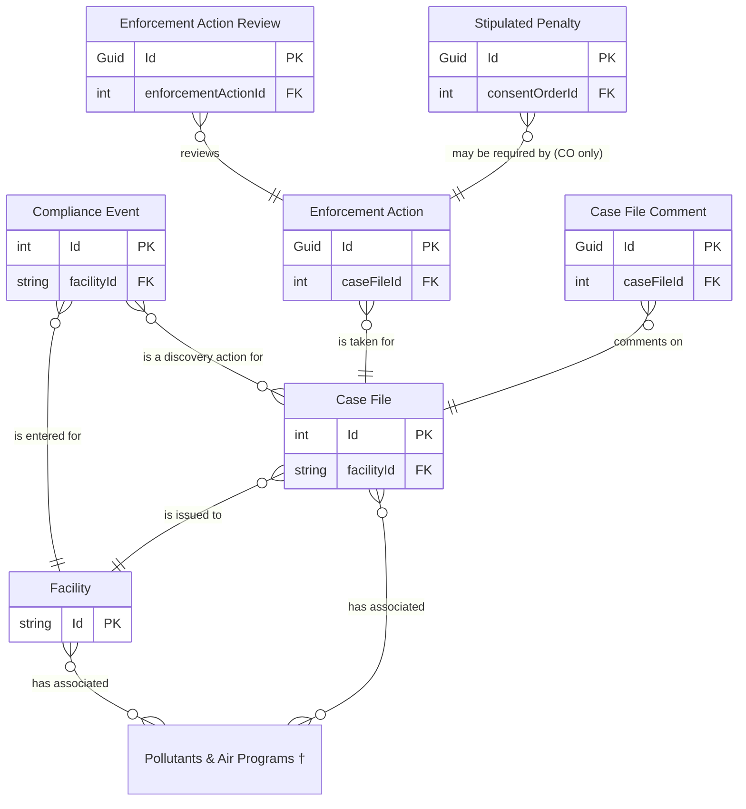

# Enforcement ERD

## Enforcement Entities

† Pollutants & Air Programs are combined on the graph but are tracked separately.

### Enforcement Action Types

* Administrative Order
* Combined NOV/NFA Letter
* Consent Order
* Informational Letter
* Letter of Noncompliance
* No Further Action Letter
* Notice of Violation
* Order Resolved  (CO or AO)
* Proposed Consent Order

## IAIP table column mapping

Columns from the `SSCP_AUDITEDENFORCEMENT` table:

| Column                     | Type          | Migrate | Case File                 | Enforcement Action              |
|----------------------------|---------------|:-------:|---------------------------|---------------------------------|
| STRENFORCEMENTNUMBER       | numeric(10)   |    ✓    | Id                        | CaseFileId                      |
| STRTRACKINGNUMBER          | numeric(10)   |    ✗    |                           |                                 |
| STRAIRSNUMBER              | varchar(12)   |    ✓    | FacilityId                |                                 |
| STRENFORCEMENTFINALIZED    | varchar(5)    |    ✓    | IsClosed, CaseFileStatus  |                                 |
| DATENFORCEMENTFINALIZED    | datetime2(0)  |    ✓    | ClosedDate                |                                 |
| NUMSTAFFRESPONSIBLE        | float         |    ✓    | ResponsibleStaff          |                                 |
| STRSTATUS                  | varchar(5)    |    ✗    |                           |                                 |
| STRACTIONTYPE              | varchar(15)   |    ✗    |                           |                                 |
| STRGENERALCOMMENTS         | varchar(4000) |    ✓    | Notes                     |                                 |
| STRDISCOVERYDATE           | varchar(5)    |    ✗    |                           |                                 |
| DATDISCOVERYDATE           | datetime2(0)  |    ✓    | DiscoveryDate             |                                 |
| STRDAYZERO                 | varchar(5)    |    ✗    |                           |                                 |
| DATDAYZERO                 | datetime2(0)  |    ✓    | DayZero                   |                                 |
| STRHPV                     | varchar(15)   |    ✓    | ViolationTypeCode         |                                 |
| STRPOLLUTANTS              | varchar(4000) |    ✓    | PollutantIds, AirPrograms |                                 |
| STRPOLLUTANTSTATUS         | varchar(2)    |    ✗    |                           |                                 |
| STRLONTOUC                 | varchar(5)    |    ✗    |                           |                                 |
| DATLONTOUC                 | datetime2(0)  |    ✓    |                           | (LON) Notes                     |
| STRLONSENT                 | varchar(5)    |    ✓    | CaseFileStatus            | Status                          |
| DATLONSENT                 | datetime2(0)  |    ✓    | EnforcementDate           | (LON) IssueDate                 |
| STRLONRESOLVED             | varchar(5)    |    ✗    |                           |                                 |
| DATLONRESOLVED             | datetime2(0)  |    ✓    |                           | (LON) ResolvedDate              |
| STRLONCOMMENTS             | varchar(4000) |    ✓    |                           | (LON) Notes                     |
| STRLONRESOLVEDENFORCEMENT  | varchar(5)    |    ✗    |                           |                                 |
| STRNOVTOUC                 | varchar(5)    |    ✗    |                           |                                 |
| DATNOVTOUC                 | datetime2(0)  |    ✓    |                           | (NOV, NOVNFA) Notes             |
| STRNOVTOPM                 | varchar(5)    |    ✗    |                           |                                 |
| DATNOVTOPM                 | datetime2(0)  |    ✓    |                           | (NOV, NOVNFA) Notes             |
| STRNOVSENT                 | varchar(5)    |    ✓    | CaseFileStatus            | Status                          |
| DATNOVSENT                 | datetime2(0)  |    ✓    | EnforcementDate           | (NOV, NOVNFA) IssueDate         |
| STRNOVRESPONSERECEIVED     | varchar(5)    |    ✓    |                           | (NOV, NOVNFA) ResponseRequested |
| DATNOVRESPONSERECEIVED     | datetime2(0)  |    ✓    |                           | (NOV, NOVNFA) ResponseReceived  |
| STRNFATOUC                 | varchar(5)    |    ✗    |                           |                                 |
| DATNFATOUC                 | datetime2(0)  |    ✓    |                           | (NFA) Notes                     |
| STRNFATOPM                 | varchar(5)    |    ✗    |                           |                                 |
| DATNFATOPM                 | datetime2(0)  |    ✓    |                           | (NFA) Notes                     |
| STRNFALETTERSENT           | varchar(5)    |    ✓    |                           | Status                          |
| DATNFALETTERSENT           | datetime2(0)  |    ✓    |                           | (NFA) IssueDate                 |
| STRNOVCOMMENT              | varchar(4000) |    ✓    |                           | (NOV) Notes                     |
| STRNOVRESOLVEDENFORCEMENT  | varchar(5)    |    ✗    |                           |                                 |
| STRCOTOUC                  | varchar(5)    |    ✗    |                           |                                 |
| DATCOTOUC                  | datetime2(0)  |    ✓    |                           | (PCO) Notes                     |
| STRCOTOPM                  | varchar(5)    |    ✗    |                           |                                 |
| DATCOTOPM                  | datetime2(0)  |    ✓    |                           | (PCO) Notes                     |
| STRCOPROPOSED              | varchar(5)    |    ✓    | CaseFileStatus            | Status                          |
| DATCOPROPOSED              | datetime2(0)  |    ✓    | EnforcementDate           | IssueDate                       |
| STRCORECEIVEDFROMCOMPANY   | varchar(5)    |    ✗    |                           |                                 |
| DATCORECEIVEDFROMCOMPANY   | datetime2(0)  |    ✓    |                           | ReceivedFromFacility            |
| STRCORECEIVEDFROMDIRECTOR  | varchar(5)    |    ✗    |                           |                                 |
| DATCORECEIVEDFROMDIRECTOR  | datetime2(0)  |    ✓    |                           | ReceivedFromDirectorsOffice     |
| STRCOEXECUTED              | varchar(5)    |    ✓    | CaseFileStatus            | Status                          |
| DATCOEXECUTED              | datetime2(0)  |    ✓    | EnforcementDate           | ExecutedDate, IssueDate         |
| STRCONUMBER                | varchar(255)  |    ✓    |                           | OrderId, OrderNumber            |
| STRCORESOLVED              | varchar(5)    |    ✗    |                           |                                 |
| DATCORESOLVED              | datetime2(0)  |    ✓    |                           | ResolvedDate                    |
| STRCOPENALTYAMOUNT         | varchar(20)   |    ✓    |                           | PenaltyAmount                   |
| STRCOPENALTYAMOUNTCOMMENTS | varchar(4000) |    ✓    |                           | PenaltyComment                  |
| STRCOCOMMENT               | varchar(4000) |    ✓    |                           | (CO) Notes                      |
| STRSTIPULATEDPENALTY       | varchar(3)    |    ✗    |                           |                                 |
| STRCORESOLVEDENFORCEMENT   | varchar(5)    |    ✗    |                           |                                 |
| STRAOEXECUTED              | varchar(5)    |    ✓    | CaseFileStatus            |                                 |
| DATAOEXECUTED              | datetime2(0)  |    ✓    | EnforcementDate           | ExecutedDate, IssueDate         |
| STRAOAPPEALED              | varchar(5)    |    ✗    |                           |                                 |
| DATAOAPPEALED              | datetime2(0)  |    ✓    |                           | AppealedDate                    |
| STRAORESOLVED              | varchar(5)    |    ✗    |                           |                                 |
| DATAORESOLVED              | datetime2(0)  |    ✓    |                           | ResolvedDate                    |
| STRAOCOMMENT               | varchar(4000) |    ✓    |                           | Notes                           |
| STRAFSKEYACTIONNUMBER      | varchar(5)    |    ✓    | ActionNumber              |                                 |
| STRAFSNOVSENTNUMBER        | varchar(5)    |    ✓    |                           | ActionNumber                    |
| STRAFSNOVRESOLVEDNUMBER    | varchar(5)    |    ✗    |                           |                                 |
| STRAFSCOPROPOSEDNUMBER     | varchar(5)    |    ✓    |                           | ActionNumber                    |
| STRAFSCOEXECUTEDNUMBER     | varchar(5)    |    ✓    |                           | ActionNumber                    |
| STRAFSCORESOLVEDNUMBER     | varchar(5)    |    ✗    |                           |                                 |
| STRAFSAOTOAGNUMBER         | varchar(5)    |    ✓    |                           | ActionNumber                    |
| STRAFSCIVILCOURTNUMBER     | varchar(5)    |    ✗    |                           |                                 |
| STRAFSAORESOLVEDNUMBER     | varchar(5)    |    ✗    |                           |                                 |
| STRMODIFINGPERSON          | varchar(3)    |    ✓    | UpdatedById               | UpdatedById                     |
| DATMODIFINGDATE            | datetime2(0)  |    ✓    | UpdatedAt                 | UpdatedAt                       |
| ICIS_STATUSIND             | varchar       |    ✓    | DataExchangeStatus        | DataExchangeStatus              |
| IsDeleted                  | bit           |    ✓    | IsDeleted                 |                                 |

Columns from the `SSCP_EnforcementEvents` table:

| Column            | Type      | Migrate | Destination                                |
|-------------------|-----------|:-------:|--------------------------------------------|
| EnforcementNumber | int       |    ✓    | CaseFileComplianceEvents.CaseFileId        |
| TrackingNumber    | int       |    ✓    | CaseFileComplianceEvents.ComplianceEventId |
| CreatedDate       | datetime2 |    ✗    |                                            |
| CreatedBy         | int       |    ✗    |                                            |

Columns from the `SSCPENFORCEMENTSTIPULATED` table:

| Column                        | Type          | Migrate | Destination               |
|-------------------------------|---------------|:-------:|---------------------------|
| STRENFORCEMENTNUMBER          | varchar(10)   |    ✓    | ConsentOrderId (indirect) |
| STRENFORCEMENTKEY             | varchar(3)    |    ✗    |                           |
| STRSTIPULATEDPENALTY          | varchar(10)   |    ✓    | StipulatedPenaltyAmount   |
| STRSTIPULATEDPENALTYCOMMENTS  | varchar(4000) |    ✓    | StipulatedPenaltyComment  |
| STRAFSSTIPULATEDPENALTYNUMBER | varchar(5)    |    ✗    |                           |
| STRMODIFINGPERSON             | varchar(3)    |    ✓    | CreatedById               |
| DATMODIFINGDATE               | datetime2(0)  |    ✓    | CreatedAt, ReceivedDate   |
