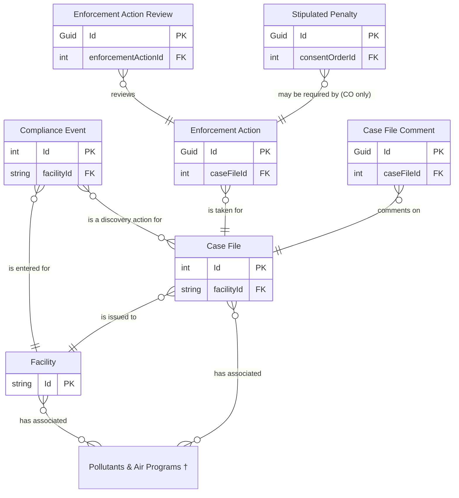

# Enforcement ERD

## Enforcement Entities

```mermaid
erDiagram
    FAC["Facility"] {
        string Id PK
    }

    CWE["Compliance Event"] {
        int Id PK
        string facilityId FK
    }

    ENF["Case File"] {
        int Id PK
        string facilityId FK
    }

    CTE["Case File Comment"] {
        Guid Id PK
        int caseFileId FK
    }

    ACT["Enforcement Action"] {
        Guid Id PK
        int caseFileId FK
    }

    POL["Pollutants & Air Programs †"]

    REV["Enforcement Action Review"] {
        Guid Id PK
        int enforcementActionId FK
    }

    STP["Stipulated Penalty"] {
        Guid Id PK
        int consentOrderId FK
    }

    FAC }o--o{ POL: "has associated"
    ENF }o--o{ POL: "has associated"
    CWE }o--o{ ENF: "is a discovery action for"
    CWE }o--|| FAC: "is entered for"
    ACT }o--|| ENF: "is taken for"
    CTE }o--|| ENF: "comments on"
    ENF }o--|| FAC: "is issued to"
    REV }o--|| ACT: "reviews"
    STP }o--|| ACT: "may be required by (CO only)"
```

† Pollutants & Air Programs are combined on the graph but are tracked separately.

### Enforcement Action Types

* Administrative Order
* Combined NOV/NFA Letter
* Consent Order
* Informational Letter
* Letter of Noncompliance
* No Further Action Letter
* Notice of Violation
* Proposed Consent Order
