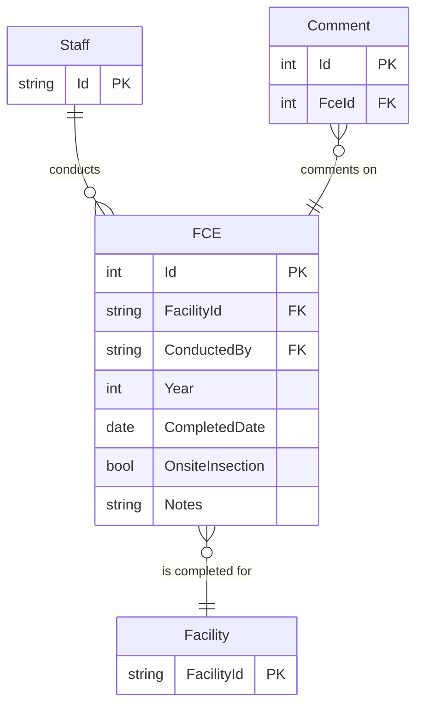

# Full Compliance Evaluation (FCE) ERD

## IAIP table column mapping

| Column                          | Type          | Migrate | Destination                 |
|---------------------------------|---------------|:-------:|-----------------------------|
| SSCPFCEMASTER.STRFCENUMBER      | numeric(10)   |    ✓    | Id                          |
| SSCPFCEMASTER.STRAIRSNUMBER     | varchar(12)   |    ✓    | FacilityId                  |
| SSCPFCEMASTER.STRMODIFINGPERSON | varchar(3)    |    ✗    | CreatedById and UpdatedById |
| SSCPFCEMASTER.DATMODIFINGDATE   | datetime2(0)  |    ✗    | CreatedAt and UpdatedAt     |
| SSCPFCEMASTER.ICIS_STATUSIND    | varchar       |    ✓    | DataExchangeStatus          |
| SSCPFCEMASTER.IsDeleted         | bit           |    ✓    | IsDeleted                   |
| SSCPFCE.STRFCESTATUS            | varchar(5)    |    ✗    | *none*                      |
| SSCPFCE.STRREVIEWER             | varchar(3)    |    ✓    | ReviewedBy                  |
| SSCPFCE.DATFCECOMPLETED         | datetime2(0)  |    ✓    | CompletedDate               |
| SSCPFCE.STRFCECOMMENTS          | varchar(4000) |    ✓    | Notes                       |
| SSCPFCE.STRMODIFINGPERSON       | varchar(3)    |    ✓    | *none*                      |
| SSCPFCE.DATMODIFINGDATE         | datetime2(0)  |    ✓    | *none*                      |
| SSCPFCE.STRSITEINSPECTION       | varchar(5)    |    ✓    | OnsiteInspection            |
| SSCPFCE.STRFCEYEAR              | varchar(4)    |    ✓    | Year                        |
