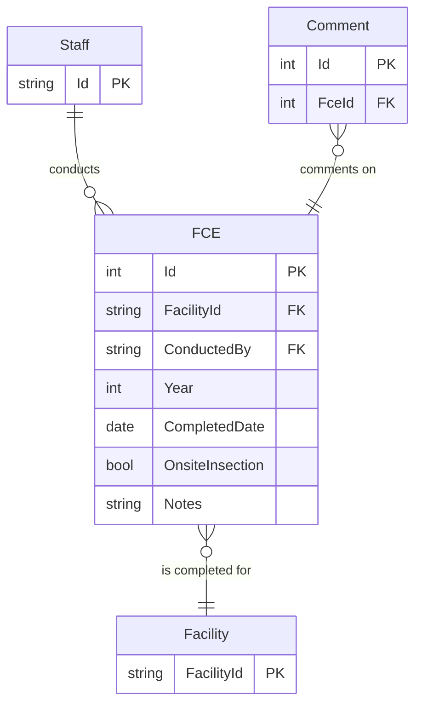

# Full Compliance Evaluation (FCE) ERD

```mermaid
erDiagram
    FAC["Facility"] {
        string FacilityId PK
    }

    FCE["FCE"] {
        int Id PK
        string FacilityId FK
        string ConductedBy FK
        int Year
        date CompletedDate
        bool OnsiteInsection
        string Notes
    }

    STF["Staff"] {
        string Id PK
    }

    CTE["Comment"] {
        int Id PK
        int FceId FK
    }

    FCE }o--|| FAC: "is completed for"
    STF ||--o{ FCE: "conducts"
    CTE }o--|| FCE: "comments on"

```
