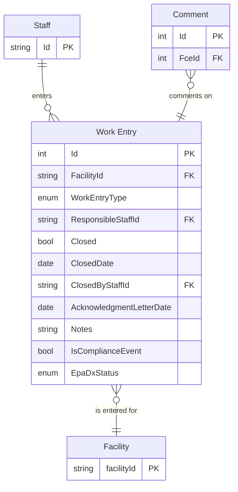
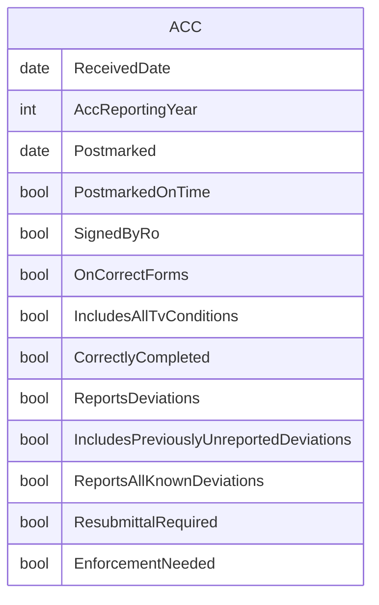
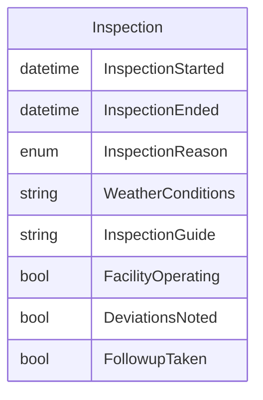
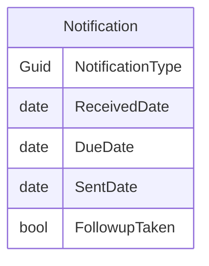
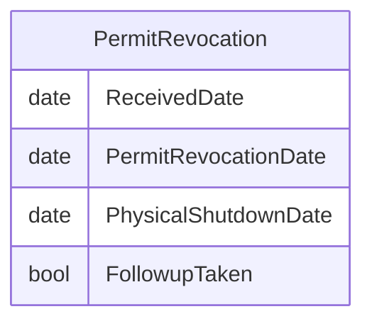
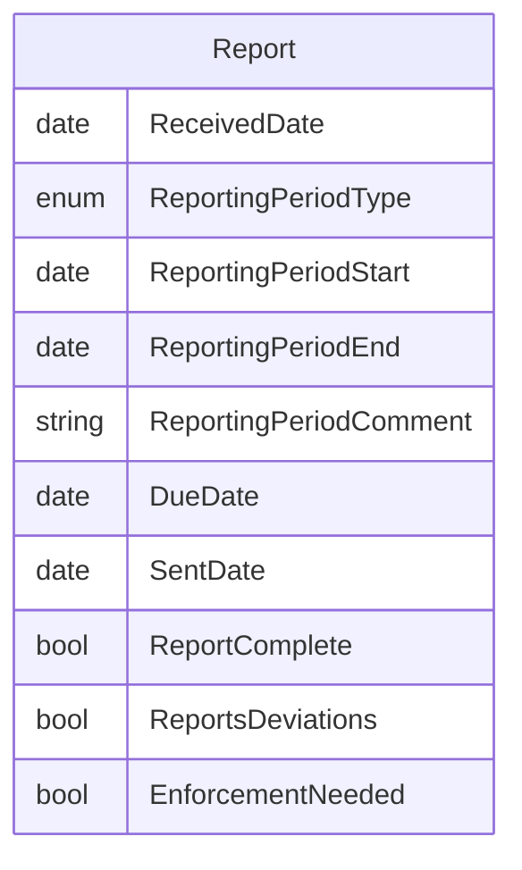
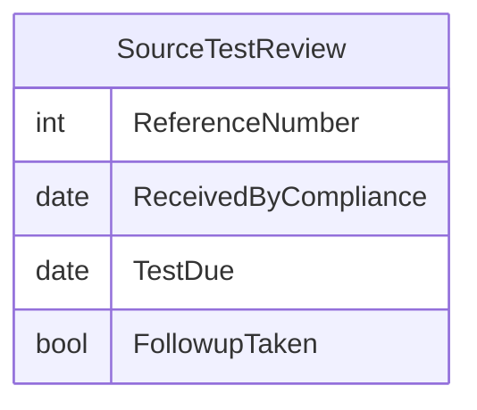

# Compliance Work Entry ERDs

## Base ERD

### IAIP table column mapping

| Column                                    | Type         | Migrate | Destination              |
|-------------------------------------------|--------------|:-------:|--------------------------|
| SSCPITEMMASTER.STRTRACKINGNUMBER          | numeric(10)  |    ✓    | Id                       |
| SSCPITEMMASTER.STRAIRSNUMBER              | varchar(12)  |    ✓    | FacilityId               |
| SSCPITEMMASTER.DATRECEIVEDDATE            | datetime2(0) |    ✓    | *subtypes*               |
| SSCPITEMMASTER.STREVENTTYPE               | varchar(3)   |    ✓    | WorkEntryType            |
| SSCPITEMMASTER.STRRESPONSIBLESTAFF        | varchar(3)   |    ✓    | ResponsibleStaffId       |
| SSCPITEMMASTER.DATCOMPLETEDATE            | datetime2(0) |    ✓    | Closed, ClosedDate       |
| SSCPITEMMASTER.STRMODIFINGPERSON          | varchar(3)   |    ✓    | base.UpdatedById         |
| SSCPITEMMASTER.DATMODIFINGDATE            | datetime2(0) |    ✓    | base.UpdatedAt           |
| SSCPITEMMASTER.STRDELETE                  | varchar(5)   |    ✓    | base.IsDeleted           |
| SSCPITEMMASTER.DATACKNOLEDGMENTLETTERSENT | datetime2(0) |    ✓    | AcknowledgmentLetterDate |
| SSCPITEMMASTER.DATINFORMATIONREQUESTDATE  | datetime2(0) |    ✗    | *none*                   |
| SSCPITEMMASTER.ICIS_STATUSIND             | varchar      |    ✓    | DataExchangeStatus       |

## ACC columns

### IAIP table column mapping

| Column                              | Type          | Migrate | Destination                            |
|-------------------------------------|---------------|:-------:|----------------------------------------|
| SSCPITEMMASTER.DATRECEIVEDDATE      | datetime2(0)  |    ✓    | ReceivedDate                           |
| SSCPACCS.STRSUBMITTALNUMBER         | numeric(3)    |    ✗    | *none*                                 |
| SSCPACCS.STRPOSTMARKEDONTIME        | varchar(5)    |    ✓    | PostmarkedOnTime                       |
| SSCPACCS.DATPOSTMARKDATE            | datetime2(0)  |    ✓    | Postmarked                             |
| SSCPACCS.STRSIGNEDBYRO              | varchar(5)    |    ✓    | SignedByRo                             |
| SSCPACCS.STRCORRECTACCFORMS         | varchar(5)    |    ✓    | OnCorrectForms                         |
| SSCPACCS.STRTITLEVCONDITIONSLISTED  | varchar(5)    |    ✓    | IncludesAllTvConditions                |
| SSCPACCS.STRACCCORRECTLYFILLEDOUT   | varchar(5)    |    ✓    | CorrectlyCompleted                     |
| SSCPACCS.STRREPORTEDDEVIATIONS      | varchar(5)    |    ✓    | ReportsDeviations                      |
| SSCPACCS.STRDEVIATIONSUNREPORTED    | varchar(5)    |    ✓    | IncludesPreviouslyUnreportedDeviations |
| SSCPACCS.STRCOMMENTS                | varchar(4000) |    ✓    | base.Notes                             |
| SSCPACCS.STRENFORCEMENTNEEDED       | varchar(5)    |    ✓    | EnforcementNeeded                      |
| SSCPACCS.STRMODIFINGPERSON          | varchar(3)    |    ?    | base.UpdatedById                       |
| SSCPACCS.DATMODIFINGDATE            | datetime2(0)  |    ?    | base.UpdatedAt                         |
| SSCPACCS.DATACCREPORTINGYEAR        | datetime2(0)  |    ✓    | AccReportingYear                       |
| SSCPACCS.STRKNOWNDEVIATIONSREPORTED | varchar(5)    |    ✓    | ReportsAllKnownDeviations              |
| SSCPACCS.STRRESUBMITTALREQUIRED     | varchar(5)    |    ✓    | ResubmittalRequired                    |

## Inspection/RMP Inspection columns

### IAIP table column mapping

| Column                                        | Type          | Migrate | Destination          |
|-----------------------------------------------|---------------|:-------:|----------------------|
| SSCPITEMMASTER.DATRECEIVEDDATE                | datetime2(0)  |    ✗    | *none*               |
| SSCPINSPECTIONS.DATINSPECTIONDATESTART        | datetime2(0)  |    ✓    | InspectionStarted    |
| SSCPINSPECTIONS.DATINSPECTIONDATEEND          | datetime2(0)  |    ✓    | InspectionEnded      |
| SSCPINSPECTIONS.STRINSPECTIONREASON           | varchar(35)   |    ✓    | InspectionReason     |
| SSCPINSPECTIONS.STRWEATHERCONDITIONS          | varchar(100)  |    ✓    | WeatherConditions    |
| SSCPINSPECTIONS.STRINSPECTIONGUIDE            | varchar(100)  |    ✓    | InspectionGuide      |
| SSCPINSPECTIONS.STRFACILITYOPERATING          | varchar(5)    |    ✓    | WasFacilityOperating |
| SSCPINSPECTIONS.STRINSPECTIONCOMPLIANCESTATUS | varchar(35)   |    ✓    | DeviationsNoted      |
| SSCPINSPECTIONS.STRINSPECTIONCOMMENTS         | varchar(4000) |    ✓    | base.Notes           |
| SSCPINSPECTIONS.STRINSPECTIONFOLLOWUP         | varchar(5)    |    ✓    | FollowupTaken        |
| SSCPINSPECTIONS.STRMODIFINGPERSON             | varchar(3)    |    ?    | base.UpdatedById     |
| SSCPINSPECTIONS.DATMODIFINGDATE               | datetime2(0)  |    ?    | base.UpdatedAt       |

## Notification columns

### IAIP table column mapping

| Column                                     | Type          | Migrate | Destination      |
|--------------------------------------------|---------------|:-------:|------------------|
| SSCPITEMMASTER.DATRECEIVEDDATE             | datetime2(0)  |    ✓    | ReceivedDate     |
| SSCPNOTIFICATIONS.DATNOTIFICATIONDUE       | datetime2(0)  |    ✓    | DueDate          |
| SSCPNOTIFICATIONS.STRNOTIFICATIONDUE       | varchar(5)    |    ✓    | DueDate          |
| SSCPNOTIFICATIONS.DATNOTIFICATIONSENT      | datetime2(0)  |    ✓    | SentDate         |
| SSCPNOTIFICATIONS.STRNOTIFICATIONSENT      | varchar(10)   |    ✓    | SentDate         |
| SSCPNOTIFICATIONS.STRNOTIFICATIONTYPE      | varchar(2)    |    ✓    | NotificationType |
| SSCPNOTIFICATIONS.STRNOTIFICATIONTYPEOTHER | varchar(100)  |    ✓    | base.Notes       |
| SSCPNOTIFICATIONS.STRNOTIFICATIONCOMMENT   | varchar(4000) |    ✓    | base.Notes       |
| SSCPNOTIFICATIONS.STRNOTIFICATIONFOLLOWUP  | varchar(5)    |    ✓    | FollowupTaken    |
| SSCPNOTIFICATIONS.STRMODIFINGPERSON        | varchar(3)    |    ?    | base.UpdatedById |
| SSCPNOTIFICATIONS.DATMODIFINGDATE          | datetime2(0)  |    ?    | base.UpdatedAt   |

## Permit Revocation columns

### IAIP table column mapping

| Column                                     | Type          | Migrate | Destination          |
|--------------------------------------------|---------------|:-------:|----------------------|
| SSCPITEMMASTER.DATRECEIVEDDATE             | datetime2(0)  |    ✓    | ReceivedDate         |
| SSCPNOTIFICATIONS.DATNOTIFICATIONDUE       | datetime2(0)  |    ✓    | PermitRevocationDate |
| SSCPNOTIFICATIONS.STRNOTIFICATIONDUE       | varchar(5)    |    ✗    | *none*               |
| SSCPNOTIFICATIONS.DATNOTIFICATIONSENT      | datetime2(0)  |    ✓    | PhysicalShutdownDate |
| SSCPNOTIFICATIONS.STRNOTIFICATIONSENT      | varchar(10)   |    ✓    | PhysicalShutdownDate |
| SSCPNOTIFICATIONS.STRNOTIFICATIONTYPE      | varchar(2)    |    ✗    | *none*               |
| SSCPNOTIFICATIONS.STRNOTIFICATIONTYPEOTHER | varchar(100)  |    ✓    | base.Notes           |
| SSCPNOTIFICATIONS.STRNOTIFICATIONCOMMENT   | varchar(4000) |    ✓    | base.Notes           |
| SSCPNOTIFICATIONS.STRNOTIFICATIONFOLLOWUP  | varchar(5)    |    ✓    | FollowupTaken        |
| SSCPNOTIFICATIONS.STRMODIFINGPERSON        | varchar(3)    |    ?    | base.UpdatedById     |
| SSCPNOTIFICATIONS.DATMODIFINGDATE          | datetime2(0)  |    ?    | base.UpdatedAt       |

## Report columns

### IAIP table column mapping

| Column                                 | Type          | Migrate | Destination            |
|----------------------------------------|---------------|:-------:|------------------------|
| SSCPITEMMASTER.DATRECEIVEDDATE         | datetime2(0)  |    ✓    | ReceivedDate           |
| SSCPREPORTS.STRREPORTPERIOD            | varchar(25)   |    ✓    | ReportingPeriodType    |
| SSCPREPORTS.DATREPORTINGPERIODSTART    | datetime2(0)  |    ✓    | ReportingPeriodStart   |
| SSCPREPORTS.DATREPORTINGPERIODEND      | datetime2(0)  |    ✓    | ReportingPeriodEnd     |
| SSCPREPORTS.STRREPORTINGPERIODCOMMENTS | varchar(4000) |    ✓    | ReportingPeriodComment |
| SSCPREPORTS.DATREPORTDUEDATE           | datetime2(0)  |    ✓    | DueDate                |
| SSCPREPORTS.DATSENTBYFACILITYDATE      | datetime2(0)  |    ✓    | SentDate               |
| SSCPREPORTS.STRCOMPLETESTATUS          | varchar(5)    |    ✓    | ReportComplete         |
| SSCPREPORTS.STRENFORCEMENTNEEDED       | varchar(5)    |    ✓    | EnforcementNeeded      |
| SSCPREPORTS.STRSHOWDEVIATION           | varchar(5)    |    ✓    | ReportsDeviations      |
| SSCPREPORTS.STRGENERALCOMMENTS         | varchar(4000) |    ✓    | base.Notes             |
| SSCPREPORTS.STRMODIFINGPERSON          | varchar(3)    |    ?    | base.UpdatedById       |
| SSCPREPORTS.DATMODIFINGDATE            | datetime2(0)  |    ?    | base.UpdatedAt         |
| SSCPREPORTS.STRSUBMITTALNUMBER         | varchar(3)    |    ✗    | *none*                 |

## Source Test Review columns

### IAIP table column mapping

| Column                                | Type          | Migrate | Destination          |
|---------------------------------------|---------------|:-------:|----------------------|
| SSCPITEMMASTER.DATRECEIVEDDATE        | datetime2(0)  |    ✓    | ReceivedByCompliance |
| SSCPTESTREPORTS.STRREFERENCENUMBER    | varchar(9)    |    ✓    | ReferenceNumber      |
| SSCPTESTREPORTS.DATTESTREPORTDUE      | datetime2(0)  |    ✓    | TestDue              |
| SSCPTESTREPORTS.STRTESTREPORTCOMMENTS | varchar(4000) |    ✓    | base.Notes           |
| SSCPTESTREPORTS.STRTESTREPORTFOLLOWUP | varchar(5)    |    ✓    | FollowupTaken        |
| SSCPTESTREPORTS.STRMODIFINGPERSON     | varchar(3)    |    ?    | base.UpdatedById     |
| SSCPTESTREPORTS.DATMODIFINGDATE       | datetime2(0)  |    ?    | base.UpdatedAt       |
