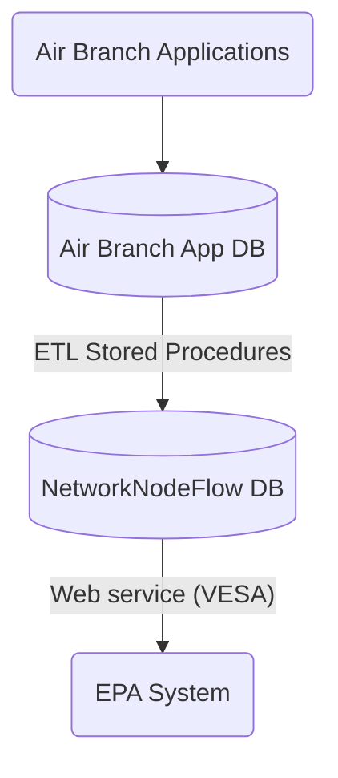

# EPA Data Exchange

## Data flow

* ETLs runs daily.
* Web service runs weekly.

## Data elements

### Compliance Monitoring

| Compliance Work Type                  | Not reportable | Reportable |
|---------------------------------------|:--------------:|:----------:|
| Annual Compliance Certification (ACC) |                |     ✓      |
| Inspection                            |                |     ✓      |
| Notification                          |       ✓        |            |
| Permit revocation                     |       ✓        |            |
| Report                                |                |     ✓      |
| Risk Management Plan (RMP) Inspection |       ✓        |            |
| Source Test Compliance Review         |                |     ✓      |

### Enforcement

| Enforcement Action type    | Not reportable | Reportable as "informal" | Reportable as "formal" |
|----------------------------|:--------------:|:------------------------:|:----------------------:|
| Letter of Noncompliance    |       ✓        |                          |                        |
| Notice of Violation        |                |            ✓             |                        |
| No Further Action Letter   |      ✓ *       |                          |                        |
| Combined NOV/NFA Letter    |                |            ✓             |                        |
| Proposed Consent Order     |                |            ✓             |                        |
| Consent Order              |                |                          |           ✓            |
| Administrative Order       |                |                          |           ✓            |
| Order Resolved  (CO or AO) |       ✓        |                          |                        |
| Informational Letter       |       ✓        |                          |                        |

* NFA letters are not reportable on their own but are sent as Addressing & Resolving Pathway Activities.

#### ICIS-Air Pathway Activities

| Item                          | ICIS-Air Data Type    | Pathway Activity                  |
|-------------------------------|-----------------------|-----------------------------------|
| Case File                     | Case File             | *N/A*                             |
| Compliance Event              | Compliance Monitoring | Discovery                         |
| Notice of Violation           | Informal EA           | Notification                      |
| No Further Action Letter      | *N/A*                 | Addressing/Resolving              |
| Combined NOV/NFA Letter       | Informal EA           | Notification/Addressing/Resolving |
| Proposed Consent Order        | Informal EA           | Notification                      |
| Consent Order                 | Formal EA             | Addressing                        |
| Consent Order Resolved        | *N/A*                 | Resolving                         |
| Administrative Order          | Formal EA             | Addressing                        |
| Administrative Order Resolved | *N/A*                 | Resolving                         |

## IAIP Database objects

| Database          | Object                                                       | Type     | Repo        | Use                          | Modification         |
|-------------------|--------------------------------------------------------------|----------|-------------|------------------------------|----------------------|
| `AIRBRANCH`       | `dbo.APBAIRPROGRAMPOLLUTANTS / TG_ICIS_AIRPROGRAMPOLLUTANTS` | Trigger  | `airbranch` | Update status for facility   | None                 |
| `AIRBRANCH`       | `dbo.APBAIRPROGRAMPOLLUTANTS / TG_ICIS_POLLUTANT`            | Trigger  | `airbranch` | Update status for facility   | None                 |
| `AIRBRANCH`       | `dbo.APBFACILITYINFORMATION / TG_APBFACILITYINFORMATION`     | Trigger  | `airbranch` | Update status for facility   | None                 |
| `AIRBRANCH`       | `dbo.APBHEADERDATA / TG_APBHEADERDATA`                       | Trigger  | `airbranch` | Update status for facility   | None                 |
| `AIRBRANCH`       | `dbo.APBHEADERDATA / TG_ICIS_POLLUTANT_CLASS_CODE`           | Trigger  | `airbranch` | Update status for facility   | None                 |
| `AIRBRANCH`       | `dbo.APBHEADERDATA / TG_ICIS_PROGRAMCODE`                    | Trigger  | `airbranch` | Manage facility data         | None                 |
| `AIRBRANCH`       | `dbo.APBMASTERAIRS / TG_APBMASTERAIRS_DEL`                   | Trigger  | `airbranch` | Update status for facility   | None                 |
| `AIRBRANCH`       | `dbo.APBSUBPARTDATA / TG_ICIS_SUBPART_CODE_DEL`              | Trigger  | `airbranch` | Update status for facility   | None                 |
| `AIRBRANCH`       | `dbo.APBSUBPARTDATA / TG_ICIS_SUBPART_CODE`                  | Trigger  | `airbranch` | Update status for facility   | None                 |
| `AIRBRANCH`       | `dbo.APBSUPPLAMENTALDATA / TG_ICIS_APBSUPPLAMENTALDATA`      | Trigger  | `airbranch` | Update CMS status            | None                 |
| `AIRBRANCH`       | `dbo.ICIS_CASEFILE_CODES / TG_ICIS_CASEFILE_CODES`           | Trigger  | `airbranch` | Manage case file data        | *Refactor*           |
| `AIRBRANCH`       | `dbo.ICIS_EDT_ERRORS / TG_ICIS_EDT_ERRORS_ASSIGNEUSER`       | Trigger  | `airbranch` | IAIP EDT tools               | None                 |
| `AIRBRANCH`       | `dbo.ICIS_ERRORID`                                           | Sequence | `airbranch` | IAIP EDT tools               | None                 |
| `AIRBRANCH`       | `dbo.ICIS_POLLUTANT / TG_ICIS_POLLUTANT_DEL`                 | Trigger  | `airbranch` | Manage facility data         | None                 |
| `AIRBRANCH`       | `dbo.ICIS_POLLUTANT / TG_ICIS_POLLUTANT_INSERT`              | Trigger  | `airbranch` | Manage facility data         | None                 |
| `AIRBRANCH`       | `dbo.ICIS_PROGRAM_CODES / TG_ICIS_PROGRAM_CODES_DEL`         | Trigger  | `airbranch` | Manage facility data         | None                 |
| `AIRBRANCH`       | `dbo.ISMPREPORTINFORMATION / TG_ICIS_ISMPREPORTINFORMATION`  | Trigger  | `airbranch` | Update status for compliance | *Refactor*           |
| `AIRBRANCH`       | `dbo.ISMPREPORTINFORMATION / TG_ISMPREPORTINFORMATION_DEL`   | Trigger  | `airbranch` | Update status for compliance | *Refactor*           |
| `AIRBRANCH`       | `dbo.SSCPACCS / TG_ICIS_SSCPACCS`                            | Trigger  | `airbranch` | Update status for compliance | *Obsolete - disable* |
| `AIRBRANCH`       | `dbo.SSCPFCE / TG_AFS_FCE`                                   | Trigger  | `airbranch` | Update status for compliance | *Obsolete - disable* |
| `AIRBRANCH`       | `dbo.SSCPFCE / TG_ICIS_SSCPFCE`                              | Trigger  | `airbranch` | Update status for compliance | *Obsolete - disable* |
| `AIRBRANCH`       | `dbo.SSCPFCEMASTER / TG_ICIS_SSCPFCEMASTER`                  | Trigger  | `airbranch` | Update status for compliance | *Obsolete - disable* |
| `AIRBRANCH`       | `dbo.SSCPFCEMASTER / TG_SSCPFCEMASTER_DEL`                   | Trigger  | `airbranch` | Update status for compliance | *Refactor*           |
| `AIRBRANCH`       | `dbo.SSCPINSPECTIONS / TG_ICIS_SSCPINSPECTIONS`              | Trigger  | `airbranch` | Update status for compliance | *Obsolete - disable* |
| `AIRBRANCH`       | `dbo.SSCPITEMMASTER / TG_ICIS_SSCPITEMMASTER`                | Trigger  | `airbranch` | Update status for compliance | *Obsolete - disable* |
| `AIRBRANCH`       | `dbo.SSCPITEMMASTER / TG_SSCPITEMMASTER_DEL`                 | Trigger  | `airbranch` | Update status for compliance | *Refactor*           |
| `AIRBRANCH`       | `dbo.SSCPTESTREPORTS / TG_ICIS_SSCPTESTREPORTS`              | Trigger  | `airbranch` | Update status for compliance | *Obsolete - disable* |
| `AIRBRANCH`       | `dbo.SSCP_AUDITEDENFORCEMENT / TG_ICIS_CASEFILE`             | Trigger  | `airbranch` | Manage case file data        | *Refactor*           |
| `AIRBRANCH`       | `dbo.SSCP_AUDITEDENFORCEMENT / TG_SSCP_AUDITEDENFORCEMENT`   | Trigger  | `airbranch` | Update status for compliance | *Refactor*           |
| `AIRBRANCH`       | `dbo.SSCP_EnforcementEvents / TG_SSCP_EnforcementEvents_DEL` | Trigger  | `airbranch` | Update status for compliance | *Refactor*           |
| `AIRBRANCH`       | `dbo.VW_ICIS_AIRFACILITY`                                    | View     | `airbranch` | Unused                       | Obsolete - ignore    |
| `AIRBRANCH`       | `dbo.VW_ICIS_CASEFILE`                                       | View     | `airbranch` | Used in staging              | *Rewrite*            |
| `AIRBRANCH`       | `dbo.VW_ICIS_COMPLIANCEMONITORING`                           | View     | `airbranch` | Used in staging              | *Rewrite*            |
| `AIRBRANCH`       | `dbo.VW_ICIS_ENFORCEMENTACTION`                              | View     | `airbranch` | Used in staging              | *Rewrite*            |
| `AIRBRANCH`       | `dbo.VW_ICIS_ID_REFERENCE`                                   | View     | `airbranch` | IAIP EDT tools               | *Rewrite*            |
| `AIRBRANCH`       | `etl.ICIS_AIRPROGRAM_DELETE`                                 | SProc    | `epa-dx`    | Stage new data               | None                 |
| `AIRBRANCH`       | `etl.ICIS_CASEFILE_DELETE`                                   | SProc    | `epa-dx`    | Stage new data               | *Rewrite*            |
| `AIRBRANCH`       | `etl.ICIS_CASEFILE_UPDATE`                                   | SProc    | `epa-dx`    | Stage new data               | *Rewrite*            |
| `AIRBRANCH`       | `etl.ICIS_CF2CM_DELETE`                                      | SProc    | `epa-dx`    | Stage new data               | *Rewrite*            |
| `AIRBRANCH`       | `etl.ICIS_CMS_DELETE`                                        | SProc    | `epa-dx`    | Stage new data               | None                 |
| `AIRBRANCH`       | `etl.ICIS_CMS_UPDATE`                                        | SProc    | `epa-dx`    | Stage new data               | None                 |
| `AIRBRANCH`       | `etl.ICIS_CM_DELETE`                                         | SProc    | `epa-dx`    | Stage new data               | *Rewrite*            |
| `AIRBRANCH`       | `etl.ICIS_CM_UPDATE`                                         | SProc    | `epa-dx`    | Stage new data               | *Rewrite*            |
| `AIRBRANCH`       | `etl.ICIS_EAMILESTONE_DELETE`                                | SProc    | `epa-dx`    | Stage new data               | *Rewrite*            |
| `AIRBRANCH`       | `etl.ICIS_FACILITY_DELETE`                                   | SProc    | `epa-dx`    | Stage new data               | None                 |
| `AIRBRANCH`       | `etl.ICIS_FACILITY_UPDATE`                                   | SProc    | `epa-dx`    | Stage new data               | None                 |
| `AIRBRANCH`       | `etl.ICIS_POLLUTANT_DELETE`                                  | SProc    | `epa-dx`    | Stage new data               | None                 |
| `AIRBRANCH`       | `etl.ICIS_Stage_All`                                         | SProc    | `epa-dx`    | Stage new data               | None                 |
| `AIRBRANCH`       | `etl.VW_AirProgramsWithSubparts`                             | View     | `epa-dx`    | Used in staging              | None                 |
| `AIRBRANCH`       | `iaip_facility.TriggerDataUpdateAtEPA`                       | SProc    | `airbranch` | Update status                | *Rewrite*            |
| `AIRBRANCH`       | `icis_edt.AssignErrors`                                      | SProc    | `airbranch` | IAIP EDT tools               | None                 |
| `AIRBRANCH`       | `icis_edt.GetErrorCounts`                                    | SProc    | `airbranch` | IAIP EDT tools               | None                 |
| `AIRBRANCH`       | `icis_edt.GetErrorDetail`                                    | SProc    | `airbranch` | IAIP EDT tools               | None                 |
| `AIRBRANCH`       | `icis_edt.GetErrorMessageDetail`                             | SProc    | `airbranch` | IAIP EDT tools               | None                 |
| `AIRBRANCH`       | `icis_edt.GetErrors`                                         | SProc    | `airbranch` | IAIP EDT tools               | None                 |
| `AIRBRANCH`       | `icis_edt.SetDefaultUser`                                    | SProc    | `airbranch` | IAIP EDT tools               | None                 |
| `AIRBRANCH`       | `icis_edt.SetResolvedStatus`                                 | SProc    | `airbranch` | IAIP EDT tools               | None                 |
| `NETWORKNODEFLOW` | `dbo.CountAllRecords`                                        | SProc    | `epa-dx`    | Auditing tool                | None                 |
| `NETWORKNODEFLOW` | `dbo.CountFacilityRecords`                                   | SProc    | `epa-dx`    | Auditing tool                | None                 |
| `NETWORKNODEFLOW` | `dbo.CountPendingRecords`                                    | SProc    | `epa-dx`    | Auditing tool                | None                 |
| `NETWORKNODEFLOW` | `dbo.SUBMISSIONSTATUS / TG_ICIS_EDT_ERRORS`                  | Trigger  | `epa-dx`    | Internal                     | None                 |
| `NETWORKNODEFLOW` | `dbo.SubmissionStatus / TG_ICIS_SubmissionStatus`            | Trigger  | `epa-dx`    | Internal                     | None                 |
