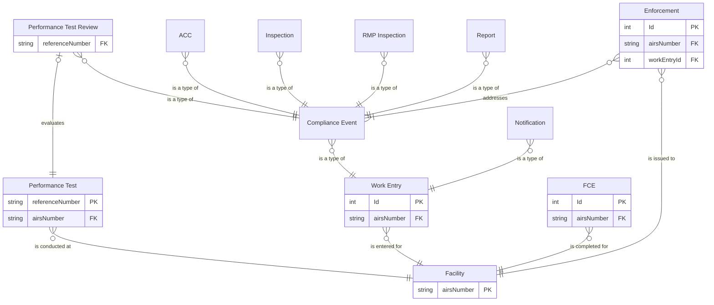

# Entity relationship diagram

## Entities

### Mirrored from IAIP

- F: Facility
- T: Performance Test

### Migrated into the Air Web app

- V: Full Compliance Evaluation (FCE)
- W: Work Entry
    - C: Compliance Event
        - A: Annual Compliance Certification (ACC)
        - I: Inspection
        - M: RMP Inspection
        - P: Performance Test Review
        - R: Report
    - N: Notification
    - X: Permit revocation †
- E: Enforcement

† Indicates a change in hierarchy compared to the IAIP.

## Diagram

