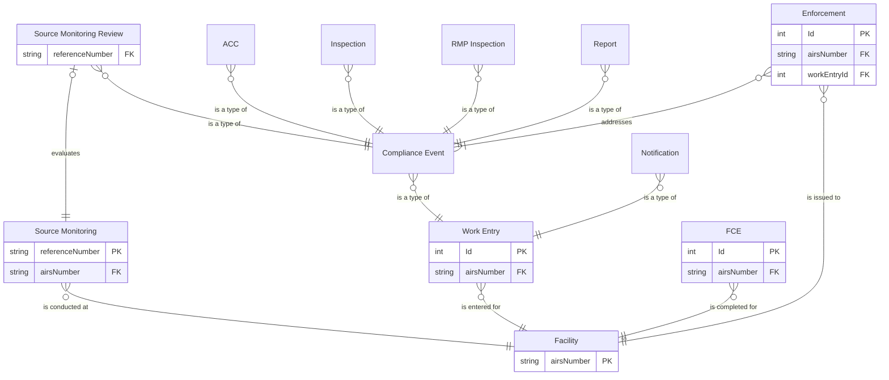

# Entity relationship diagram

## Entities

### Mirrored from IAIP

- FAC: Facility
- MON: Source Monitoring (Performance Test/Stack Test)

### Migrated into the Air Web app

- FCE: Full Compliance Evaluation (FCE)
- WRK: Work Entry
    - CME: Compliance Event
        - ACC: Annual Compliance Certification (ACC)
        - INS: Inspection
        - RMP: RMP Inspection
        - STR: Source Monitoring Review
        - REP: Report
    - NOT: Notification
    - PX: Permit revocation †
- ENF: Enforcement

† Indicates a change in hierarchy compared to the IAIP.

## SSCP Diagram

