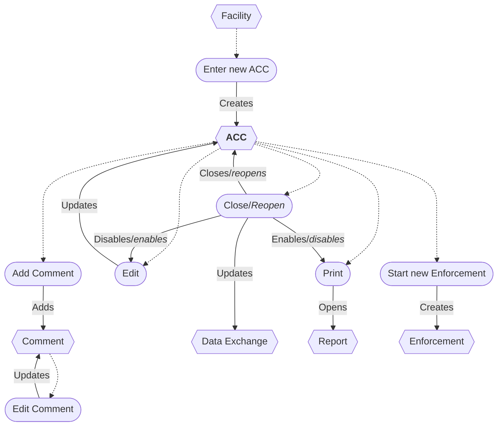

# Annual Compliance Certification (ACC) Workflow

* A new ACC can be entered from a Facility.
* The ACC can be edited while open.
* Additional comments can be added at any time.
* Closing an ACC disables updating and enables printing.
* Reopening an ACC enables updating and disables printing.
* Closing or Reopening an ACC updates the data exchange.
* The ACC report can be printed.
* Enforcement can be started from an ACC.
* An ACC can be deleted/restored *(not shown)*.
* Comments can be edited.
* A Comment can be deleted *(not shown)*.

