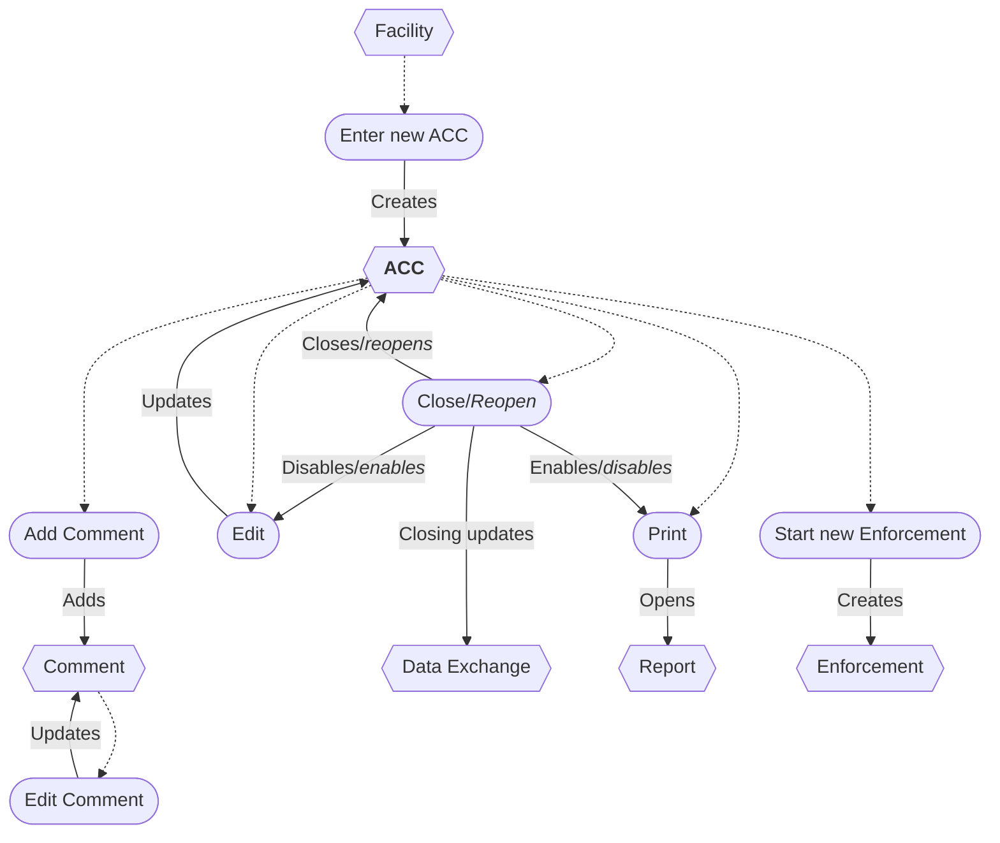
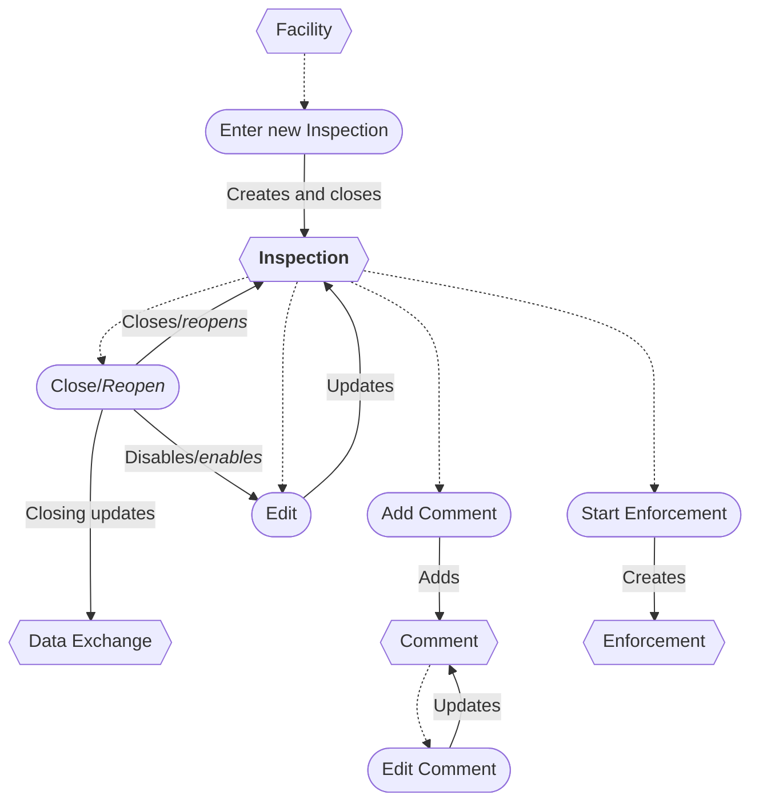
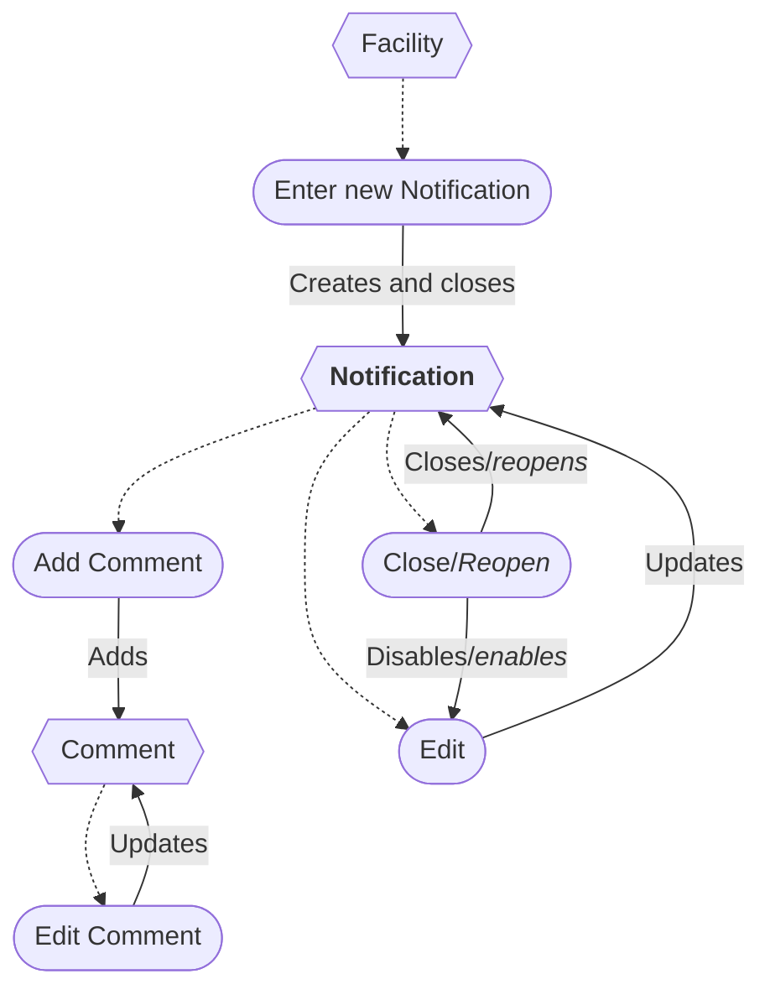
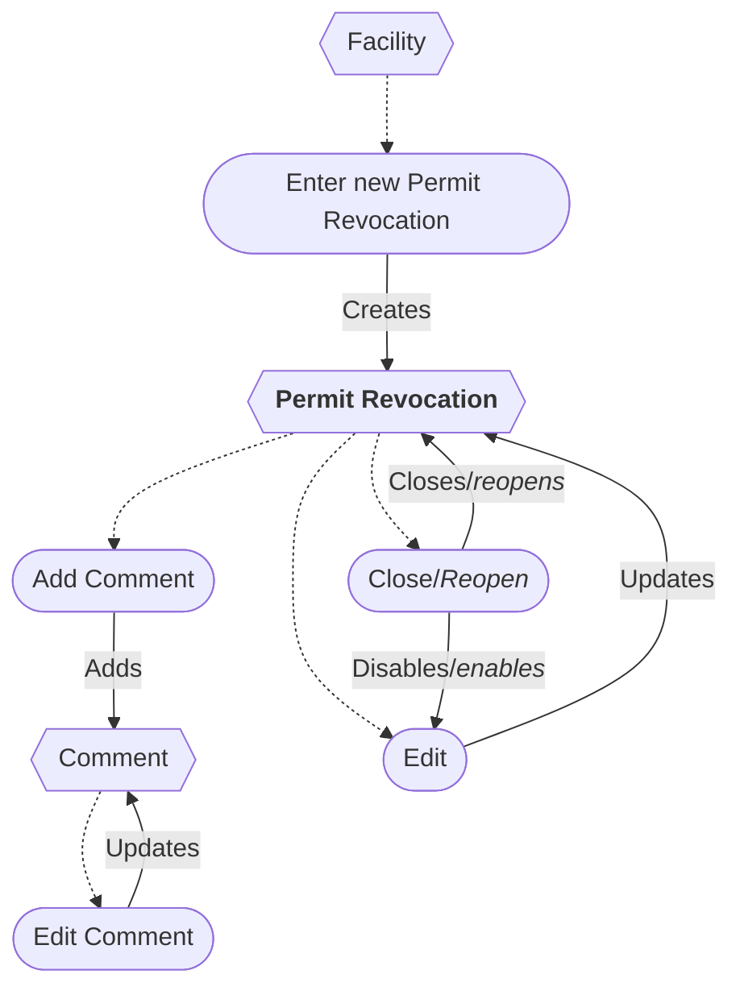
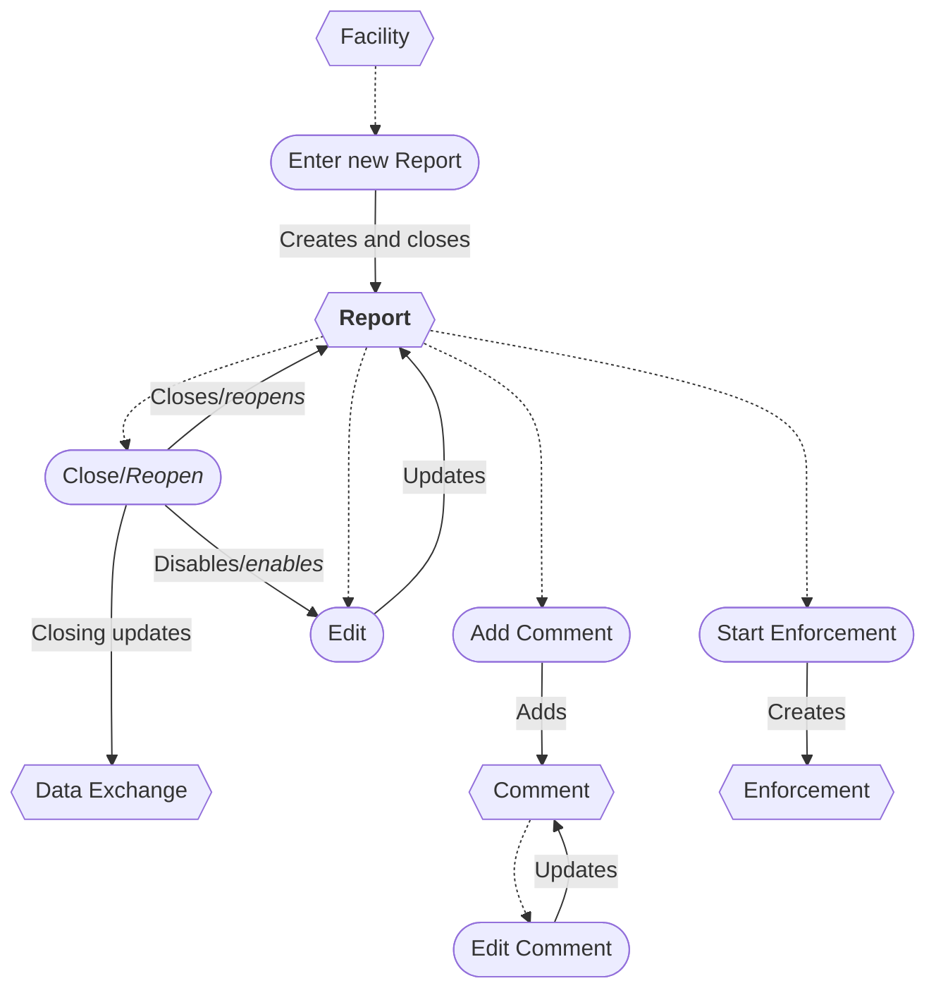
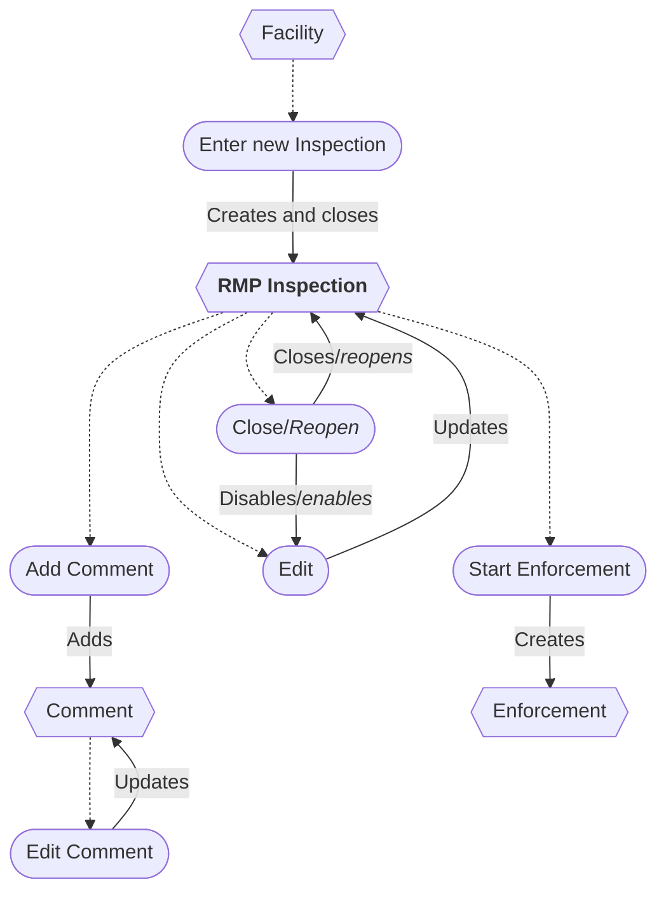
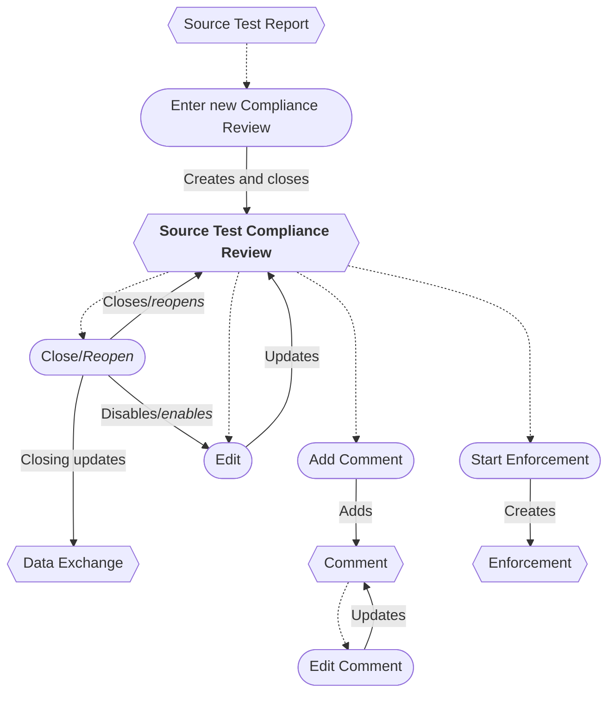

# Compliance Monitoring Workflows

## Compliance Work Types

| Compliance Work Type                  | Automatically Closed * | Compliance Event † | Data Exchange ‡ |
|---------------------------------------|:----------------------:|:------------------:|:---------------:|
| Annual Compliance Certification (ACC) |                        |         ✓          |        ✓        |
| Inspection                            |           ✓            |         ✓          |        ✓        |
| Notification                          |           ✓            |                    |                 |
| Permit revocation                     |                        |                    |                 |
| Report                                |           ✓            |         ✓          |        ✓        |
| Risk Management Plan (RMP) Inspection |           ✓            |         ✓          |                 |
| Source Test Compliance Review         |           ✓            |         ✓          |        ✓        |

* Indicates the Compliance Work entry is automatically closed when created (but can be reopened). 
† Indicates the Compliance Work entry is a Compliance Event (i.e., available as an enforcement discovery event). 
‡ Indicates a Compliance Event which is shared with the ICIS-Air Data Exchange.

### General Compliance Monitoring Workflow

* A new Compliance Work entry can be entered from a Facility.
* The entry can be edited if open.
    * Closing an entry disables editing.
    * Reopening an entry enables editing.
    * Some entries are automatically closed when they are first created.
* An entry can be deleted/restored *(not shown in diagrams)*.
* Comments can be added.
* A Comment can be deleted *(not shown)*.

### Compliance Event Workflow

* Some Compliance Work types are categorized as *Compliance Events.*
* Enforcement can be started from a Compliance Event.
* Compliance Events are shared with the Data Exchange (excluding RMP Inspections).

## Annual Compliance Certification (ACC) Workflow

* An ACC is a Compliance Event.
* An ACC report can be printed if closed.
    * Closing an ACC enables printing.
    * Reopening an ACC disables printing.

## Inspection Workflow

* An Inspection is a Compliance Event.
* An Inspection is automatically closed when created.

## Notification Workflow

* A Notification is automatically closed when created.

## Permit Revocation Workflow

## Report Workflow

* A Report is a Compliance Event.
* A Report is automatically closed when created.

## RMP Inspection Workflow

* An RMP Inspection is a Compliance Event but is not reportable to the Data Exchange.
* An RMP Inspection is automatically closed when created.

## Source Test Compliance Review Workflow

* A Source Test Compliance Review can only be entered from a Source Test Report (STR).
* A Source Test Compliance Review is a Compliance Event.
* A Source Test Compliance Review is automatically closed when created.

