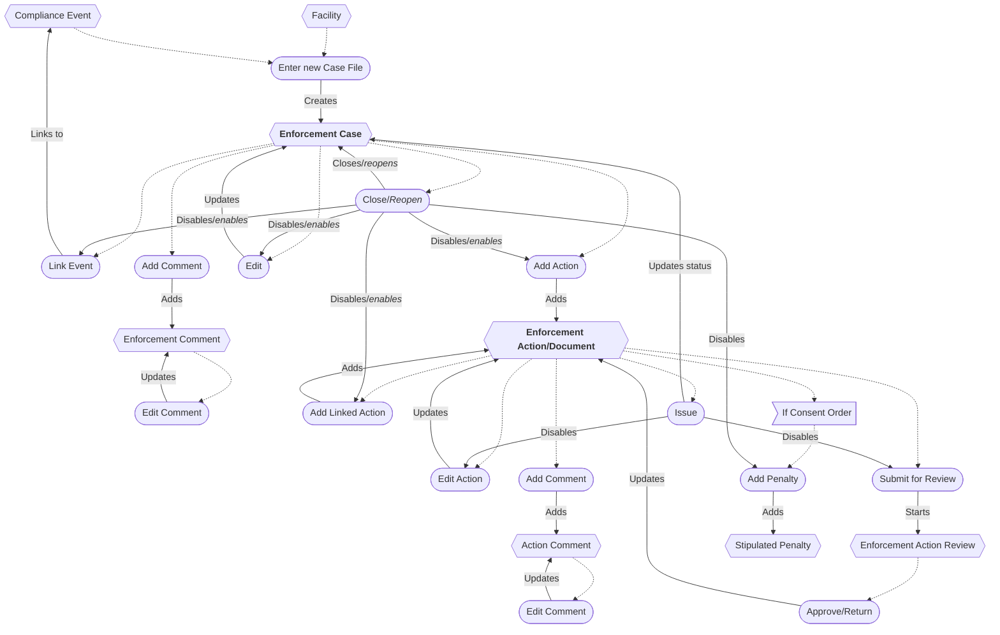
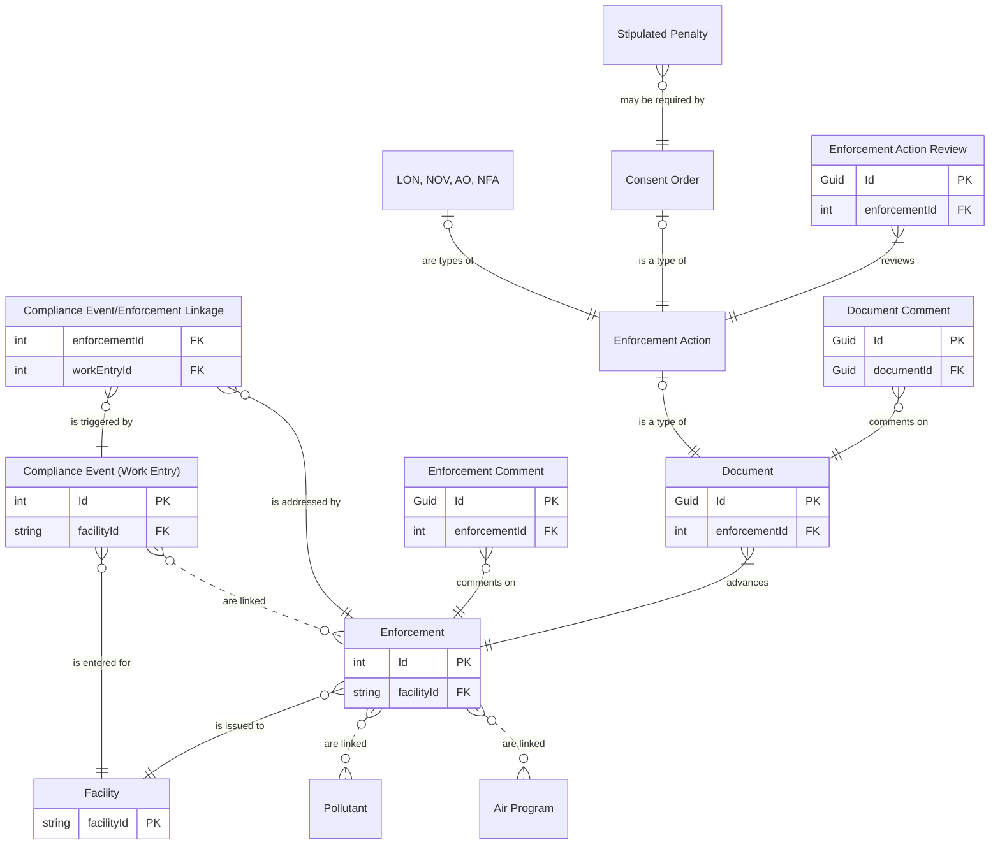

# Enforcement Workflow

## Enforcement Case

* A new Enforcement can be entered from a Facility or Compliance Event.
* An Enforcement can be linked to multiple Compliance Events.
* The Enforcement can be edited while open.
* Closing an Enforcement disables all editing.
* Reopening an Enforcement enables all editing.
* Comments can be added and edited.
* A Comment can be deleted *(not shown)*.
* An Enforcement can be deleted *(not shown)*.

## Enforcement Action/Document

* An Enforcement Action can be added to an Enforcement.
* An Enforcement Action can be started from another Enforcement Action where a linkage exists (e.g., an NFA from an NOV
  or a public notice from a CO).
* An Enforcement Action can be edited while the Enforcement is open.
* Issuing an Enforcement Action closes it and disables all editing.
* Comments can be added and edited.
* A Comment can be deleted *(not shown)*.
* An Enforcement Action can be deleted *(not shown)*.

## Enforcement Action Review

* An Enforcement Action can be submitted for review, creating an Enforcement Action Review.
* An Enforcement Action Review can be completed, updating the Enforcement Action.

## Data Exchange/Internal Auditing

* Submitting to EPA will enable the Data Exchange *(not shown)*.
* Any of the following will update the Data Exchange and generate an audit point *(not shown)*:
    * Adding or editing an Enforcement or Enforcement Action.
    * Closing or reopening the Enforcement.
    * Linking a Compliance Event.
    * Issuing an Enforcement Action.

## Flow Chart

## Entity Relationship Diagram

