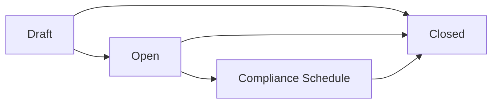
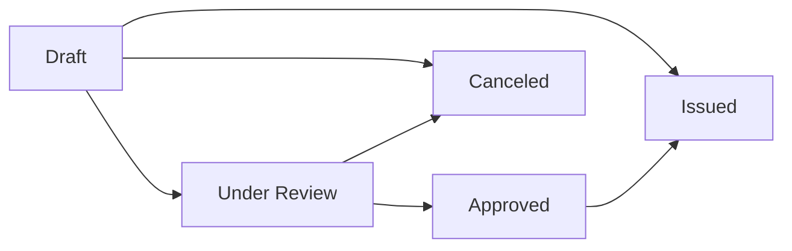
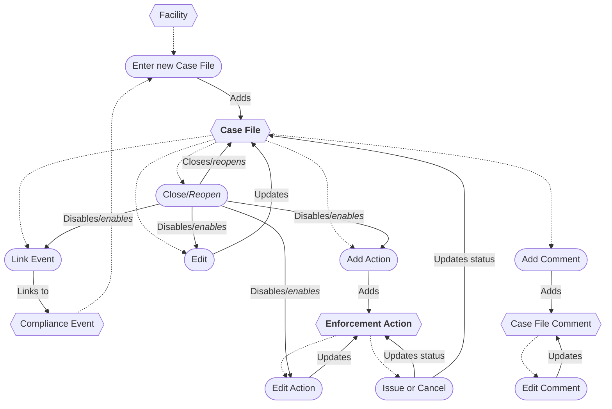
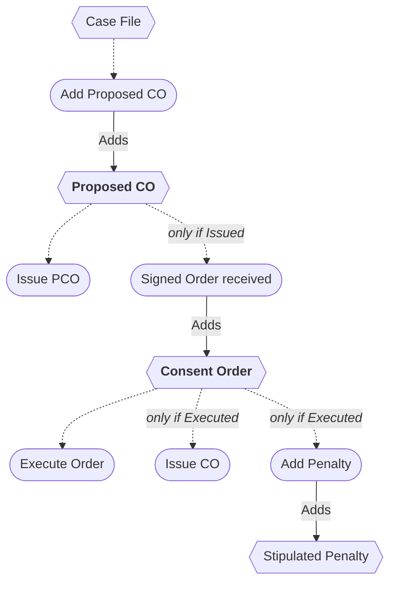
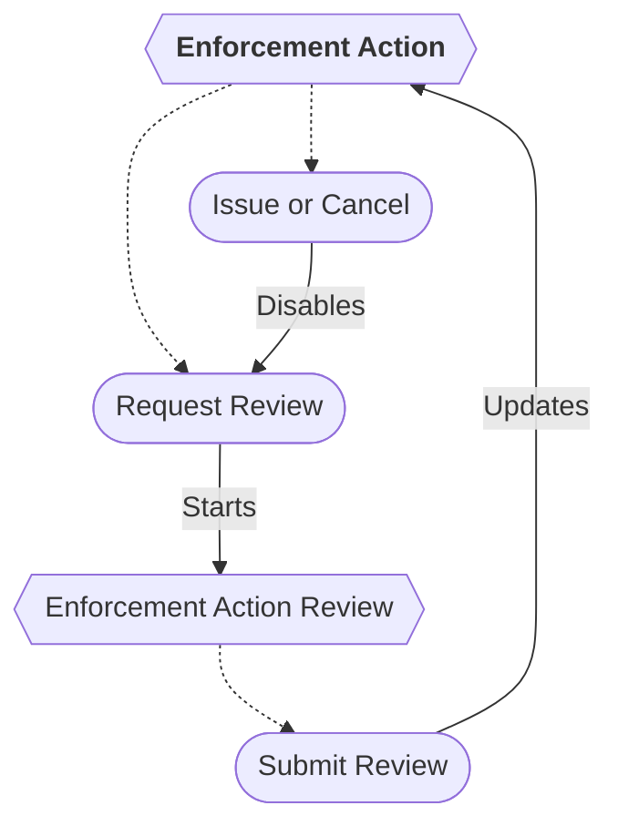

# Enforcement Case Workflow

Case Files address non-compliance. They are linked to a single facility and may be linked to one or more Compliance
Events. One or more Enforcement Actions will be issued for a Case File, some of which can be considered to resolve the
Case File. Once all work on a Case File is complete, it can be closed.

## Case File

* A new Case File can be entered from a Facility or Compliance Event.
* A Case File can be linked to multiple Compliance Events.
* The Case File can be edited while open.
* Closing/finalizing a Case File disables all editing.
* Reopening a Case File re-enables all editing.
* Comments can be added.
* A Comment can be deleted *(not shown in diagram)*.
* A Case File can be deleted *(not shown in diagram)*.

### Case File Status

The Case File status depends (in part) on the status of its Enforcement Actions.

- *Draft* - Case File has no issued Enforcement Actions.
- *Open* - Case File has at least one issued Enforcement Action.
- *Subject to compliance schedule* - Case File has at least one Formal Enforcement Action (see Data Exchange table
  below) that has been executed.
- *Closed* - Case File is closed.

## Enforcement Action

* An Enforcement Action can be added to an open Case File.
* An Enforcement Action can be edited while the Case File is open.
* An Enforcement Action can be submitted for review, creating an Enforcement Action Review.
* An Enforcement Action Review can be completed, updating the Enforcement Action status.
* An Enforcement Action can be issued (sent to facility) or canceled (closed as unsent), both of which disable the
  review
  process.
* An Enforcement Action can be deleted *(not shown in diagram)*.

### Enforcement Action Types

* Informational Letter
* Letter of Noncompliance (LON)
* No Further Action Letter (NFA)
* Notice of Violation (NOV)
* Combined NOV/NFA Letter
* Proposed Consent Order (PCO)
* Consent Order (CO)
* Administrative Order (AO)

### Enforcement Action Type-Specific Logic

* An LON or a Combined NOV/NFA letter cannot be added if a reportable Enforcement Action (see Data Exchange table below)
  has already been issued.
* An NFA cannot be added directly to a Case File. It can only be generated from an existing NOV from the Actions menu.
* A CO cannot be added directly to a Case File. It can only be generated from an existing PCO from the Actions menu.
* Stipulated Penalties can be added to a Consent Order.
* A Stipulated Penalty can be deleted *(not shown in diagram)*.

### Enforcement Action Status

## Case File Process Flow Chart

### Consent Order Process Flow Chart

### Enforcement Action Review Process Flow Chart

## Data Exchange

When an Informal or Formal Enforcement Action (EA) exists and a Compliance Event is linked, the Data Exchange is
enabled for the Case File.

| Enforcement Action type    | Not reportable | Informal reportable | Formal reportable |
|----------------------------|:--------------:|:-------------------:|:-----------------:|
| Letter of Noncompliance    |       ✓        |                     |                   |
| Notice of Violation        |                |          ✓          |                   |
| No Further Action Letter   |       ✓        |                     |                   |
| Combined NOV/NFA Letter    |                |          ✓          |                   |
| Proposed Consent Order     |                |          ✓          |                   |
| Consent Order              |                |                     |         ✓         |
| Administrative Order       |                |                     |         ✓         |
| Order Resolved  (CO or AO) |       ✓        |                     |                   |
| Informational Letter       |       ✓        |                     |                   |

### ICIS-Air Data Exchange Activities

| Item                          | ICIS-Air Data Type    | Pathway Activity *                |
|-------------------------------|-----------------------|-----------------------------------|
| Case File                     | Case File             | *N/A*                             |
| Compliance Event              | Compliance Monitoring | Discovery                         |
| Notice of Violation           | Informal EA           | Notification                      |
| No Further Action Letter      | *N/A*                 | Addressing & Resolving            |
| Combined NOV/NFA Letter       | Informal EA           | Notification/Addressing/Resolving |
| Proposed Consent Order        | Informal EA           | Notification                      |
| Consent Order                 | Formal EA             | Addressing                        |
| Consent Order Resolved        | *N/A*                 | Resolving                         |
| Administrative Order          | Formal EA             | Addressing                        |
| Administrative Order Resolved | *N/A*                 | Resolving                         |

<small>
* Indicates Pathway Activities tracked for each Case File.
</small>
