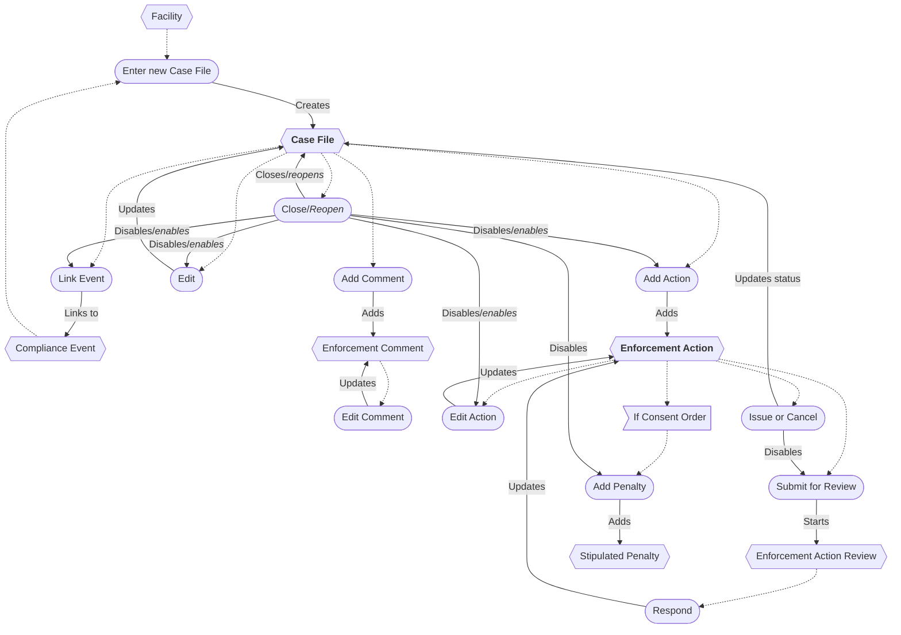

# Enforcement Workflow

## Case File

* A new Case File can be entered from a Facility or Compliance Event.
* A Case File can be linked to multiple Compliance Events.
* The Case File can be edited while open.
* Closing/finalizing a Case File disables all editing.
* Reopening a Case File enables all editing.
* Comments can be added and edited.
* A Comment can be deleted *(not shown in diagram)*.
* A Case File can be deleted *(not shown)*.

## Enforcement Action

* An Enforcement Action can be added to an open Case File.
* An Enforcement Action can be edited while the Case File is open.
* An Enforcement Action can be submitted for review.
* An Enforcement Action can be issued (closed as sent) or canceled (closed as unsent), disabling the review process.
* Comments can be added and edited.
* A Comment can be deleted *(not shown)*.
* An Enforcement Action can be deleted *(not shown)*.

### Enforcement Action Types

| Enforcement action type  | Reportable | Informal | Formal |
|--------------------------|:----------:|:--------:|:------:|
| Letter of Noncompliance  |            |          |        |
| Notice of Violation      |     ✓      |    ✓     |        |
| No Further Action Letter |            |          |        |
| Combined NOV/NFA Letter  |     ✓      |    ✓     |        |
| Proposed Consent Order   |     ✓      |    ✓     |        |
| Consent Order            |     ✓      |          |   ✓    |
| Order Resolved           |            |          |        |
| Administrative Order     |     ✓      |          |   ✓    |
| Informational Letter     |            |          |        |

#### Consent Order

* If the Enforcement Action is a Consent Order, Stipulated Penalties can be added.

## Enforcement Action Review

* An Enforcement Action can be submitted for review, creating an Enforcement Action Review.
* An Enforcement Action Review can be completed, updating the Enforcement Action.

## Data Exchange

* When an Informal or Formal Enforcement Action (EA) exists and a Compliance Event is linked, the Data Exchange is
  enabled for the Case File *(not shown)*.

| Item                          |  ICIS-Air Data Type   |        Pathway Activity *         |
|-------------------------------|:---------------------:|:---------------------------------:|
| Case File                     |       Case File       |                                   |
| Compliance Event              | Compliance Monitoring |             Discovery             |
| Notice of Violation           |      Informal EA      |           Notification            |
| No Further Action Letter      |                       |      Addressing & Resolving       |
| Combined NOV/NFA Letter       |      Informal EA      | Notification/Addressing/Resolving |
| Proposed Consent Order        |      Informal EA      |           Notification            |
| Consent Order                 |       Formal EA       |            Addressing             |
| Consent Order Resolved        |                       |             Resolving             |
| Administrative Order          |       Formal EA       |            Addressing             |
| Administrative Order Resolved |                       |             Resolving             |

<small>
* Indicates Pathway Activities tracked for each Case File.
</small>

## Flow Chart

## Review Process Flow Chart

