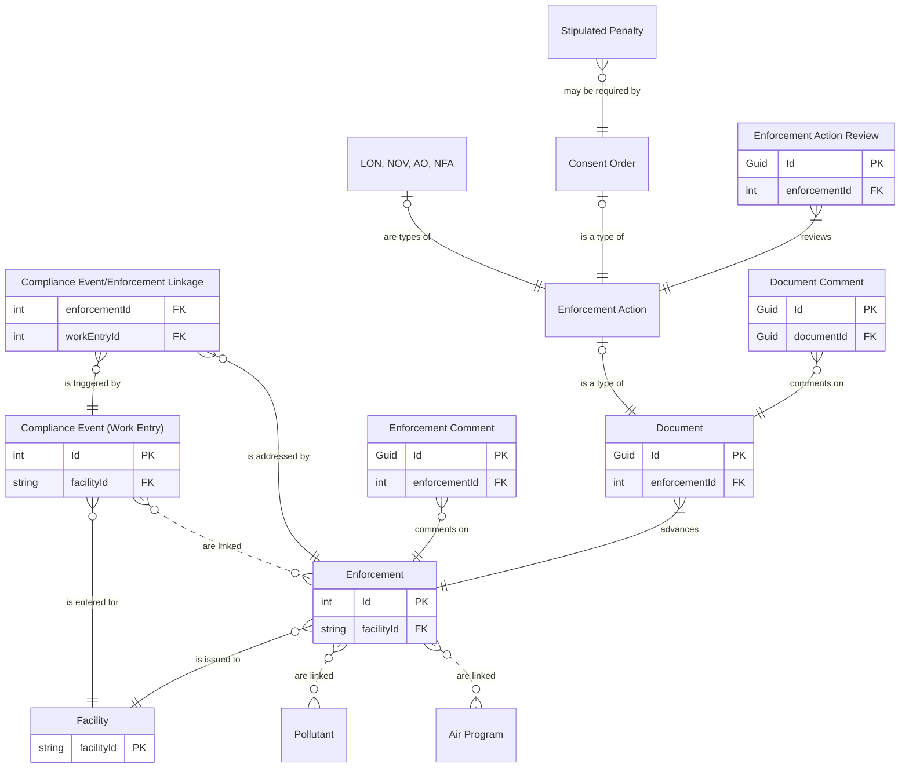

# Enforcement ERD

```mermaid
erDiagram
    FAC["Facility"] {
        string facilityId PK
    }

    CWE["Compliance Event (Work Entry)"] {
        int Id PK
        string facilityId FK
    }

    ENF["Enforcement"] {
        int Id PK
        string facilityId FK
    }

    LNK["Compliance Event/Enforcement Linkage"] {
        int enforcementId FK
        int workEntryId FK
    }

    CTE["Enforcement Comment"] {
        Guid Id PK
        int enforcementId FK
    }

    DOC["Document"] {
        Guid Id PK
        int enforcementId FK
    }

    ACT["Enforcement Action"]

    REV["Enforcement Action Review"] {
        Guid Id PK
        int enforcementId FK
    }

    CTA["Document Comment"] {
        Guid Id PK
        Guid documentId FK
    }

    EAO["LON, NOV, AO, NFA"]
    CO["Consent Order"]
    POL["Pollutant"]
    PGM["Air Program"]
    STP["Stipulated Penalty"]

    CWE }o--|| FAC: "is entered for"
    ENF }o--|| FAC: "is issued to"

    CWE }o..o{ ENF: "are linked"
    LNK }o--|| CWE: "is triggered by"
    LNK }o--|| ENF: "is addressed by"

    CTE }o--|| ENF: "comments on"
    DOC }|--|| ENF: "advances"
    ACT |o--|| DOC: "is a type of"

    ENF }o..o{ POL: "are linked"
    ENF }o..o{ PGM: "are linked"

    EAO |o--|| ACT: "are types of"
    CO |o--|| ACT: "is a type of"
    REV }|--|| ACT: "reviews"
    
    CTA }o--|| DOC: "comments on"

    STP }o--|| CO: "may be required by"

```
