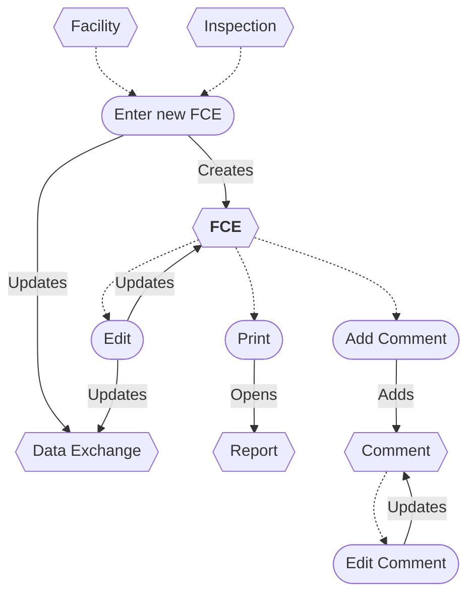
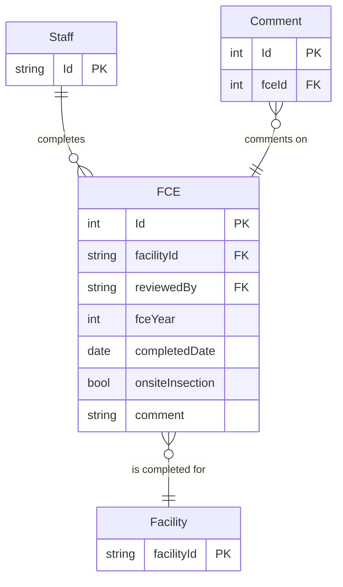

# Full Compliance Evaluation (FCE) Workflow

* A new FCE can be entered from a Facility or an Inspection.
* The FCE can be edited.
* Saving an FCE updates the Data Exchange.
* The FCE report can be printed.
* An FCE can be deleted/restored *(not shown)*.
* Comments can be added and edited.
* A Comment can be deleted *(not shown)*.

## Flowchart

## Entity Relationship Diagram

