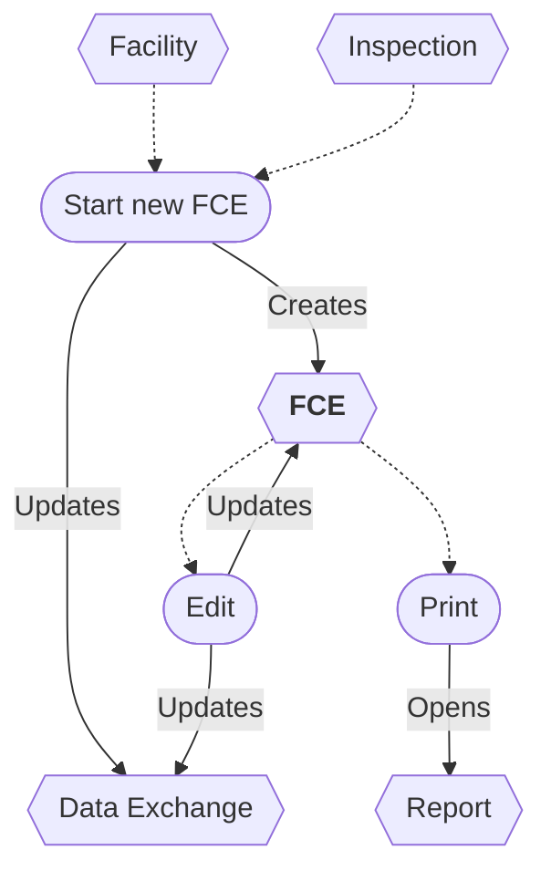

# Full Compliance Evaluation (FCE) Workflow

* A new FCE can be started from a Facility or an Inspection.
* The FCE can be updated.
* Saving an FCE updates the data exchange.
* The FCE report can be printed.
* An FCE can be deleted/undeleted *(not shown)*.

