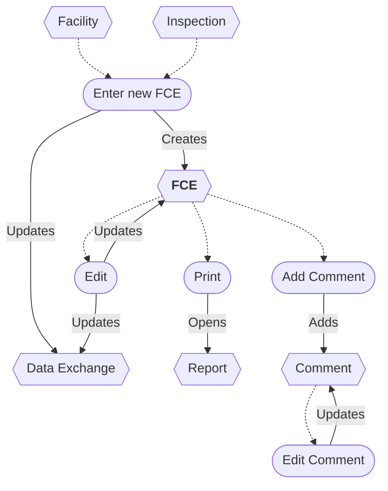
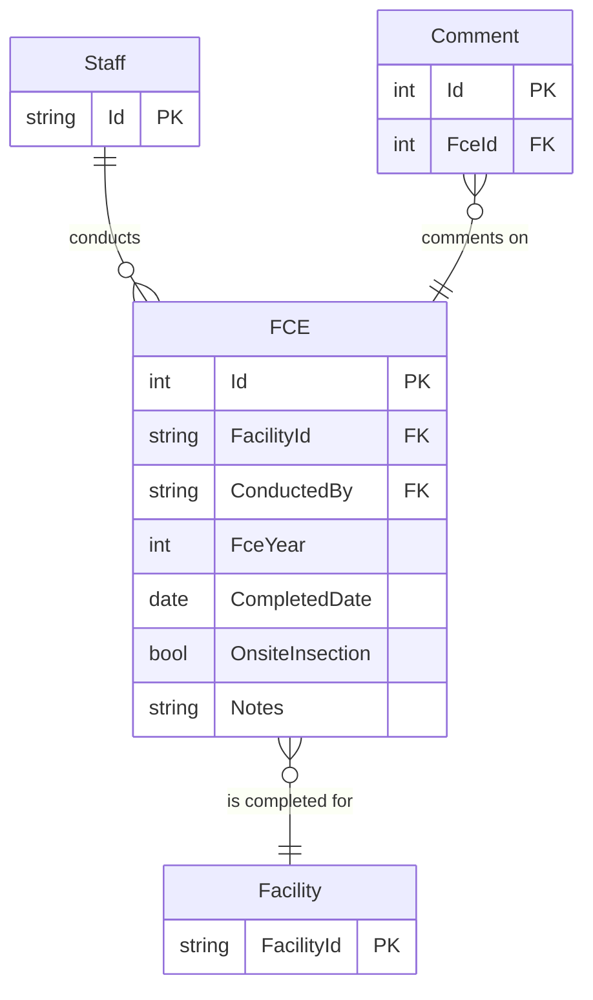

# Full Compliance Evaluation (FCE) Workflow and ERD

* A new FCE can be entered from a Facility or an Inspection.
* The FCE can be edited.
* Saving an FCE updates the Data Exchange.
* The FCE report can be printed.
* An FCE can be deleted/restored *(not shown)*.
* Comments can be added and edited.
* A Comment can be deleted *(not shown)*.

## Flowchart

## ERD

## Original IAIP table columns

| Column                          | Type          | Migrate | Destination      |
|---------------------------------|---------------|:-------:|------------------|
| SSCPFCEMASTER.STRFCENUMBER      | numeric(10)   |    ✔    | Id               |
| SSCPFCEMASTER.STRAIRSNUMBER     | varchar(12)   |    ✔    | FacilityId       |
| SSCPFCEMASTER.STRMODIFINGPERSON | varchar(3)    |    ✖    | *none*           |
| SSCPFCEMASTER.DATMODIFINGDATE   | datetime2(0)  |    ✖    | *none*           |
| SSCPFCEMASTER.ICIS_STATUSIND    | varchar       | *defer* |                  |
| SSCPFCEMASTER.IsDeleted         | bit           |    ✔    | base.IsDeleted   |
| SSCPFCE.STRFCESTATUS            | varchar(5)    |    ✖    | *none*           |
| SSCPFCE.STRREVIEWER             | varchar(3)    |    ✔    | ConductedBy      |
| SSCPFCE.DATFCECOMPLETED         | datetime2(0)  |    ✔    | CompletedDate    |
| SSCPFCE.STRFCECOMMENTS          | varchar(4000) |    ✔    | Notes            |
| SSCPFCE.STRMODIFINGPERSON       | varchar(3)    |    ✔    | base.UpdatedById |
| SSCPFCE.DATMODIFINGDATE         | datetime2(0)  |    ✔    | base.UpdatedAt   |
| SSCPFCE.STRSITEINSPECTION       | varchar(5)    |    ✔    | OnsiteInspection |
| SSCPFCE.STRFCEYEAR              | varchar(4)    |    ✔    | FceYear          |
