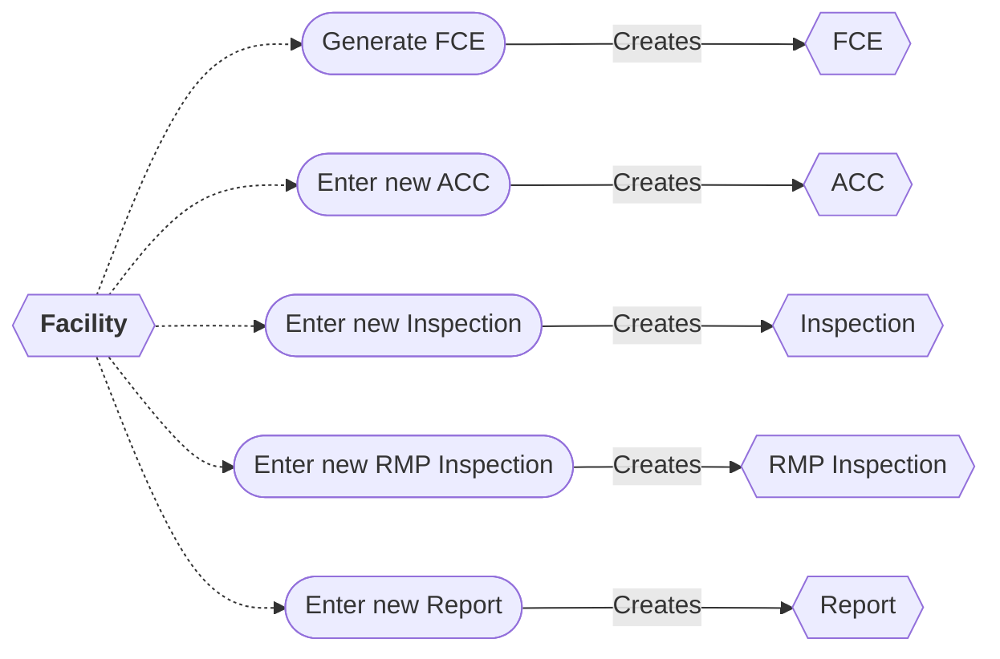

# Facility Workflow

* A new FCE can be entered from a Facility.
* A new ACC can be entered from a Facility.
* A new Inspection can be entered from a Facility.
* A new RMP Inspection can be entered from a Facility.
* A new Report can be entered from a Facility.

