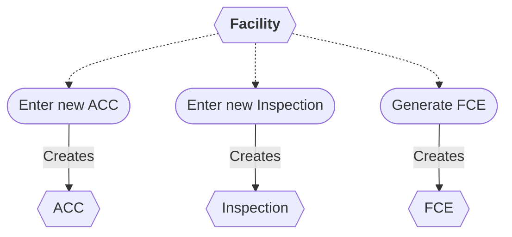

# Facility Workflow

* A new Inspection can be entered from a Facility.
* A new FCE can be entered from a Facility.
* A new ACC can be entered from a Facility.

```mermaid
flowchart
    FAC{{"`**Facility**`"}}
    ACC{{ACC}}
    INS{{Inspection}}
    FCE{{FCE}}

    acc([Enter new ACC])
    ins([Enter new Inspection])
    fce([Generate FCE])

    FAC -.-> acc
    FAC -.-> ins
    FAC -.-> fce

    acc -->|Creates| ACC
    ins -->|Creates| INS
    fce -->|Creates| FCE
```
