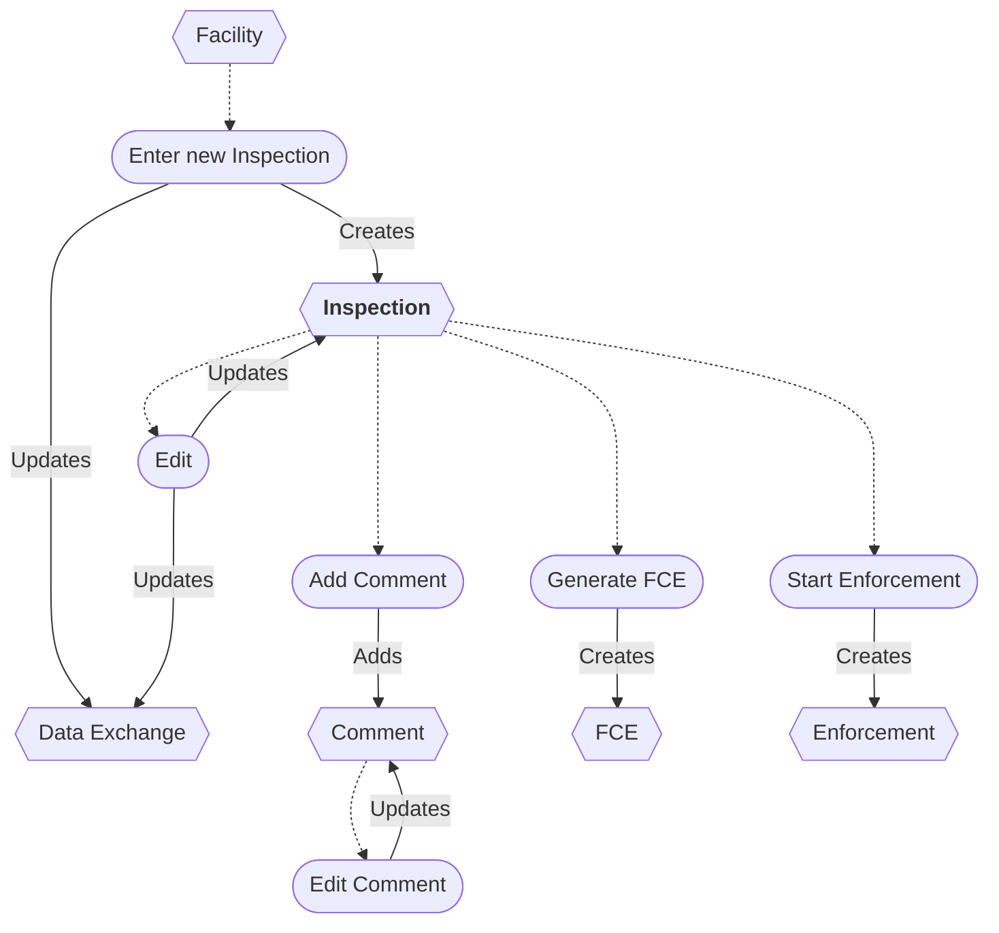

# Inspection Workflow

* A new Inspection can be entered from a Facility.
* The Inspection can be edited.
* Additional comments can be added at any time.
* Saving an Inspection updates the data exchange.
* Enforcement can be started from an Inspection.
* A new FCE can be entered from an Inspection.
* An Inspection can be deleted/restored *(not shown)*.
* Comments can be edited.
* A Comment can be deleted *(not shown)*.

