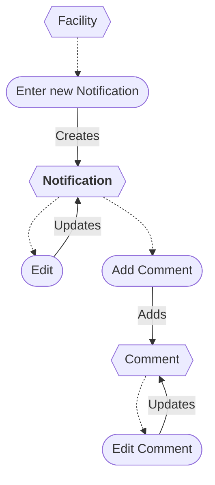

# Notification Workflow

* A new Notification can be entered from a Facility.
* The Notification can be edited.
* A Notification can be deleted/restored *(not shown)*.
* Comments can be added and edited.
* A Comment can be deleted *(not shown)*.

