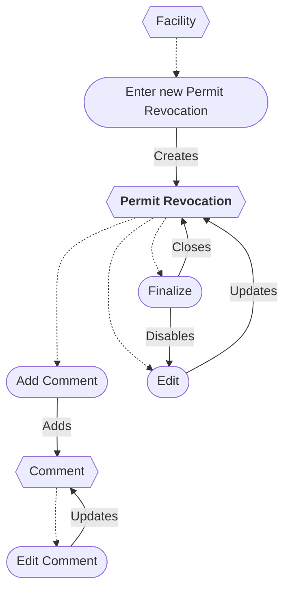

# Permit Revocation Workflow

* A new Permit Revocation can be started from a Facility.
* The Permit Revocation can be edited while open.
* Finalizing a Permit Revocation disables updating.
* A Permit Revocation can be deleted/restored *(not shown)*.
* Comments can be added and edited.
* A Comment can be deleted *(not shown)*.

