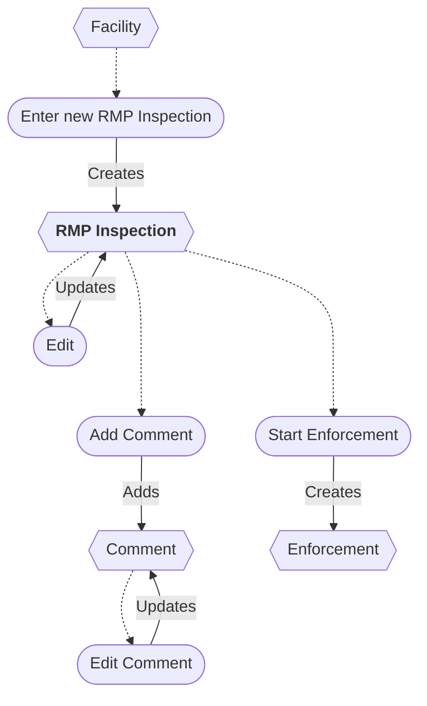

# RMP Inspection Workflow

* A new RMP Inspection can be entered from a Facility.
* The RMP Inspection can be edited.
* Enforcement can be started from an RMP Inspection.
* An RMP Inspection can be deleted/restored *(not shown)*.
* Comments can be added and edited.
* A Comment can be deleted *(not shown)*.

