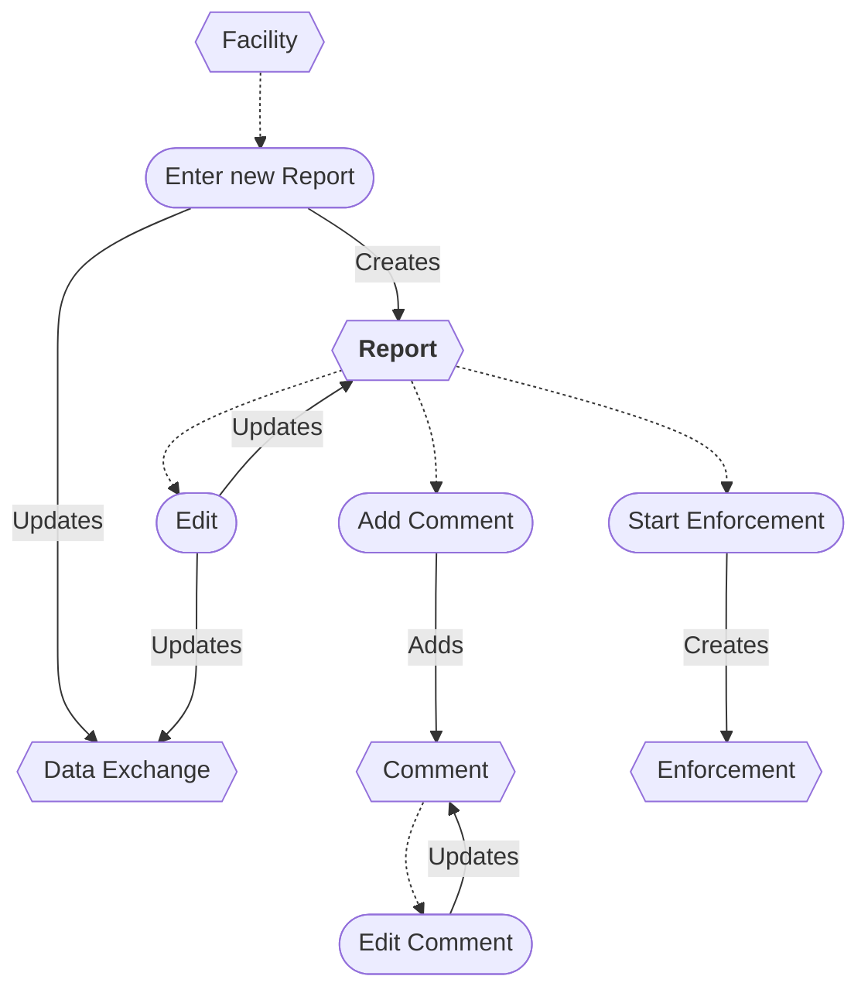

# Report Entry Workflow

* A new Report can be entered from a Facility.
* The Report entry can be edited.
* Saving a Report entry updates the data exchange.
* Enforcement can be started from a Report entry.
* A Report entry can be deleted/restored *(not shown)*.
* Comments can be added and edited.
* A Comment can be deleted *(not shown)*.

