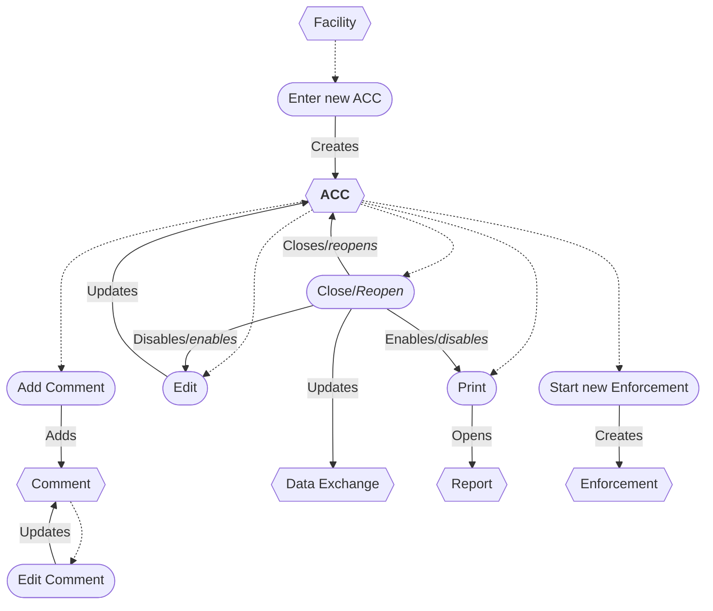
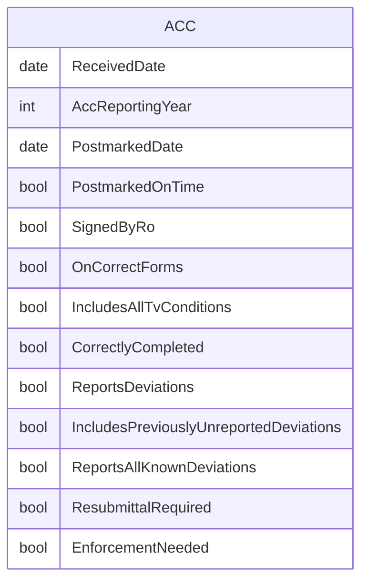

# Annual Compliance Certification (ACC) Workflow

* A new ACC can be entered from a Facility.
* The ACC can be edited while open.
* Closing an ACC disables updating and enables printing.
* Reopening an ACC enables updating and disables printing.
* Closing or Reopening an ACC updates the Data Exchange.
* The ACC report can be printed.
* Enforcement can be started from an ACC.
* An ACC can be deleted/restored *(not shown)*.
* Comments can be added and edited.
* A Comment can be deleted *(not shown)*.

## ERD

## Original IAIP table columns

| Column                              | Type          | Migrate | Destination                          |
|-------------------------------------|---------------|:-------:|--------------------------------------|
| SSCPITEMMASTER.DATRECEIVEDDATE      | datetime2(0)  |    ✔    | ReceivedDate                         |
| SSCPACCS.STRSUBMITTALNUMBER         | numeric(3)    |    ✖    | *none*                               |
| SSCPACCS.STRPOSTMARKEDONTIME        | varchar(5)    |    ✔    | PostmarkedOnTime                     |
| SSCPACCS.DATPOSTMARKDATE            | datetime2(0)  |    ✔    | PostmarkedDate                       |
| SSCPACCS.STRSIGNEDBYRO              | varchar(5)    |    ✔    | SignedByRo                           |
| SSCPACCS.STRCORRECTACCFORMS         | varchar(5)    |    ✔    | OnCorrectForms                       |
| SSCPACCS.STRTITLEVCONDITIONSLISTED  | varchar(5)    |    ✔    | IncludesAllTvConditions              |
| SSCPACCS.STRACCCORRECTLYFILLEDOUT   | varchar(5)    |    ✔    | CorrectlyCompleted                 |
| SSCPACCS.STRREPORTEDDEVIATIONS      | varchar(5)    |    ✔    | ReportsDeviations                    |
| SSCPACCS.STRDEVIATIONSUNREPORTED    | varchar(5)    |    ✔    | IncludesPreviouslyUnreportedDeviations |
| SSCPACCS.STRCOMMENTS                | varchar(4000) |    ✔    | base.Notes                           |
| SSCPACCS.STRENFORCEMENTNEEDED       | varchar(5)    |    ✔    | EnforcementNeeded                  |
| SSCPACCS.STRMODIFINGPERSON          | varchar(3)    |    ?    | base.UpdatedById                     |
| SSCPACCS.DATMODIFINGDATE            | datetime2(0)  |    ?    | base.UpdatedAt                       |
| SSCPACCS.DATACCREPORTINGYEAR        | datetime2(0)  |    ✔    | AccReportingYear                     |
| SSCPACCS.STRKNOWNDEVIATIONSREPORTED | varchar(5)    |    ✔    | ReportsAllKnownDeviations            |
| SSCPACCS.STRRESUBMITTALREQUIRED     | varchar(5)    |    ✔    | ResubmittalRequired                |
