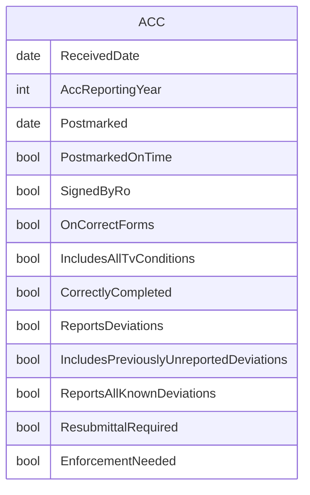

# Annual Compliance Certification (ACC)

## Workflow additions

* An ACC is a Compliance Event.
* An ACC report can be printed if closed.
* Closing an ACC enables printing.
* Reopening an ACC disables printing.

## Flowchart

## ERD

## Original IAIP table columns

| Column                              | Type          | Migrate | Destination                            |
|-------------------------------------|---------------|:-------:|----------------------------------------|
| SSCPITEMMASTER.DATRECEIVEDDATE      | datetime2(0)  |    ✔    | ReceivedDate                           |
| SSCPACCS.STRSUBMITTALNUMBER         | numeric(3)    |    ✖    | *none*                                 |
| SSCPACCS.STRPOSTMARKEDONTIME        | varchar(5)    |    ✔    | PostmarkedOnTime                       |
| SSCPACCS.DATPOSTMARKDATE            | datetime2(0)  |    ✔    | Postmarked                             |
| SSCPACCS.STRSIGNEDBYRO              | varchar(5)    |    ✔    | SignedByRo                             |
| SSCPACCS.STRCORRECTACCFORMS         | varchar(5)    |    ✔    | OnCorrectForms                         |
| SSCPACCS.STRTITLEVCONDITIONSLISTED  | varchar(5)    |    ✔    | IncludesAllTvConditions                |
| SSCPACCS.STRACCCORRECTLYFILLEDOUT   | varchar(5)    |    ✔    | CorrectlyCompleted                     |
| SSCPACCS.STRREPORTEDDEVIATIONS      | varchar(5)    |    ✔    | ReportsDeviations                      |
| SSCPACCS.STRDEVIATIONSUNREPORTED    | varchar(5)    |    ✔    | IncludesPreviouslyUnreportedDeviations |
| SSCPACCS.STRCOMMENTS                | varchar(4000) |    ✔    | base.Notes                             |
| SSCPACCS.STRENFORCEMENTNEEDED       | varchar(5)    |    ✔    | EnforcementNeeded                      |
| SSCPACCS.STRMODIFINGPERSON          | varchar(3)    |    ?    | base.UpdatedById                       |
| SSCPACCS.DATMODIFINGDATE            | datetime2(0)  |    ?    | base.UpdatedAt                         |
| SSCPACCS.DATACCREPORTINGYEAR        | datetime2(0)  |    ✔    | AccReportingYear                       |
| SSCPACCS.STRKNOWNDEVIATIONSREPORTED | varchar(5)    |    ✔    | ReportsAllKnownDeviations              |
| SSCPACCS.STRRESUBMITTALREQUIRED     | varchar(5)    |    ✔    | ResubmittalRequired                    |
