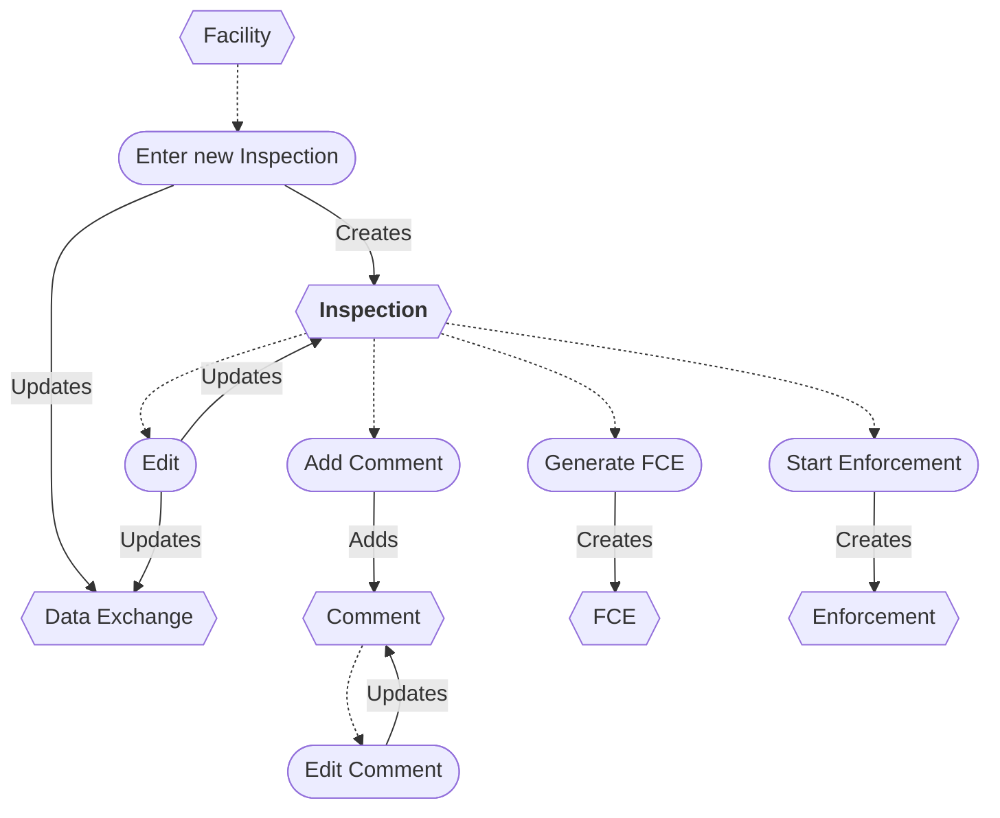
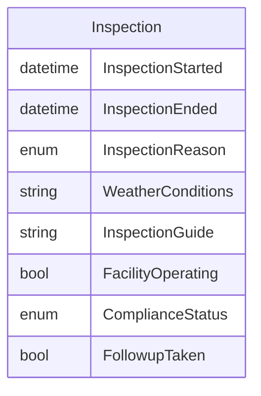

# Inspection Workflow

## Workflow additions

* A new FCE can be entered from an Inspection.

## Flowchart

## ERD

## Original IAIP table columns

| Column                                        | Type          | Migrate | Destination          |
|-----------------------------------------------|---------------|:-------:|----------------------|
| SSCPITEMMASTER.DATRECEIVEDDATE                | datetime2(0)  |    ✖    | *none*               |
| SSCPINSPECTIONS.DATINSPECTIONDATESTART        | datetime2(0)  |    ✔    | InspectionStarted    |
| SSCPINSPECTIONS.DATINSPECTIONDATEEND          | datetime2(0)  |    ✔    | InspectionEnded      |
| SSCPINSPECTIONS.STRINSPECTIONREASON           | varchar(35)   |    ✔    | InspectionReason     |
| SSCPINSPECTIONS.STRWEATHERCONDITIONS          | varchar(100)  |    ✔    | WeatherConditions    |
| SSCPINSPECTIONS.STRINSPECTIONGUIDE            | varchar(100)  |    ✔    | InspectionGuide      |
| SSCPINSPECTIONS.STRFACILITYOPERATING          | varchar(5)    |    ✔    | WasFacilityOperating |
| SSCPINSPECTIONS.STRINSPECTIONCOMPLIANCESTATUS | varchar(35)   |    ✔    | ComplianceStatus     |
| SSCPINSPECTIONS.STRINSPECTIONCOMMENTS         | varchar(4000) |    ✔    | base.Notes           |
| SSCPINSPECTIONS.STRINSPECTIONFOLLOWUP         | varchar(5)    |    ✔    | FollowupTaken        |
| SSCPINSPECTIONS.STRMODIFINGPERSON             | varchar(3)    |    ?    | base.UpdatedById     |
| SSCPINSPECTIONS.DATMODIFINGDATE               | datetime2(0)  |    ?    | base.UpdatedAt       |
