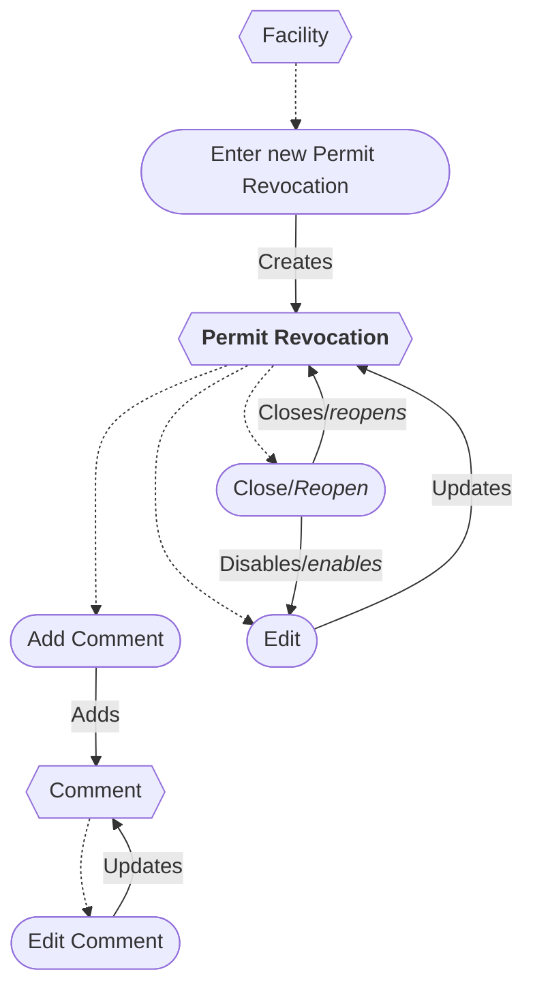
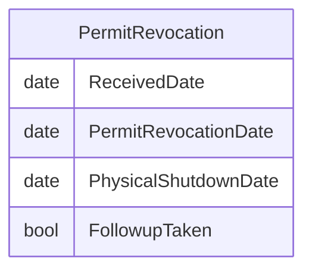

# Permit Revocation Workflow

## Flowchart

## ERD

## Original IAIP table columns

| Column                                     | Type          | Migrate | Destination          |
|--------------------------------------------|---------------|:-------:|----------------------|
| SSCPITEMMASTER.DATRECEIVEDDATE             | datetime2(0)  |    ✔    | ReceivedDate         |
| SSCPNOTIFICATIONS.DATNOTIFICATIONDUE       | datetime2(0)  |    ✔    | PermitRevocationDate |
| SSCPNOTIFICATIONS.STRNOTIFICATIONDUE       | varchar(5)    |    ✖    | *none*               |
| SSCPNOTIFICATIONS.DATNOTIFICATIONSENT      | datetime2(0)  |    ✔    | PhysicalShutdownDate |
| SSCPNOTIFICATIONS.STRNOTIFICATIONSENT      | varchar(10)   |    ✔    | PhysicalShutdownDate |
| SSCPNOTIFICATIONS.STRNOTIFICATIONTYPE      | varchar(2)    |    ✖    | *none*               |
| SSCPNOTIFICATIONS.STRNOTIFICATIONTYPEOTHER | varchar(100)  |    ✔    | base.Notes           |
| SSCPNOTIFICATIONS.STRNOTIFICATIONCOMMENT   | varchar(4000) |    ✔    | base.Notes           |
| SSCPNOTIFICATIONS.STRNOTIFICATIONFOLLOWUP  | varchar(5)    |    ✔    | FollowupTaken        |
| SSCPNOTIFICATIONS.STRMODIFINGPERSON        | varchar(3)    |    ?    | base.UpdatedById     |
| SSCPNOTIFICATIONS.DATMODIFINGDATE          | datetime2(0)  |    ?    | base.UpdatedAt       |
