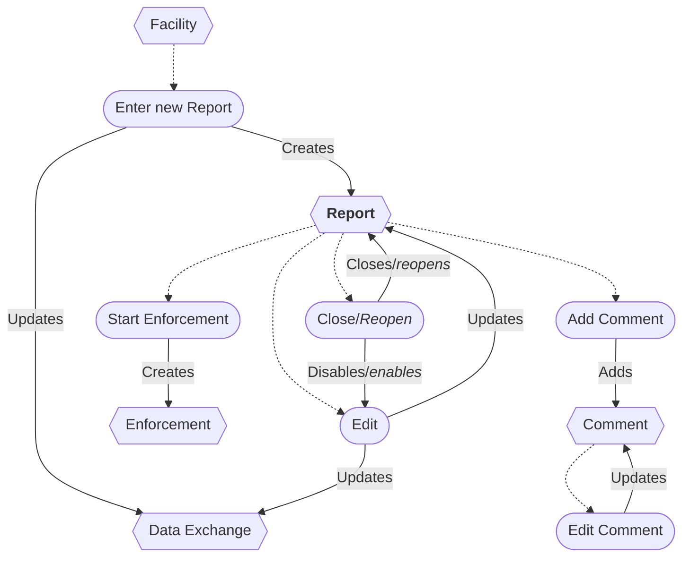
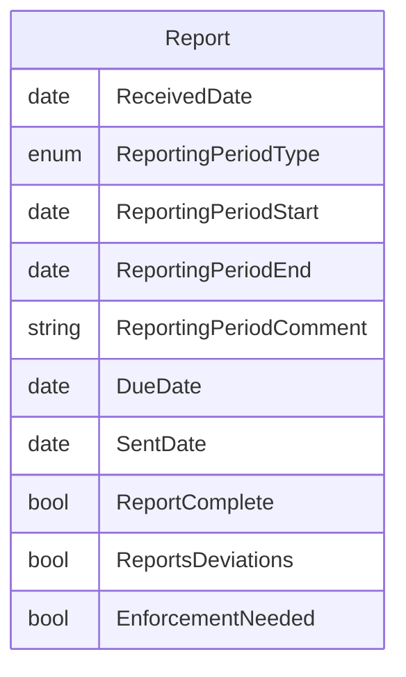

# Report Workflow

## Workflow additions

* A Report is a Compliance Event.
* A Report is automatically closed when created.

## Flowchart

## ERD

## Original IAIP table columns

| Column                                 | Type          | Migrate | Destination            |
|----------------------------------------|---------------|:-------:|------------------------|
| SSCPITEMMASTER.DATRECEIVEDDATE         | datetime2(0)  |    ✔    | ReceivedDate           |
| SSCPREPORTS.STRREPORTPERIOD            | varchar(25)   |    ✔    | ReportingPeriodType             |
| SSCPREPORTS.DATREPORTINGPERIODSTART    | datetime2(0)  |    ✔    | ReportingPeriodStart   |
| SSCPREPORTS.DATREPORTINGPERIODEND      | datetime2(0)  |    ✔    | ReportingPeriodEnd     |
| SSCPREPORTS.STRREPORTINGPERIODCOMMENTS | varchar(4000) |    ✔    | ReportingPeriodComment |
| SSCPREPORTS.DATREPORTDUEDATE           | datetime2(0)  |    ✔    | DueDate                |
| SSCPREPORTS.DATSENTBYFACILITYDATE      | datetime2(0)  |    ✔    | SentDate               |
| SSCPREPORTS.STRCOMPLETESTATUS          | varchar(5)    |    ✔    | ReportComplete       |
| SSCPREPORTS.STRENFORCEMENTNEEDED       | varchar(5)    |    ✔    | EnforcementNeeded    |
| SSCPREPORTS.STRSHOWDEVIATION           | varchar(5)    |    ✔    | ReportsDeviations      |
| SSCPREPORTS.STRGENERALCOMMENTS         | varchar(4000) |    ✔    | base.Notes             |
| SSCPREPORTS.STRMODIFINGPERSON          | varchar(3)    |    ?    | base.UpdatedById       |
| SSCPREPORTS.DATMODIFINGDATE            | datetime2(0)  |    ?    | base.UpdatedAt         |
| SSCPREPORTS.STRSUBMITTALNUMBER         | varchar(3)    |    ✖    | *none*                 |
