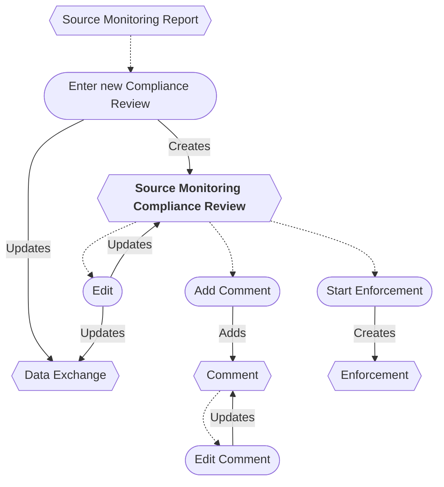
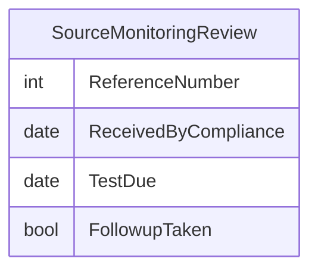

# Source Monitoring Compliance Review Workflow

* A new Source Monitoring Compliance Review can be entered from a Source Monitoring Report.
* The Review entry can be edited.
* Saving a Review entry updates the Data Exchange.
* Enforcement can be started from a Review entry.
* A Review entry can be deleted/restored *(not shown)*.
* Comments can be added and edited.
* A Comment can be deleted *(not shown)*.

## ERD

## Original IAIP table columns

| Column                                | Type          | Migrate | Destination          |
|---------------------------------------|---------------|:-------:|----------------------|
| SSCPITEMMASTER.DATRECEIVEDDATE        | datetime2(0)  |    ✔    | ReceivedByCompliance |
| SSCPTESTREPORTS.STRREFERENCENUMBER    | varchar(9)    |    ✔    | ReferenceNumber      |
| SSCPTESTREPORTS.DATTESTREPORTDUE      | datetime2(0)  |    ✔    | TestDue              |
| SSCPTESTREPORTS.STRTESTREPORTCOMMENTS | varchar(4000) |    ✔    | base.Notes           |
| SSCPTESTREPORTS.STRTESTREPORTFOLLOWUP | varchar(5)    |    ✔    | FollupTaken          |
| SSCPTESTREPORTS.STRMODIFINGPERSON     | varchar(3)    |    ?    | base.UpdatedById     |
| SSCPTESTREPORTS.DATMODIFINGDATE       | datetime2(0)  |    ?    | base.UpdatedAt       |
