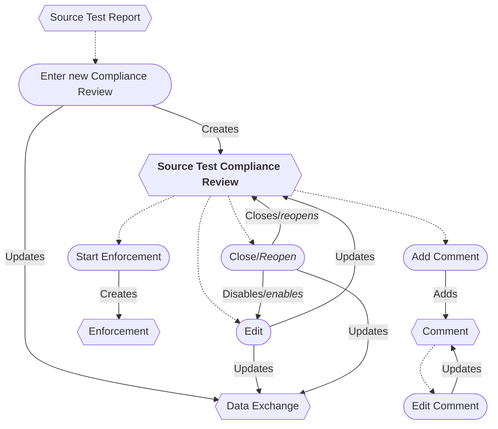
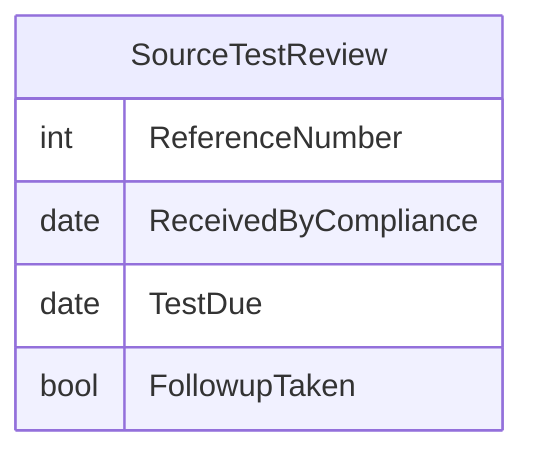

# Source Test Compliance Review Workflow

## Workflow additions

* A Source Test Compliance Review can only be entered from a Source Test Report.
* A Source Test Compliance Review is a Compliance Event.
* A Source Test Compliance Review is automatically closed when created.

## Flowchart

## ERD

## Original IAIP table columns

| Column                                | Type          | Migrate | Destination          |
|---------------------------------------|---------------|:-------:|----------------------|
| SSCPITEMMASTER.DATRECEIVEDDATE        | datetime2(0)  |    ✔    | ReceivedByCompliance |
| SSCPTESTREPORTS.STRREFERENCENUMBER    | varchar(9)    |    ✔    | ReferenceNumber      |
| SSCPTESTREPORTS.DATTESTREPORTDUE      | datetime2(0)  |    ✔    | TestDue              |
| SSCPTESTREPORTS.STRTESTREPORTCOMMENTS | varchar(4000) |    ✔    | base.Notes           |
| SSCPTESTREPORTS.STRTESTREPORTFOLLOWUP | varchar(5)    |    ✔    | FollowupTaken        |
| SSCPTESTREPORTS.STRMODIFINGPERSON     | varchar(3)    |    ?    | base.UpdatedById     |
| SSCPTESTREPORTS.DATMODIFINGDATE       | datetime2(0)  |    ?    | base.UpdatedAt       |
