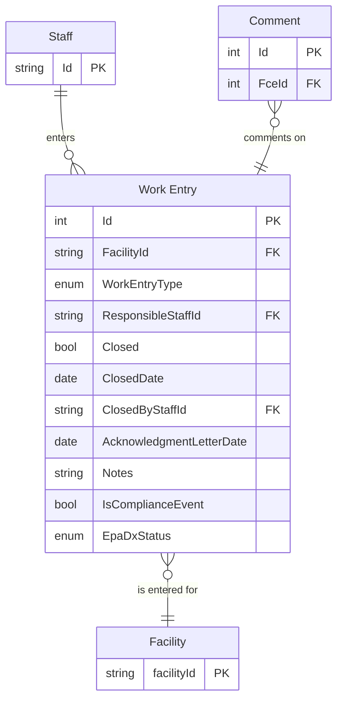

# Work Entry

## General Workflow

* A new Work Entry can be entered from a Facility.
* The Work Entry can be edited if open.
* A Work Entry can be closed/reopened (some are automatically closed when they are first created).
* Closing a Work Entry disables editing.
* Reopening a Work Entry enables editing.
* A Work Entry can be deleted/restored *(not shown in diagrams)*.
* Comments can be added and edited.
* A Comment can be deleted *(not shown in diagrams)*.

## Compliance Event Workflow

* Some Work Entry types are categorized as "Compliance Events."
* Enforcement can be started from a Compliance Event.
* Closing a Compliance Event updates the Data Exchange.

## Entities

- WRK: Work Entry
    - ACC: Annual Compliance Certification (ACC) †
  - INS: Inspection * †
  - RMP: RMP Inspection * †
  - REP: Report * †
  - STR: Source Test Compliance Review * †
  - NOT: Notification *
    - REV: Permit revocation

<small>* Indicates the Work Entry is automatically closed when created.</small> 
<small>† Indicates a Compliance Event (available as an enforcement discovery event).</small>

## Base ERD

## Original IAIP table columns

| Column                                    | Type         | Migrate | Destination              |
|-------------------------------------------|--------------|:-------:|--------------------------|
| SSCPITEMMASTER.STRTRACKINGNUMBER          | numeric(10)  |    ✔    | Id                       |
| SSCPITEMMASTER.STRAIRSNUMBER              | varchar(12)  |    ✔    | FacilityId               |
| SSCPITEMMASTER.DATRECEIVEDDATE            | datetime2(0) |    ✔    | *subtypes*               |
| SSCPITEMMASTER.STREVENTTYPE               | varchar(3)   |    ✔    | WorkEntryType            |
| SSCPITEMMASTER.STRRESPONSIBLESTAFF        | varchar(3)   |    ✔    | ResponsibleStaffId       |
| SSCPITEMMASTER.DATCOMPLETEDATE            | datetime2(0) |    ✔    | Closed, ClosedDate       |
| SSCPITEMMASTER.STRMODIFINGPERSON          | varchar(3)   |    ✔    | base.UpdatedById         |
| SSCPITEMMASTER.DATMODIFINGDATE            | datetime2(0) |    ✔    | base.UpdatedAt           |
| SSCPITEMMASTER.STRDELETE                  | varchar(5)   |    ✔    | base.IsDeleted           |
| SSCPITEMMASTER.DATACKNOLEDGMENTLETTERSENT | datetime2(0) |    ✔    | AcknowledgmentLetterDate |
| SSCPITEMMASTER.DATINFORMATIONREQUESTDATE  | datetime2(0) |    ✖    | *none*                   |
| SSCPITEMMASTER.ICIS_STATUSIND             | varchar      | *defer* | EpaDxStatus              |
